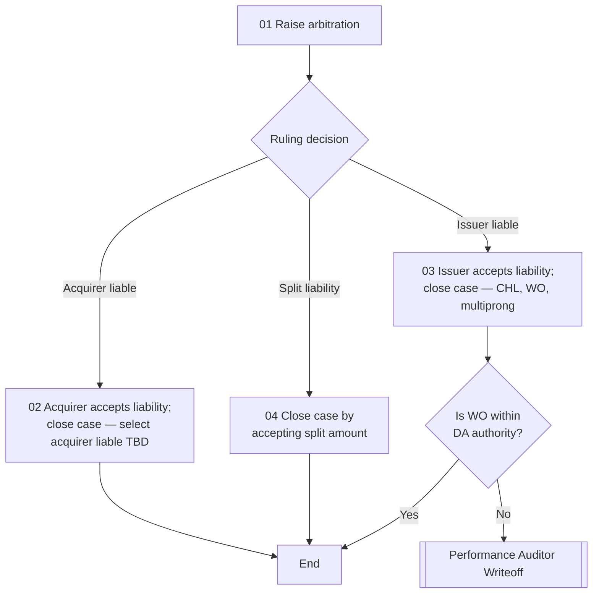

# Arbitration Flow

**Purpose:** How a dispute escalated to **card-network arbitration** is closed once the network issues its ruling — recording the case as **acquirer liable**, **issuer liable**, or **split liability**, and applying the appropriate close action, with issuer-liable write-offs beyond the analyst's authority routed to the Performance Auditor.

**Position:** Entered from [[Second Presentment Flow]] when the Performance Auditor approves raising arbitration. Over-authority write-offs route to [[Performance Auditor Writeoff Flow]].

## Flow

## Step Detail

### Step ARB-01 — Raise Arbitration

> **Step ID:** `ARB-01` (source step 01) · **Capability:** PAY-TXN-04 (chargebacks) · **Actor:** Disputes analyst · **Preconditions:** PA approved raising arbitration in [[Second Presentment Flow]] · **Exits:** → ARB-02 (ruling)

The analyst **raises arbitration** with the card network, submitting the dispute for a binding ruling.

### Step ARB-02 — Apply the Ruling

> **Step ID:** `ARB-02` (source steps 02–04) · **Capability:** OPS-CAS-06 (resolution); SVC-MON-07 · **Preconditions:** ARB-01; network ruling received · **Inputs:** ruling decision · **Exits:** acquirer/split → End; issuer liable → ARB-03

The network returns a **ruling**, and the analyst closes the case accordingly:

- **Acquirer liable** → the **acquirer accepts liability**; the case is closed by selecting *acquirer liable* (close action TBD in source).
- **Issuer liable** → the **issuer accepts liability**; the case is closed with **CHL / WO / multiprong**.
- **Split liability** → the case is closed by **accepting the split amount**.

### Step ARB-03 — Write-Off Authority (Issuer Liable)

> **Step ID:** `ARB-03` · **Capability:** OPS-WFR-02 (approvals); SVC-MON-07 · **Preconditions:** ARB-02 (issuer liable) · **Inputs:** WO amount vs. authority · **Exits:** within authority → End; over authority → [[Performance Auditor Writeoff Flow]]

Where the issuer-liable resolution is a write-off, the analyst checks **whether the WO is within their authority**. Yes → End; **No → [[Performance Auditor Writeoff Flow]]**.

## Business Rules (Generalized)

| Rule | Statement |
|---|---|
| Binding ruling | The network's arbitration ruling determines the close action |
| Three outcomes | Acquirer liable, issuer liable, or split liability |
| Issuer-liable close | Issuer-liable closes with CHL / WO / multiprong |
| Write-off authority | Issuer-liable write-offs over analyst authority route to the Performance Auditor |

## Capability Mapping

| Capability | How exercised |
|---|---|
| [[Transaction Processing]] PAY-TXN-04 | Arbitration as the terminal chargeback escalation |
| [[Case Management]] OPS-CAS-06 | Ruling-based case resolution and closure |
| [[Servicing - Monetary]] SVC-MON-07 | Liability/write-off resolution on the dispute |
| Operations — Workflow & Rules OPS-WFR-02 (adjacent) | Write-off authority gate |

## Source Traceability

Generalized from the *Arbitration* flow (RCS – Disputes Analyst lane). CRS and the DA/PA roles abstracted per [[Systems and Integration Reference]]; the acquirer-liable close action is preserved as a TBD from the source deck (Capco, 2020).
