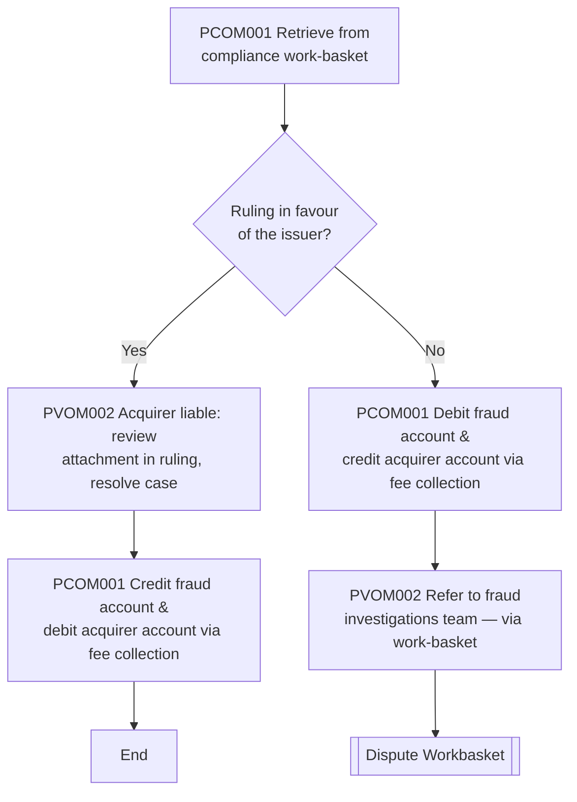

# Compliance Flow

**Purpose:** How a **compliance ruling** is resolved with the financial settlement between issuer and acquirer. The analyst retrieves the case from the compliance work-basket and, based on whether the ruling is **in favour of the issuer**, moves funds via the network **fee-collection** mechanism — crediting the fraud (issuer) account and debiting the acquirer's account when the issuer wins, or the reverse (and referral back to the fraud investigations team) when it does not.

**Position:** Entered from [[Pre-Compliance Flow]] when compliance is initiated to the network. Settlement is a [[Settlement|PAY-STL-01]] action; referral on an adverse ruling returns to the fraud investigations team ([[Dispute Workbasket Flow]]). Source step labels `PCOM001`/`PVOM002` are preserved (the source reused these labels; `PVOM` is a typo for `PCOM`).

## Flow

## Step Detail

### Step CMP-01 — Retrieve from Compliance Work-Basket

> **Step ID:** `CMP-01` (source `PCOM001`) · **Capability:** OPS-CAS-02 (routing) · **Actor:** Disputes analyst · **Preconditions:** compliance initiated from [[Pre-Compliance Flow]] · **Exits:** → CMP-02

The analyst **retrieves the case from the compliance work-basket** once the network has processed the compliance case.

### Step CMP-02 — Apply the Ruling

> **Step ID:** `CMP-02` (source `PVOM002`/`PCOM001`) · **Capability:** PAY-STL-01 (network settle / fee collection); OPS-CAS-06 (resolution); SVC-MON-07 · **Preconditions:** CMP-01 · **Inputs:** ruling in favour of issuer? · **Exits:** issuer wins → End; issuer loses → CMP-03

The analyst checks whether the **ruling is in favour of the issuer**:

- **Yes (acquirer liable)** — the analyst **reviews the attachment provided as part of the ruling and resolves the case**, then settles via **fee collection**: **credit the fraud (issuer) account and debit the acquirer's account** on the disputed transaction. Case ends.
- **No** — settle the other way via fee collection: **debit the fraud account and credit the acquirer's account** on the disputed transaction.

### Step CMP-03 — Refer on Adverse Ruling

> **Step ID:** `CMP-03` (source `PVOM002`) · **Capability:** OPS-CAS-02/05 · **Preconditions:** CMP-02 (not in favour of issuer) · **Exits:** → [[Dispute Workbasket Flow]]

On an adverse ruling, after the fund movement the analyst **refers the case to the fraud investigations team** (via a work-basket — the specific basket is an open question in source) for any remaining cardholder-side handling.

## Business Rules (Generalized)

| Rule | Statement |
|---|---|
| Work-basket retrieval | Compliance cases are worked from the compliance work-basket |
| Ruling drives settlement | The compliance ruling determines the direction of the fee-collection movement |
| Issuer wins | Acquirer liable → credit issuer (fraud) account, debit acquirer via fee collection |
| Issuer loses | Debit issuer (fraud) account, credit acquirer, and refer back to fraud investigations |

## Capability Mapping

| Capability | How exercised |
|---|---|
| [[Settlement]] PAY-STL-01 | Network fee-collection fund movement between issuer and acquirer |
| [[Case Management]] OPS-CAS-02/05/06 | Work-basket retrieval, referral, resolution |
| [[Transaction Processing]] PAY-TXN-04 | Compliance as the rules-violation chargeback track |
| [[Servicing - Monetary]] SVC-MON-07 | Account-level settlement of the disputed transaction |

## Source Traceability

Generalized from the *Compliance* flow (RCS – Dispute Analyst lane). CRS, fee collection, and the ITR referral abstracted per [[Systems and Integration Reference]]; the source's duplicated `PCOM001`/`PVOM002` labels and the "via what WB?" open item are preserved (Capco, 2020).
