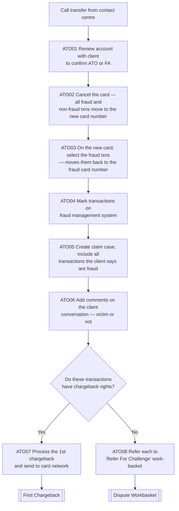

# Dispute Transfer to ITR Flow

**Purpose:** The fraud path of a dispute: when account takeover (ATO) or a fraudulent application is suspected, the call is transferred from the contact centre to the **fraud investigations team**, who confirm the fraud with the client, cancel and reissue the card (moving fraud vs. non-fraud transactions to the right card numbers), mark the fraud, create the claim case with victim commentary, and either raise a first chargeback or refer the items to the challenge work-basket.

**Position:** Invoked from [[Initiate Dispute Flow]] when fraud is indicated; leads to [[First Chargeback Flow]] (chargeback-eligible) or [[Dispute Workbasket Flow]] (challenge). Source step labels `ATO01`–`ATO08` are preserved. The companion *fraud investigations team* is the source's "ITR" inbound team.

## Flow

## Step Detail

### Step ATO01 — Confirm Fraud with Client

> **Step ID:** `ATO01` · **Capability:** FRR-FRD-04 (fraud investigation) · **Actor:** Fraud investigations team · **Preconditions:** transferred from [[Initiate Dispute Flow]] · **Exits:** → ATO02

The specialist **reviews the account with the client to confirm account takeover (ATO) or fraudulent application (FA)**.

### Step ATO02 — Cancel Card (Move All Transactions)

> **Step ID:** `ATO02` · **Capability:** SVC-NON-08 (card block), SVC-NON-06 (reissue) · **Preconditions:** ATO01 · **Exits:** → ATO03

The specialist **cancels the card**; all transactions — both fraud and non-fraud — are transferred to the **new card number** on the card processing platform.

### Step ATO03 — Reassign Fraud Transactions

> **Step ID:** `ATO03` · **Capability:** FRR-FRD-03 (fraud detection) · **Preconditions:** ATO02 · **Exits:** → ATO04

On the new card, the specialist **selects the fraud transactions**, which **moves them back to the (old) fraud card number** — isolating fraudulent activity on the compromised card while genuine activity follows the customer to the new card.

### Step ATO04 — Mark Transactions

> **Step ID:** `ATO04` · **Capability:** FRR-FRD-03 · **Preconditions:** ATO03 · **Exits:** → ATO05

The specialist **marks the transactions on the fraud management system**.

### Step ATO05 — Create Claim Case

> **Step ID:** `ATO05` · **Capability:** OPS-CAS-01 (create case) · **Preconditions:** ATO04 · **Exits:** → ATO06

The specialist **creates a claim case on the disputes platform and includes all the transactions the client says are fraud**.

### Step ATO06 — Record Victim Commentary

> **Step ID:** `ATO06` · **Capability:** OPS-CAS-04 (audit track) · **Preconditions:** ATO05 · **Exits:** → ATO07/ATO08 (chargeback-rights gate)

The specialist **adds comments on the conversation with the client as to whether they are a victim or not** — the auditable basis for the liability decision.

### Step ATO07 — Raise First Chargeback

> **Step ID:** `ATO07` · **Capability:** PAY-TXN-04 (chargebacks) · **Preconditions:** ATO06 + chargeback rights exist · **Exits:** → [[First Chargeback Flow]]

Where the transactions **have chargeback rights**, the disputes platform **processes the first chargeback and sends it to the card network**.

### Step ATO08 — Refer to Challenge Work-Basket

> **Step ID:** `ATO08` · **Capability:** OPS-CAS-02 (routing); PAY-TXN-06 · **Preconditions:** ATO06 + no chargeback rights · **Exits:** → [[Dispute Workbasket Flow]]

Where there are **no chargeback rights**, each item is **referred to the 'Refer For Challenge' work-basket** for specialist review.

## Business Rules (Generalized)

| Rule | Statement |
|---|---|
| Confirm before acting | Fraud (ATO/FA) is confirmed with the client first |
| Card-number isolation | Non-fraud transactions follow the customer to the new card; fraud stays on the old card number |
| Victim commentary recorded | The case records whether the client is assessed as a victim |
| Chargeback-rights gate | A first chargeback is raised only where chargeback rights exist; otherwise the item is challenged |

## Capability Mapping

| Capability | How exercised |
|---|---|
| [[Fraud Management]] FRR-FRD-04/03 | Fraud confirmation, transaction marking, fraud/non-fraud isolation |
| [[Case Management]] OPS-CAS-01/04 | Claim-case creation and victim commentary |
| [[Servicing - Monetary]] SVC-MON-07 | The fraud dispute claim |
| [[Transaction Processing]] PAY-TXN-04 | First chargeback when rights exist |
| Servicing — Non-Monetary (adjacent) | Card cancel and reissue |

## Source Traceability

Generalized from the *Dispute Transfer to ITR* flow (ITR Inbound lane, steps ATO01–ATO08). "ITR" abstracted to the fraud investigations team; TS2, PRM, CRS, MC abstracted per [[Systems and Integration Reference]]; source deck (Capco, 2020) is workshop material.
