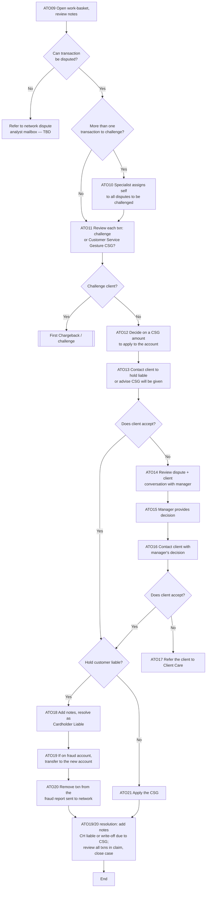

# Dispute Workbasket Flow

**Purpose:** How a fraud claims specialist works disputes from the work-basket: deciding whether a transaction can be disputed at all, whether to **challenge** (pursue a chargeback) or apply a **Customer Service Gesture (CSG)** goodwill credit, contacting the client about liability, escalating to the manager and ultimately Client Care where the client does not accept, and finally resolving — **holding the customer liable** (with fraud-report removal) or **applying the CSG** — and closing the claim.

**Position:** Reached from [[Dispute Transfer to ITR Flow]] / [[Initiate Dispute Flow]] (challenge work-basket). Challenged items feed [[First Chargeback Flow]]; unresolved complaints route to Client Care. Source step labels `ATO09`–`ATO21` are preserved (the source numbered two steps `ATO19`/`ATO20` twice; the second occurrences are noted as *resolution* steps). Combines the source's *Workbasket* and *Workbasket – Con't* pages.

## Flow

## Step Detail

### Step ATO09 — Open Work-Basket; Disputability Gate

> **Step ID:** `ATO09` · **Capability:** OPS-CAS-02 (routing), FRR-FRD-05 (fraud queue) · **Actor:** Fraud claims specialist · **Exits:** disputable → ATO10/11; not disputable → network dispute-analyst mailbox (TBD)

The specialist **opens the work-basket and reviews the notes**, then decides whether the **transaction can be disputed**. If not, it is **referred to the network dispute-analyst mailbox** (process TBD in source).

### Step ATO10 — Assign Multiple Challenges

> **Step ID:** `ATO10` · **Capability:** OPS-CAS-02 · **Preconditions:** ATO09 (disputable) · **Exits:** → ATO11

If there is **more than one transaction to challenge**, the specialist **assigns themselves to all the disputes to be challenged** (so a single owner works the related items).

### Step ATO11 — Challenge or Goodwill Decision

> **Step ID:** `ATO11` · **Capability:** FRR-FRD-04; SVC-MON-07 · **Preconditions:** ATO09/10 · **Inputs:** per-transaction assessment · **Exits:** challenge → [[First Chargeback Flow]]; no challenge → ATO12

The specialist **reviews each transaction to decide whether a challenge or a Customer Service Gesture (CSG) should apply**. **Challenge** → the dispute is pursued as a chargeback against the merchant ([[First Chargeback Flow]]). **No challenge** → a CSG is considered.

### Step ATO12 — Decide CSG Amount

> **Step ID:** `ATO12` · **Capability:** SVC-MON-03 (adjustments) · **Preconditions:** ATO11 (no challenge) · **Exits:** → ATO13

The specialist **decides on a CSG amount to apply to the account** (a goodwill credit in lieu of pursuing a chargeback).

### Step ATO13 — Contact Client on Outcome

> **Step ID:** `ATO13` · **Capability:** CEN-REL-04 (complaints); OPS-CAS-04 · **Preconditions:** ATO12 · **Inputs:** client acceptance · **Exits:** accepts → ATO-HOLD; does not accept → ATO14

The specialist **contacts the client to hold them liable or to advise that a CSG will be given**. A **client-acceptance** gate follows: accept → resolution; do not accept → manager escalation.

### Step ATO14–ATO17 — Manager Escalation and Client Care

> **Step ID:** `ATO14`–`ATO17` · **Capability:** OPS-CAS-05 (escalation); CEN-REL-04 · **Preconditions:** ATO13 (client did not accept) · **Exits:** client accepts manager decision → ATO-HOLD; still not accepted → Client Care

If the client does not accept, the specialist **reviews the dispute and client conversation with the manager for a final decision** (`ATO14`); the **manager provides the decision** (`ATO15`); the specialist **contacts the client with the manager's decision** (`ATO16`). A second client-acceptance gate: accept → resolution; **still not accepted → refer the client to Client Care** (`ATO17`).

### Step ATO18–ATO20 — Hold Customer Liable

> **Step ID:** `ATO18`–`ATO20` · **Capability:** OPS-CAS-06 (resolution); FRR-FRD-03; SVC-MON-07 · **Preconditions:** decision = hold liable · **Exits:** → resolution close

On a **hold-liable** outcome: **add notes and resolve as Cardholder Liable** (`ATO18`); **if the transaction is on the fraud account, transfer it to the new account** (`ATO19`); **remove the transaction from the fraud report that was sent to the network** (`ATO20`) — since a cardholder-liable item is not a fraud loss.

### Step ATO21 — Apply CSG

> **Step ID:** `ATO21` · **Capability:** SVC-MON-03 · **Preconditions:** decision = not liable (goodwill) · **Exits:** → resolution close

Where the customer is **not held liable**, the specialist **applies the CSG** to the account.

### Step ATO-RES — Resolution and Close

> **Step ID:** `ATO19/ATO20` (second occurrence in source) · **Capability:** OPS-CAS-04/06 · **Preconditions:** ATO20 or ATO21 · **Exits:** End

The specialist **adds resolution notes** (resolve = CH liable, or write-off due to CSG purchase / CSG cash) and **reviews all the transactions in the claim to ensure all are resolved before closing the case**.

## Business Rules (Generalized)

| Rule | Statement |
|---|---|
| Disputability first | A transaction must be disputable; otherwise it goes to the network dispute-analyst mailbox |
| Single owner for multi-item | One specialist owns all related challenges |
| Challenge vs. CSG | Each transaction is either challenged (chargeback) or resolved with a goodwill CSG |
| Escalate on non-acceptance | Client non-acceptance escalates to the manager, then to Client Care |
| Fraud-report hygiene | A cardholder-liable item is removed from the network fraud report |
| Close only when fully resolved | All transactions in the claim must be resolved before the case is closed |

## Capability Mapping

| Capability | How exercised |
|---|---|
| [[Fraud Management]] FRR-FRD-04/05/03 | Fraud claim handling, queue, fraud-report maintenance |
| [[Case Management]] OPS-CAS-02/04/05/06 | Routing, audit notes, escalation, resolution/closure |
| [[Servicing - Monetary]] SVC-MON-07/03 | Dispute resolution; CSG adjustment / write-off |
| Customer Engagement — Relationship Mgmt (adjacent) | Client contact and Client Care complaint referral |

## Source Traceability

Generalized from the *Workbasket* and *Workbasket – Con't* flows (ITR Inbound lane, steps ATO09–ATO21). The duplicated `ATO19`/`ATO20` labels in the source are represented as distinct hold-liable and resolution steps. "ITR"/"MC" abstracted per [[Systems and Integration Reference]]; source deck (Capco, 2020) contained TBD items.
