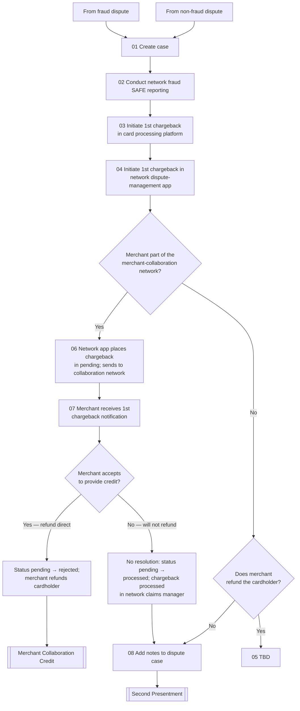

# First Chargeback Flow

**Purpose:** How the dispute analyst raises the **first chargeback** against the card network and acquirer — creating the case, conducting network fraud (SAFE) reporting for fraud disputes, initiating the chargeback in both the card processing platform and the network dispute-management application, and routing merchant-collaboration-network members through a fast merchant-credit path while others proceed toward the acquirer's second presentment.

**Position:** Entered from a fraud dispute ([[Dispute Transfer to ITR Flow]]) or a non-fraud dispute ([[Initiate Dispute Flow]]). Collaboration-network members branch to [[Merchant Collaboration Credit Flow]]; non-resolved cases proceed to [[Second Presentment Flow]].

## Flow

## Step Detail

### Step CB1-01 — Create Case and SAFE Reporting

> **Step ID:** `CB1-01` (source steps 01–02) · **Capability:** OPS-CAS-01 (create case); FRR-FRD-02 (SAFE reporting) · **Actor:** Disputes analyst · **Exits:** → CB1-02

The analyst **creates the case** on the disputes platform and, for fraud disputes, **conducts network fraud (SAFE) reporting** — registering the fraud with the card network's fraud-reporting system.

### Step CB1-02 — Initiate the Chargeback in Both Systems

> **Step ID:** `CB1-02` (source steps 03–04) · **Capability:** PAY-TXN-04 (chargebacks) · **Preconditions:** CB1-01 · **Exits:** → CB1-03

The analyst **initiates the first chargeback in the card processing platform** and **in the network dispute-management application** — the chargeback must exist in both the issuer's system of record and the network's inflight-dispute tool.

### Step CB1-03 — Collaboration-Network Routing

> **Step ID:** `CB1-03` (source steps 06–07) · **Capability:** PAY-TXN-04; PAY-STL-02 (direct merchant) · **Preconditions:** CB1-02 · **Inputs:** merchant network membership · **Exits:** member → CB1-04; non-member → CB1-05

If the merchant is part of the **merchant-collaboration network**, the network application **places the chargeback in pending status and sends it to the collaboration network**, and the **merchant receives the first-chargeback notification** — a fast lane to a merchant credit before formal processing.

### Step CB1-04 — Merchant Credit Decision (Member)

> **Step ID:** `CB1-04` · **Capability:** PAY-STL-02; PAY-TXN-05 (reversals) · **Preconditions:** CB1-03 (member) · **Inputs:** merchant decision · **Exits:** accepts → [[Merchant Collaboration Credit Flow]]; declines → no-resolution processing

If the merchant **accepts to provide credit**, the chargeback status moves **pending → rejected** and the merchant **refunds the cardholder directly** → [[Merchant Collaboration Credit Flow]]. If the merchant **will not refund**, there is **no resolution**: status moves **pending → processed** and the chargeback is processed in the network claims manager.

### Step CB1-05 — Non-Member Refund Decision

> **Step ID:** `CB1-05` (source steps 05, 08) · **Capability:** PAY-TXN-04; OPS-CAS-04 · **Preconditions:** CB1-03 (non-member) · **Inputs:** merchant refund · **Exits:** refund → resolution (TBD); no refund → CB1-06

For non-collaboration merchants, if the merchant **refunds the cardholder**, the case resolves (process TBD in source). If **not**, the analyst **adds notes to the dispute case** and the case proceeds to the acquirer's second presentment.

### Step CB1-06 — Proceed to Second Presentment

> **Step ID:** `CB1-06` · **Capability:** PAY-TXN-04 · **Preconditions:** CB1-04 (no resolution) or CB1-05 (no refund) · **Exits:** → [[Second Presentment Flow]]

The processed chargeback awaits the acquirer's response → [[Second Presentment Flow]].

## Business Rules (Generalized)

| Rule | Statement |
|---|---|
| Dual initiation | The chargeback is initiated in both the card platform and the network application |
| SAFE for fraud | Network fraud (SAFE) reporting is conducted for fraud disputes |
| Collaboration fast-lane | Collaboration-network merchants get a notification and a chance to refund before formal processing |
| Status transitions | Merchant accepts → pending→rejected (direct refund); declines → pending→processed (claims manager) |
| Unresolved → 2nd presentment | A processed, unrefunded chargeback proceeds to the acquirer's second presentment |

## Capability Mapping

| Capability | How exercised |
|---|---|
| [[Transaction Processing]] PAY-TXN-04/05 | First chargeback initiation and status transitions |
| [[Case Management]] OPS-CAS-01/03/04 | Case creation, status, notes |
| [[Fraud Management]] FRR-FRD-02 | Network fraud (SAFE) reporting |
| [[Settlement]] PAY-STL-02 | Direct merchant refund path |

## Source Traceability

Generalized from the *1st Chargeback* flow (RCS – Dispute Analyst lane). CRS, TSYS/TS2, MCOM (MasterCom), MC, and Ethoca abstracted per [[Systems and Integration Reference]]; source deck (Capco, 2020) contained a TBD resolution step.
