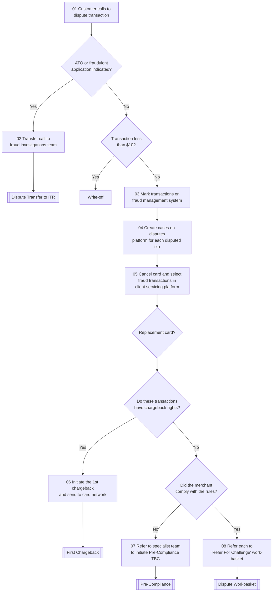

# Initiate Dispute Flow

**Purpose:** The front door of the disputes process: a customer calls the contact centre to dispute a transaction, and the agent triages it — routing suspected fraud to the fraud investigations team, writing off low-value items, and otherwise creating dispute cases, marking transactions, and determining whether the transactions carry **chargeback rights** before raising a first chargeback or referring to the compliance/challenge tracks.

**Position:** Entry point for the whole library. Suspected fraud branches to [[Dispute Transfer to ITR Flow]]; chargeback-eligible items proceed to [[First Chargeback Flow]]; rules-violation items go to [[Pre-Compliance Flow]]; others go to the challenge work-basket ([[Dispute Workbasket Flow]]).

## Flow

## Step Detail

### Step INIT-01 — Customer Disputes a Transaction

> **Step ID:** `INIT-01` (source step 01) · **Capability:** SVC-MON-07 (Disputes); CHN-AS (contact centre) · **Actor:** Customer + contact-centre agent · **Exits:** → INIT-02 triage

The customer calls the contact centre to **dispute a transaction**. The agent opens the dispute on the client servicing platform.

### Step INIT-02 — Fraud Triage

> **Step ID:** `INIT-02` (source step 02) · **Capability:** FRR-FRD-03/04 · **Preconditions:** INIT-01 · **Inputs:** ATO/FA indicators · **Exits:** fraud → [[Dispute Transfer to ITR Flow]]; otherwise → INIT-03

The agent assesses whether **account takeover (ATO) or a fraudulent application (FA)** is indicated. If so, the **call is transferred to the fraud investigations team** ([[Dispute Transfer to ITR Flow]]) and this flow ends. Otherwise it continues as a standard (non-fraud) dispute.

### Step INIT-03 — Low-Value Write-Off Gate

> **Step ID:** `INIT-03` · **Capability:** SVC-MON-07; OPS-WFR (policy) · **Preconditions:** INIT-02 (not fraud) · **Inputs:** transaction amount · **Exits:** < $10 → write-off (terminal); ≥ $10 → INIT-04

A value gate: transactions **under $10** are **written off** rather than disputed (the cost of pursuing a chargeback exceeds the value). Items at or above the threshold proceed.

### Step INIT-04 — Mark Transactions and Create Cases

> **Step ID:** `INIT-04` (source steps 03–04) · **Capability:** FRR-FRD-03; OPS-CAS-01 (create case) · **Preconditions:** INIT-03 · **Exits:** → INIT-05

The agent **marks the transactions on the fraud management system** and **creates a case on the disputes platform for each disputed transaction**.

### Step INIT-05 — Cancel Card / Replacement

> **Step ID:** `INIT-05` (source step 05) · **Capability:** SVC-NON-08 (card block), SVC-NON-06 (card reissue) · **Preconditions:** INIT-04 · **Exits:** → INIT-06

The agent **cancels the card and selects the fraud transactions in the client servicing platform**, with a **replacement-card** sub-decision where a reissue is required.

### Step INIT-06 — Chargeback-Rights Determination

> **Step ID:** `INIT-06` (source step 06) · **Capability:** PAY-TXN-04 (chargebacks) · **Preconditions:** INIT-05 · **Inputs:** network chargeback-rights rules · **Exits:** rights → INIT-07; no rights → INIT-08

The agent determines whether the disputed transactions **carry chargeback rights** under network rules. If they do, the agent **initiates the first chargeback and sends it to the card network** → [[First Chargeback Flow]].

### Step INIT-07 — Rules-Compliance Branch (Pre-Compliance)

> **Step ID:** `INIT-07` (source step 07) · **Capability:** PAY-TXN-04; OPS-CAS-05 (escalation) · **Preconditions:** INIT-06 (no chargeback rights) · **Exits:** merchant did not comply → [[Pre-Compliance Flow]]

Where there are no chargeback rights, the agent checks whether the **merchant complied with the rules**. If **not**, the case is **referred to the specialist team to initiate pre-compliance** (marked *to be confirmed* in source) → [[Pre-Compliance Flow]].

### Step INIT-08 — Challenge Work-Basket

> **Step ID:** `INIT-08` (source step 08) · **Capability:** PAY-TXN-06 (exception handling); OPS-CAS-02 (routing) · **Preconditions:** INIT-06 (no rights) and merchant complied · **Exits:** → [[Dispute Workbasket Flow]]

Where the merchant complied and there are no chargeback rights, each item is **referred to the 'Refer For Challenge' work-basket** for specialist review ([[Dispute Workbasket Flow]]).

## Business Rules (Generalized)

| Rule | Statement |
|---|---|
| Fraud routes out at intake | ATO/FA-indicated disputes transfer to the fraud investigations team |
| Low-value write-off | Transactions under $10 are written off rather than disputed |
| Case per transaction | A dispute case is created on the disputes platform for each disputed transaction |
| Card cancelled on fraud | The compromised card is cancelled and fraud transactions selected; a replacement may be issued |
| Chargeback rights gate | A first chargeback is raised only where chargeback rights exist |
| No-rights routing | Without chargeback rights, non-compliant merchants go to pre-compliance; compliant ones to the challenge work-basket |

## Capability Mapping

| Capability | How exercised |
|---|---|
| [[Servicing - Monetary]] SVC-MON-07 | The dispute claim itself, logged and triaged |
| [[Case Management]] OPS-CAS-01/02 | Case creation per transaction; routing to fraud/compliance/challenge |
| [[Transaction Processing]] PAY-TXN-04/06 | Chargeback-rights determination; exception routing |
| [[Fraud Management]] FRR-FRD-03 | Marking transactions; fraud triage |
| Servicing — Non-Monetary (adjacent) | Card cancel/replacement |

## Source Traceability

Generalized from the *Initiate Dispute* flow (contact-centre lane). CIBC abstracted to "the bank"; CRS, PRM, PSP, MC, and the ESD/ITR teams abstracted per [[Systems and Integration Reference]]. Source deck (Capco, 2020) contained TBC items, preserved as such.
