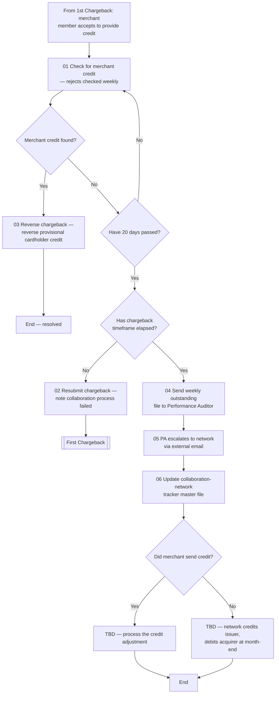

# Merchant Collaboration Credit Flow

**Purpose:** How a chargeback resolved through the **merchant-collaboration network** is reconciled: the analyst checks (weekly) whether the merchant credit has arrived, **reverses the chargeback** (and the provisional cardholder credit) when it has, and — when it has not within the network window — either **resubmits the chargeback** or escalates to the card network for the end-of-month issuer credit, tracking outstanding items on a master file.

**Position:** Entered from [[First Chargeback Flow]] when a collaboration-network merchant accepts to provide a credit. Resubmission loops back to [[First Chargeback Flow]]. The source vendor is "Ethoca" (a card-network merchant-collaboration network); abstracted here to the generic *merchant-collaboration network*.

## Flow

## Step Detail

### Step ETH-01 — Check for Merchant Credit

> **Step ID:** `ETH-01` (source step 01) · **Capability:** PAY-STL-05 (recon files) · **Actor:** Disputes analyst · **Preconditions:** collaboration merchant accepted to credit · **Exits:** found → ETH-02; not found → timing gates

The analyst **checks for the merchant credit**. Collaboration-network rejects are **checked for merchant credits on a weekly basis**.

### Step ETH-02 — Reverse Chargeback on Credit Received

> **Step ID:** `ETH-02` (source step 03) · **Capability:** PAY-TXN-05 (reversals); SVC-MON-11 (refunds/reversals) · **Preconditions:** ETH-01 (credit found) · **Exits:** End (resolved)

When the merchant credit is found, the analyst **reverses the chargeback** — because the **client was already credited when the dispute process was initiated**, that provisional credit is reversed once the merchant credit is received (avoiding a double credit).

### Step ETH-03 — Timing Gates

> **Step ID:** `ETH-03` · **Capability:** OPS-WFR-06 (SLA) · **Preconditions:** ETH-01 (no credit) · **Exits:** within timeframe → resubmit; timeframe elapsed → escalate

If no credit is found, two timers apply: **have 20 days passed?** (if not, keep checking) and **has the chargeback timeframe elapsed?** If the timeframe has **not** elapsed, the analyst **resubmits the chargeback** (with a note that the collaboration process failed) → [[First Chargeback Flow]]. If it **has** elapsed, the outstanding item is escalated.

### Step ETH-04 — Escalate and Track

> **Step ID:** `ETH-04` (source steps 04–06) · **Capability:** PAY-STL-05/01; OPS-CAS-05 (escalation) · **Preconditions:** ETH-03 (timeframe elapsed) · **Exits:** → ETH-05

The analyst **sends the weekly outstanding file to the Performance Auditor**, who **escalates to the card network via external email** (the network support mailbox). The item is recorded on the **collaboration-network tracker master file** that tracks all rejects.

### Step ETH-05 — Month-End Settlement

> **Step ID:** `ETH-05` · **Capability:** PAY-STL-01 (network settle) · **Preconditions:** ETH-04 · **Inputs:** whether merchant sent credit · **Exits:** End

A final gate: **did the merchant send the credit?** If yes, the credit adjustment is processed (process TBD in source). If no, the **card network credits the issuer and debits the acquirer at the end of the month** (process TBD in source).

## Business Rules (Generalized)

| Rule | Statement |
|---|---|
| Weekly check | Collaboration rejects are checked for merchant credits weekly |
| Reverse provisional credit | When the merchant credit arrives, the provisional cardholder credit is reversed |
| Resubmit within window | If no credit and the chargeback timeframe has not elapsed, the chargeback is resubmitted |
| Escalate when elapsed | Outstanding items beyond the timeframe escalate to the auditor and the network |
| Month-end settlement | Absent a merchant credit, the network credits the issuer and debits the acquirer month-end |

## Capability Mapping

| Capability | How exercised |
|---|---|
| [[Transaction Processing]] PAY-TXN-05/04 | Chargeback reversal and resubmission |
| [[Servicing - Monetary]] SVC-MON-11 | Reversal of the provisional cardholder credit |
| [[Settlement]] PAY-STL-05/01/02 | Reconciliation files, network settlement, merchant credit |

## Source Traceability

Generalized from the *Ethoca* flow (RCS – Dispute Analyst / Performance Auditor lanes). "Ethoca" abstracted to the merchant-collaboration network; TS2, CRS, the MC support mailbox, and the Ethoca tracker abstracted per [[Systems and Integration Reference]]; source deck (Capco, 2020) contained TBD settlement steps.
