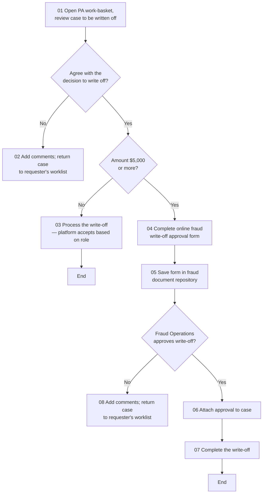

# Performance Auditor Writeoff Flow

**Purpose:** How a dispute **write-off beyond a dispute analyst's authority** is approved: the Performance Auditor reviews the case, applies a value threshold ($5,000), and for higher-value write-offs obtains a Fraud-Operations approval (captured on a form and stored in the fraud document repository) before completing the write-off — or returns the case to the requester if not agreed/approved.

**Position:** Invoked from [[Second Presentment Flow]] and [[Arbitration Flow]] when a write-off exceeds dispute-analyst authority. The write-off itself is a [[Servicing - Monetary|SVC-MON-07]] loss action gated by [[Case Management|OPS-CAS]] approvals.

## Flow

## Step Detail

### Step PAW-01 — Review the Write-Off Request

> **Step ID:** `PAW-01` (source step 01) · **Capability:** OPS-WFR-02 (approvals); OPS-CAS-05 · **Actor:** Performance Auditor · **Preconditions:** referred from a resolution flow · **Exits:** agree → PAW-02; disagree → return to requester

The Performance Auditor **opens the work-basket and reviews the case to be written off**, then decides whether they **agree with the decision to write off**. If not, they **add comments and return the case to the requester's worklist** (`step 02`).

### Step PAW-02 — Value Threshold

> **Step ID:** `PAW-02` · **Capability:** OPS-WFR-02; FRR-FRD-01 (fraud-loss policy) · **Preconditions:** PAW-01 (agree) · **Inputs:** write-off amount · **Exits:** < $5,000 → process directly; ≥ $5,000 → PAW-03

The Auditor applies a value threshold: **amount $5,000 or more?** If **under**, the Auditor **processes the write-off** (the platform accepts it based on the Auditor's role) and the case ends. If **at or above**, additional approval is required.

### Step PAW-03 — Fraud-Operations Approval

> **Step ID:** `PAW-03` (source steps 04–05) · **Capability:** OPS-WFR-02; OPS-CAS-04 · **Preconditions:** PAW-02 (≥ $5,000) · **Exits:** → PAW-04 decision

The Auditor **completes an online fraud write-off approval form** and **saves it in the fraud document repository** — creating the auditable approval record for the higher-value write-off.

### Step PAW-04 — Approval Outcome and Completion

> **Step ID:** `PAW-04` (source steps 06–08) · **Capability:** OPS-CAS-06 (resolution); SVC-MON-07 · **Preconditions:** PAW-03 · **Inputs:** Fraud-Operations decision · **Exits:** approved → complete; not approved → return to requester

A **Fraud-Operations approval** gate: if **not approved**, the Auditor **adds comments and returns the case to the requester's worklist** (`step 08`). If **approved**, the Auditor **attaches the approval to the case** (`step 06`) and **completes the write-off** (`step 07`).

## Business Rules (Generalized)

| Rule | Statement |
|---|---|
| Auditor agreement first | The Auditor must agree with the write-off before processing |
| Value threshold | Write-offs of $5,000 or more require a Fraud-Operations approval |
| Documented approval | Higher-value write-offs are evidenced by a form stored in the fraud document repository |
| Role-based processing | Sub-threshold write-offs are processed directly based on the Auditor's role |
| Return on rejection | Disagreement or non-approval returns the case to the requester's worklist |

## Capability Mapping

| Capability | How exercised |
|---|---|
| Operations — Workflow & Rules OPS-WFR-02 | Write-off approval gates and thresholds |
| [[Case Management]] OPS-CAS-04/05/06 | Approval evidence, escalation, resolution |
| [[Servicing - Monetary]] SVC-MON-07 | The write-off (loss) action on the dispute |
| [[Fraud Management]] FRR-FRD-01 (adjacent) | Fraud-loss write-off policy/authority |

## Source Traceability

Generalized from the *2nd Presentment – PA Writeoff* flow (Performance Auditor lane). CRS, the Fraud SharePoint, and the FO approver abstracted per [[Systems and Integration Reference]]; source deck (Capco, 2020) is workshop material.
