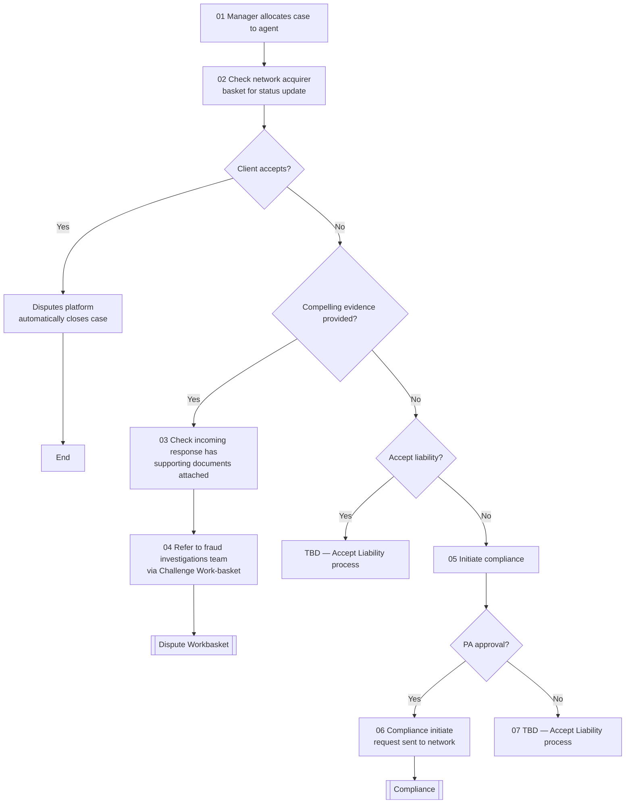

# Pre-Compliance Flow

**Purpose:** The pre-compliance track, used when a dispute rests on a **merchant/acquirer rules violation** rather than standard chargeback rights. A manager allocates the case, the analyst checks the network acquirer basket for a status update, and depending on the acquirer's response — whether the client accepts, whether compelling evidence/supporting documents are provided, and whether liability is accepted — the case auto-closes, routes to the fraud-investigations challenge work-basket, or escalates into formal **compliance** (with Performance-Auditor approval).

**Position:** Entered from [[Initiate Dispute Flow]] (merchant did not comply with the rules). Escalation leads to [[Compliance Flow]]; document-backed responses route to [[Dispute Workbasket Flow]] (challenge work-basket).

## Flow

## Step Detail

### Step PCMP-01 — Allocate and Check Status

> **Step ID:** `PCMP-01` (source steps 01–02) · **Capability:** OPS-CAS-02 (routing), OPS-CAS-03 (status) · **Actor:** RCS manager + dispute analyst · **Preconditions:** referred from [[Initiate Dispute Flow]] · **Exits:** → PCMP-02

The **manager allocates the case to an agent**, who **checks the network acquirer basket for a status update** on the inflight dispute.

### Step PCMP-02 — Client Acceptance

> **Step ID:** `PCMP-02` · **Capability:** OPS-CAS-06 (resolution); CEN-REL-04 · **Preconditions:** PCMP-01 · **Inputs:** client decision · **Exits:** accept → auto-close (End); reject → PCMP-03

A client-acceptance gate: if the **client accepts**, the **disputes platform automatically closes the case**. Otherwise the analyst evaluates the acquirer's response.

### Step PCMP-03 — Evidence Assessment

> **Step ID:** `PCMP-03` (source steps 03–04) · **Capability:** OPS-CAS-04 (audit/documents) · **Preconditions:** PCMP-02 (not accepted) · **Inputs:** compelling evidence? · **Exits:** evidence → challenge work-basket; no evidence → PCMP-04

If **compelling evidence is provided**, the analyst **checks the incoming response has supporting documents attached** and **refers the case to the fraud investigations team via the Challenge Work-basket** ([[Dispute Workbasket Flow]]).

### Step PCMP-04 — Liability and Compliance Escalation

> **Step ID:** `PCMP-04` (source steps 05–07) · **Capability:** PAY-TXN-04; OPS-WFR-02 (approvals); OPS-CAS-05 · **Preconditions:** PCMP-03 (no compelling evidence) · **Exits:** accept liability → TBD; initiate compliance + PA approves → [[Compliance Flow]]

Where there is no compelling evidence, an **accept-liability** gate: if liability is **accepted**, an accept-liability process runs (TBD in source). If **not accepted**, the analyst **initiates compliance**, and on **Performance-Auditor approval** the **compliance-initiate request is sent to the network** → [[Compliance Flow]]; without PA approval, an accept-liability process runs (TBD).

## Business Rules (Generalized)

| Rule | Statement |
|---|---|
| Rules-violation track | Pre-compliance is used when the dispute rests on a merchant rules violation |
| Status from acquirer basket | The analyst checks the network acquirer basket for the inflight status |
| Auto-close on acceptance | Client acceptance auto-closes the case |
| Evidence → challenge | A document-backed acquirer response routes to the challenge work-basket |
| PA approval to escalate | Initiating formal compliance to the network requires Performance-Auditor approval |

## Capability Mapping

| Capability | How exercised |
|---|---|
| [[Transaction Processing]] PAY-TXN-04 | The pre-compliance/compliance chargeback track |
| [[Case Management]] OPS-CAS-02/03/04/05 | Allocation, status, document checks, escalation |
| Operations — Workflow & Rules OPS-WFR-02 | PA approval to initiate compliance |
| Customer Engagement — Relationship Mgmt (adjacent) | Client acceptance handling |

## Source Traceability

Generalized from the *Pre-Compliance* flow (ITR Inbound / RCS lanes). CRS, the MC acquirer basket, the "CRA" auto-close, and the ITR team abstracted per [[Systems and Integration Reference]]; multiple accept-liability steps are preserved as TBD from the source deck (Capco, 2020).
