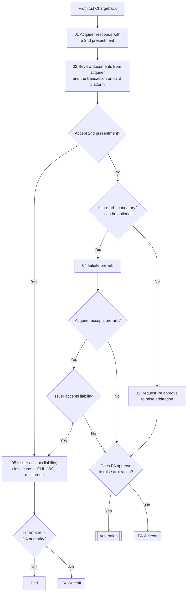

# Second Presentment Flow

**Purpose:** How the dispute analyst handles the **acquirer's second presentment** — the merchant's bank responding to the first chargeback. The analyst reviews the supporting documents and the transaction, then either **accepts** liability and closes the case, or escalates via **pre-arbitration** and, with Performance-Auditor approval, **arbitration** — with write-offs beyond the analyst's authority routed to the auditor.

**Position:** Entered from [[First Chargeback Flow]]. Escalation leads to [[Arbitration Flow]]; over-authority write-offs to [[Performance Auditor Writeoff Flow]].

## Flow

## Step Detail

### Step CB2-01 — Acquirer Responds; Review

> **Step ID:** `CB2-01` (source steps 01–02) · **Capability:** PAY-TXN-04 (chargebacks); OPS-CAS-03 · **Actor:** Disputes analyst · **Preconditions:** first chargeback processed · **Exits:** → CB2-02

The **acquirer (the merchant's bank) responds to the dispute with a second presentment**. The analyst **reviews the documents provided by the acquirer and the transaction on the card processing platform**.

### Step CB2-02 — Accept or Escalate

> **Step ID:** `CB2-02` · **Capability:** PAY-TXN-04; OPS-CAS-06 (resolution) · **Preconditions:** CB2-01 · **Inputs:** acceptance decision · **Exits:** accept → CB2-05; reject → CB2-03

The analyst decides whether to **accept the second presentment**. Accepting means **the issuer accepts liability**; the case is **closed with the appropriate action — Cardholder Liable (CHL), Write-Off (WO), or multiprong**. (Per source: accepting the pre-arb later means the bank agrees its initial dispute is not legitimate based on the document review.)

### Step CB2-03 — Pre-Arbitration Path

> **Step ID:** `CB2-03` (source steps 03–04) · **Capability:** PAY-TXN-04; OPS-WFR-02 (approvals) · **Preconditions:** CB2-02 (not accepted) · **Exits:** → CB2-04 decisions

If the analyst does **not** accept, the path depends on whether **pre-arbitration is mandatory** (it can be optional):

- **Pre-arb mandatory** → the analyst **initiates pre-arb**.
- **Not mandatory** → the analyst **requests Performance-Auditor approval to raise arbitration** directly.

*(Open question in source: if the acquirer responds outside 45 days from the first chargeback, is it mandatory to go to the arbitration flow?)*

### Step CB2-04 — Pre-Arb Outcome and Arbitration Decision

> **Step ID:** `CB2-04` · **Capability:** PAY-TXN-04; OPS-WFR-02; OPS-CAS-05 · **Preconditions:** CB2-03 · **Exits:** issuer liable → CB2-05; PA approves → [[Arbitration Flow]]; PA declines → [[Performance Auditor Writeoff Flow]]

After initiating pre-arb: **does the acquirer accept the pre-arb?** If yes, **does the issuer accept liability?** — yes → close (CB2-05); no → the **PA-approval-to-arbitrate** gate. If the acquirer does not accept the pre-arb, the same **PA-approval** gate applies. **PA approves → [[Arbitration Flow]]; PA declines → [[Performance Auditor Writeoff Flow]]**.

### Step CB2-05 — Close and Write-Off Authority

> **Step ID:** `CB2-05` (source step 05) · **Capability:** OPS-CAS-06; SVC-MON-07 · **Preconditions:** issuer accepts liability · **Exits:** WO within authority → End; over authority → [[Performance Auditor Writeoff Flow]]

On issuer-accepts-liability, the case is **closed (CHL / WO / multiprong)**. A write-off is gated by authority: **is the WO within the dispute analyst's authority?** Yes → End; **No → [[Performance Auditor Writeoff Flow]]**.

## Business Rules (Generalized)

| Rule | Statement |
|---|---|
| Document review | The acquirer's documents and the transaction are reviewed before deciding |
| Accept = issuer liable | Accepting the second presentment closes the case with the issuer liable (CHL/WO/multiprong) |
| Pre-arb may be optional | Pre-arbitration is initiated where mandatory; otherwise arbitration is requested directly |
| Approval to arbitrate | Raising arbitration requires Performance-Auditor approval |
| Write-off authority | Write-offs beyond dispute-analyst authority route to the Performance Auditor |

## Capability Mapping

| Capability | How exercised |
|---|---|
| [[Transaction Processing]] PAY-TXN-04 | Second-presentment handling; pre-arb/arbitration escalation |
| [[Case Management]] OPS-CAS-03/05/06 | Status, escalation, resolution/closure |
| [[Servicing - Monetary]] SVC-MON-07 | Dispute liability resolution / write-off |
| Operations — Workflow & Rules OPS-WFR-02 | PA approval gates |

## Source Traceability

Generalized from the *2nd Presentment – RCS* flow (RCS – Dispute Analyst / Acquirer lanes). CRS, TS2, PA/DA roles abstracted per [[Systems and Integration Reference]]; the 45-day arbitration question is preserved as an open item from the source deck (Capco, 2020).
