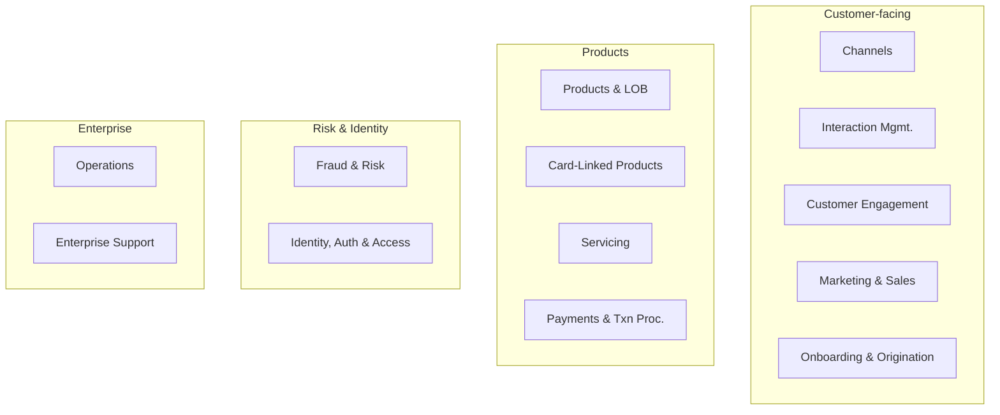

# Generic Multi-Functional Bank — Capability Model

The enterprise capability model for a **generic multi-functional bank** — the master reference that this library's process flows are mapped against. It is organized as **L0 domains → L1 capability groups → L2 capabilities**. The flows in this library are *generalized* from a real Canadian card-issuer integration program (credit-card content, rewards, product setup, and offer management); brand and vendor specifics have been abstracted to the generic roles described in [[Systems and Integration Reference]].

## L0 Domains

The thirteen L0 functional domains: **Fraud & Risk**, **Channels**, **Interaction Management**, **Identity, Auth & Access**, **Marketing & Sales**, **Customer Engagement**, **Onboarding & Origination**, **Products & LOB**, **Card-Linked Products**, **Servicing**, **Payments & Transaction Processing**, **Enterprise Support**, and **Operations** — supported by a corporate-function band (Business Strategy, Product Mgmt., Project Mgmt., HR & Talent, Legal, Vendor/Partner/Supplier, Facilities, Comms & Investor Relations, Corporate Responsibility).

## Scope Covered by This Library

The card-issuing content, rewards, product-setup, and offer-management flows in this library primarily exercise five L0 domains. The L1 capability groups documented as notes here are:

| L0 Domain | L1 Capability Group | ID | Note |
|---|---|---|---|
| Customer Engagement | Content Management | `CEN-CNT` | [[Content Management]] |
| Customer Engagement | Offers | `CEN-OFR` | [[Offers]] |
| Customer Engagement | Contact Management | `CEN-CON` | [[Contact Management]] |
| Card-Linked Products | Rewards | `CLP-RWD` | [[Rewards]] |
| Card-Linked Products | Loyalty | `CLP-LOY` | [[Loyalty]] |
| Products & LOB | Cards | `PLB-CRD` | [[Cards]] |
| Products & LOB | Insurance | `PLB-INS` | [[Insurance]] |
| Marketing & Sales | Marketing Strategy · CRM | `MKS-MKT` · `MKS-CRM` | [[Marketing and Sales]] |
| Servicing | Monetary | `SVC-MON` | [[Servicing - Monetary]] |

## Cross-Domain Dependencies

The flows here also touch capabilities owned by adjacent L0 domains, referenced inline rather than given their own notes:

- **Onboarding & Origination** (`ONB`) — new-customer acquisition and adjudication on the [[Phone Campaign New Customer Flow]]; **Collateral & Customer Communications** (`ONB-CCC`) for customer disclosures presented at offer and content publish time. (This domain is documented in depth in the companion *Onboarding & Origination* library.)
- **Identity, Auth & Access** (`IAA`) — operator entitlements, user groups/roles, and access controls exercised by the [[Operator Security Administration Flow]].
- **Operations** (`OPS`) — Workflow & Rules (workflow initiation, approvals, rules engine) and Case Management behind every approval/notification step in the product-setup flows.
- **Channels** (`CHN`) — self-serve (public web, IVR) and assisted (contact centre, agent desktop) surfaces the flows run on.
- **Enterprise Support** (`ENT`) — Books of Record (product BoR), Data & Analytics (the marketing data warehouse), and Docs & Integrations (document archival, API management).
- **Fraud & Risk** (`FRR`) — Compliance (regulatory disclosures) for [[Disclosure Management Flow]]; Credit Risk for penalty-pricing strategy in [[Manage Pricing Flow]].

## Identifier Conventions

- **Capability IDs** — `<L0>-<L1>-nn`, e.g., `CEN-CNT-01` (Customer Engagement → Content Management → Define / Publish). L0/L1 codes are listed in the scope table above.
- **Step IDs** — each process flow uses a flow-local prefix (e.g., `CPM-`, `BEN-A1`, `POP-`) on `Step XX-nn` headings, addressable as `[[Flow Name#Step XX-nn — Title]]`.
- Full traceability of flow steps to L2 capabilities lives in the [[Process-to-Capability Mapping Matrix]].

## Related

[[00 - Card Issuing and Offer Management Index]] · [[Systems and Integration Reference]] · [[Glossary]] · [[Canadian Regulatory Context]]
