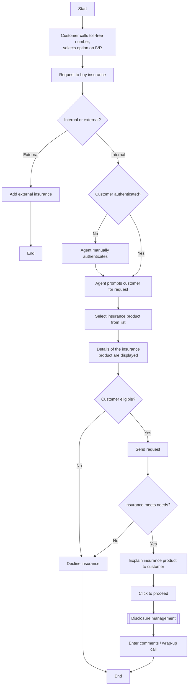

# Add Insurance Product Phone Channel Flow

**Purpose:** How a **customer buys a credit-protection insurance product over the phone** — the customer calls in requesting insurance, is authenticated, the agent selects the product and checks eligibility, explains the product, the customer confirms, and disclosure management and wrap-up complete the sale. Handles the internal-vs-external insurance fork.

**Position:** The dedicated phone *buy* flow for insurance (distinct from offer-driven [[Insurance Offer Presentment Flow]]); products come from [[Manage Insurance Product Setup Flow]]. An account-servicing sales flow.

## Flow

## Step Detail

### Step AIP-01 — Call, Request, Internal/External Fork

> **Step ID:** `AIP-01` · **Capability:** CHN (adjacent); CEN-OFR-01 · **Actor:** Customer + IVR · **Exits:** internal → AIP-02; external → end (add external insurance)

The customer **calls the toll-free number, selects an IVR option, and requests to buy insurance**. A fork determines **internal vs external** insurance: external insurance is added through the external path; internal insurance continues in this flow. *(Source note: insurance may not have a dedicated IVR menu pick — to be confirmed.)*

### Step AIP-02 — Authenticate and Select Product

> **Step ID:** `AIP-02` · **Capability:** IAA (authentication); PLB-INS-06 · **Preconditions:** AIP-01 internal · **Exits:** → AIP-03

If not authenticated, the agent **manually authenticates** the customer, then **prompts for the request** and **selects the insurance product from the list**; the **product details are displayed** (from the agent workflow / card platform).

### Step AIP-03 — Eligibility and Needs Check

> **Step ID:** `AIP-03` · **Capability:** PLB-INS-06; CEN-OFR-01 · **Preconditions:** AIP-02 · **Inputs:** eligibility + needs assessment · **Exits:** eligible + meets needs → AIP-04; otherwise → decline

The agent checks whether the **customer is eligible** for the insurance; if eligible, a **request is sent** and the agent confirms the **insurance meets the customer's needs**. Ineligibility or a poor fit leads to **declining the insurance** (a suitability safeguard).

### Step AIP-04 — Explain, Disclose, Wrap-Up

> **Step ID:** `AIP-04` · **Capability:** PLB-INS-07 (issuance); ONB-CCC-01 (disclosure) · **Preconditions:** AIP-03 · **Exits:** End

The agent **explains the insurance product to the customer**, the customer **clicks to proceed**, **disclosure management** runs (presenting the required disclosures — see [[Disclosure Management Flow]]), and the agent **enters comments / wraps up the call**.

## Business Rules (Generalized)

| Rule | Statement |
|---|---|
| Internal/external fork | External insurance is handled on a separate path from internal products |
| Authenticate first | Internal purchases require an authenticated customer |
| Eligibility + suitability | The agent checks eligibility and that the product meets the customer's needs |
| Disclosure before close | Disclosure management runs before wrap-up |

## Capability Mapping

| Capability | How exercised |
|---|---|
| [[Insurance]] PLB-INS-06/07 | Product selection, eligibility, and issuance over the phone |
| [[Offers]] CEN-OFR-01 | Insurance presented/sold via the phone channel |
| Onboarding & Origination — ONB-CCC-01 (adjacent) | Disclosure management before completion |

## Source Traceability

Generalized from the MBNA Phone Channel *Add Insurance Product (Credit Wise)* flow. "Credit Wise" abstracted to a generic credit-protection insurance product; IVR, CSR, PEGA/TSYS abstracted per [[Systems and Integration Reference]]; source deck is DRAFT.
