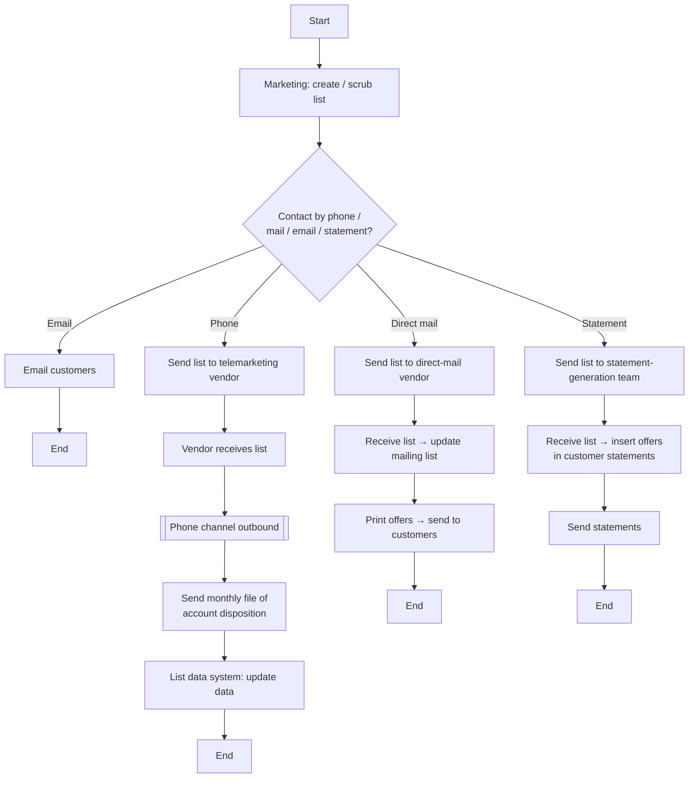

# Apply List to Offers Flow

**Purpose:** How a **customer list is created, scrubbed, and applied to offers across channels** — marketing builds the list, decides the contact channel (phone, email, direct mail, or statement), and dispatches it to the appropriate vendor/team, with dispositions fed back.

**Position:** The list-management capability behind campaigns; produces the audiences consumed by [[Direct Marketing Campaign Flow]], [[Phone Channel Outbound Flow]], and the statement/email channels. A [[Marketing and Sales|segment-management (MKS-MKT-03)]] / [[Contact Management|outreach (CEN-CON-05)]] flow. Covers both "Create/scrub List" and "Apply List".

## Flow

## Step Detail

### Step LST-01 — Create / Scrub List

> **Step ID:** `LST-01` · **Capability:** MKS-MKT-03 (segment mgmt) · **Actor:** Marketing · **Exits:** → LST-02

Marketing **creates the customer list** (and scrubs it — deduplication, suppression, eligibility/consent filtering) for the campaign.

### Step LST-02 — Channel Split

> **Step ID:** `LST-02` · **Capability:** CEN-CON-04 (channel preference), CEN-CON-05 (outreach) · **Preconditions:** LST-01 · **Inputs:** contact-channel decision · **Exits:** per channel → LST-03

A decision splits the list by contact channel — **phone, email, direct mail, or statement** — honouring channel preference and contact rules.

### Step LST-03 — Dispatch and Disposition

> **Step ID:** `LST-03` · **Capability:** CEN-CON-05; CEN-OFR-01 · **Preconditions:** LST-02 · **Exits:** End

The list is dispatched to the relevant channel/vendor:

- **Email** — marketing **emails customers** directly.
- **Phone** — list sent to the **telemarketing vendor**, who receives it, runs the **outbound calling** ([[Phone Channel Outbound Flow]]), and **sends a monthly file of account dispositions**, which the **list data system updates**.
- **Direct mail** — list sent to the **direct-mail vendor**, who receives it, updates the mailing list, prints the offers, and sends them to customers.
- **Statement** — list sent to the **statement-generation team**, who receives it, inserts offers in customer statements, and sends the statements.

## Business Rules (Generalized)

| Rule | Statement |
|---|---|
| Create then scrub | Lists are built and scrubbed (dedupe/suppression/consent) before use |
| Channel split | The list is split by the chosen contact channel |
| Vendor dispatch | Phone/mail/statement work is dispatched to the relevant vendor/team |
| Disposition feedback | Telemarketing returns a monthly disposition file that updates the list data |

## Capability Mapping

| Capability | How exercised |
|---|---|
| [[Marketing and Sales]] MKS-MKT-03 | List/segment creation and scrubbing |
| [[Contact Management]] CEN-CON-04/05 | Channel split and outreach dispatch |
| [[Offers]] CEN-OFR-01 | Offers applied to the list across channels |

## Source Traceability

Generalized from the MBNA Marketing *Sales/Value Add/Offer Management — List Management — Apply List* flow (Source: discussion notes). The telemarketing vendor, "Bacardi" list data system, direct-mail vendor, and statement-generation team are abstracted per [[Systems and Integration Reference]]; source deck is DRAFT.
