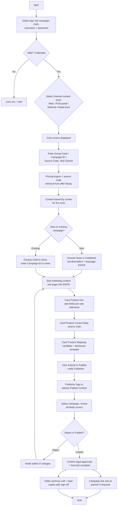

# Content Management CPCMS Flow

**Purpose:** How card-**acquisition campaign content** is managed on the **public (sales) site** through the campaign content-management system — selecting a channel content zone, creating or cloning a campaign, editing marketing content together with card **rate**, **control (source-code)**, and **mapping (variable/disclosure)** data, then routing through an editor → publisher workflow with **legal approval, audit archival, and partner notification** before publish.

**Channel context:** The *public-site* counterpart to the secure-site [[Create and Update Content Management Flow]]. Pricing values are supplied by the **pricing engine**; source codes tie campaign content to offers managed in [[Manage Source Code Flow]]. Source deck spans three diagram pages (1–3 of 3), combined here.

## Flow

## Step Detail

### Step CPM-01 — Editor Authentication

> **Step ID:** `CPM-01` · **Capability:** CEN-CNT-01 · **Actor:** Editor · **Exits:** valid → CPM-02; 3 failed attempts → lockout + note

The editor signs in to the campaign content-management system; the standard three-attempt lockout applies.

### Step CPM-02 — Select Channel Content Zone

> **Step ID:** `CPM-02` · **Capability:** CEN-CNT-01, CEN-CNT-03 (search/locate) · **Preconditions:** CPM-01 · **Inputs:** zone selection · **Exits:** → CPM-03

The editor selects the **channel content zone** for the work. The zones map to where the content is consumed:

- **Web zone** — content for applications on the public web.
- **POS-portal zone** — content for the point-of-sale / branch portal.
- **Referral zone** — content for applications referred in (e.g., via chip/referral).
- **Retail-front zone** — content for the retail front-ends.

The selected zone's screen is displayed.

### Step CPM-03 — Key the Campaign and Retrieve Codes

> **Step ID:** `CPM-03` · **Capability:** CEN-OFR-03 (promo/source codes); SVC-MON-01 (pricing via pricing engine) · **Preconditions:** CPM-02 · **Inputs:** Group Code / Campaign ID / Source Code · **Exits:** → CPM-04

The editor enters the **Group Code, Campaign ID, or Source Code** as applicable and submits. The **pricing engine** and the offer library return source codes, group code, and campaign ID (stored at the offer-library level) for the campaign. The **content hierarchy screen** for the zone is displayed.

### Step CPM-04 — Create or Clone the Campaign

> **Step ID:** `CPM-04` · **Capability:** CEN-CNT-01; MKS-MKT-02 (campaign mgmt) · **Preconditions:** CPM-03 · **Inputs:** new/existing choice, description, language · **Exits:** → CPM-05

The editor chooses the **group name** and indicates whether this is a **new or existing campaign**:

- **New:** choose *None* or *Published*; enter campaign description; select **language (English / French)**.
- **Existing:** choose *Draft* to **clone an existing application**; enter the Campaign ID to clone and confirm.

### Step CPM-05 — Edit Marketing, Rate, Control, and Mapping Data

> **Step ID:** `CPM-05` · **Capability:** CEN-CNT-01; SVC-MON-01; ONB-CCC-01 (disclosure template) · **Preconditions:** CPM-04 · **Exits:** → CPM-06

The editor edits the campaign across four content areas (each saved as completed):

1. **Marketing content and page info** — English and French.
2. **Card Product Info** — the rate fields (effective date, introductory/promotional rate, purchase rate, cash-advance rate, etc.), entered per the rate-calculation reference; French applications require correct French formatting.
3. **Card Product Control Data** — the **source code** for the specific campaign.
4. **Card Product Mapping** — **generic variables** and the **disclosure template** (type obtained from the marketing manager) plus any custom text boxes.

The editor clicks **Submit to Publish**, which notifies the publisher.

### Step CPM-06 — Publisher Review

> **Step ID:** `CPM-06` · **Capability:** CEN-CNT-01 · **Actor:** Publisher · **Preconditions:** CPM-05 submitted · **Inputs:** review of all fields · **Exits:** reject → CPM-05 (editor); publish → CPM-07

The publisher signs in, opens the Publish Content screen for the relevant zone, selects the campaign, and **reviews it to ensure all fields are correct**. The publisher then **rejects** (notify editor of changes required → back to editing) or **publishes**.

### Step CPM-07 — Legal Approval, Audit Archival, Partner Notification

> **Step ID:** `CPM-07` · **Capability:** CEN-CNT-01, CEN-CNT-02 (version/audit); FRR Compliance (reg. disclosures, adjacent) · **Preconditions:** CPM-06 publish · **Exits:** End

Before/at publish the team **confirms all required legal approvals are in place and final QA is complete**. The editor **performs final QA, creates copies of all application screens, and stores soft and hard copies with sign-off in the audit file**. Where the campaign belongs to a co-brand/affinity partner, the **campaign link is sent to the partner** if required.

## Business Rules (Generalized)

| Rule | Statement |
|---|---|
| Zone-scoped content | Every content item is authored within a specific channel content zone |
| Pricing is engine-sourced | Rate values come from the pricing engine, not free entry |
| Bilingual | Campaigns carry English and French content; French formatting is validated |
| Editor → Publisher workflow | Submit-to-publish notifies a publisher who reviews and may reject back to the editor |
| Legal gate | Legal approvals and final QA must be confirmed before publish |
| Audit archival | Soft and hard copies of published screens are stored with sign-off for audit |
| Partner distribution | Co-brand/affinity campaign links are sent to the partner when required |

## Capability Mapping

| Capability | How exercised |
|---|---|
| [[Content Management]] CEN-CNT-01/02/03 | Zone-scoped authoring, bilingual content, editor/publisher publish, audit archival |
| [[Offers]] CEN-OFR-03 | Source-code / campaign-ID binding of promotional acquisition content |
| [[Marketing and Sales]] MKS-MKT-02 | Campaign creation, cloning, and description management |
| [[Servicing - Monetary]] SVC-MON-01 | Rate fields supplied by the pricing engine |

## Source Traceability

Generalized from the MBNA Online Channel *Content Mgmt CPCMS Process Flow (1–3 of 3)*. Marketing zones (CECOM/CFACE/CMAIL/CRETL), the CACC screens, the Pricing Offering Engine (POE), and "SOL"-level storage are abstracted per [[Systems and Integration Reference]]; source deck is DRAFT.
