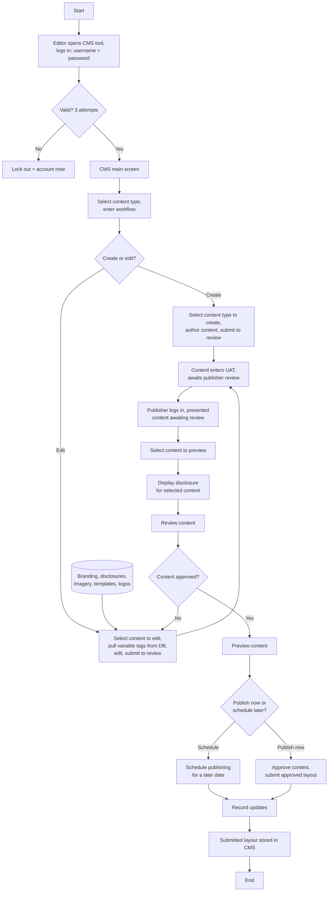

# Content Management Site Refresh Flow

**Purpose:** How **existing public-site content is refreshed** — branding, disclosures, imagery, templates, and logos — through the CMS: an editor edits content (pulling variable tags from the content database), submits it to UAT, a publisher reviews it with its disclosure, approves, and either **publishes now or schedules** for a later date, with the submitted layout **stored and versioned** in the CMS.

**Channel context:** Distinct from new-campaign authoring ([[Content Management CPCMS Flow]]) and secure-site authoring ([[Create and Update Content Management Flow]]); this flow is the periodic *refresh* of already-live site content. Source deck spans two diagram pages (1–2 of 2), combined here.

## Flow

## Step Detail

### Step SRF-01 — Editor Authentication

> **Step ID:** `SRF-01` · **Capability:** CEN-CNT-01 · **Actor:** Editor · **Exits:** valid → SRF-02; 3 failed attempts → lockout + account note

The editor opens the CMS tool and signs in; the standard three-attempt lockout applies.

### Step SRF-02 — Select Content and Create/Edit

> **Step ID:** `SRF-02` · **Capability:** CEN-CNT-01 · **Preconditions:** SRF-01 · **Inputs:** content type, create/edit choice · **Exits:** → SRF-03

From the CMS main screen the editor selects a content type and enters the workflow, choosing to **create** new content or **edit** existing content. On the edit path the editor pulls **variable content (tags) from the content database** — the store of refreshable assets: **branding, disclosures, imagery, templates, logos**. The edited/created content is submitted to review.

### Step SRF-03 — UAT and Publisher Pickup

> **Step ID:** `SRF-03` · **Capability:** CEN-CNT-01; OPS (UAT, adjacent) · **Preconditions:** SRF-02 · **Exits:** → SRF-04

The content **enters UAT and awaits publisher review**. The publisher signs in (own lockout-controlled login) and is presented with the content awaiting review.

### Step SRF-04 — Review with Disclosure and Approve

> **Step ID:** `SRF-04` · **Capability:** CEN-CNT-01; ONB-CCC-01 (disclosure) · **Preconditions:** SRF-03 · **Inputs:** approval decision · **Exits:** approved → SRF-05; not approved → back to SRF-02

The publisher **selects content to preview**, the system **displays the disclosure for the selected content**, and the publisher **reviews** it. If **not approved**, the content returns to the editor; if **approved**, it advances to preview.

### Step SRF-05 — Publish Now or Schedule, then Store

> **Step ID:** `SRF-05` · **Capability:** CEN-CNT-01, CEN-CNT-02 (version) · **Preconditions:** SRF-04 approved · **Inputs:** publish-now / schedule choice · **Exits:** End

The publisher previews the content and chooses **publish now** (approve content and submit the approved layout) or **schedule for a later date**. Updates are **recorded** and the **submitted layout is stored (versioned) in the CMS**.

## Business Rules (Generalized)

| Rule | Statement |
|---|---|
| Refresh vs. new | This flow refreshes already-live content (branding, disclosures, imagery, templates, logos) |
| Variable tags | Edits pull variable content (tags) from the content database |
| Disclosure shown at review | The disclosure for the content is displayed to the publisher before approval |
| Publish or schedule | Approved content can go live now or be scheduled for a later date |
| Versioned storage | The submitted layout is stored in the CMS for audit/version history |

## Capability Mapping

| Capability | How exercised |
|---|---|
| [[Content Management]] CEN-CNT-01/02 | Refresh authoring, UAT, publisher review, publish/schedule, versioned storage |
| Onboarding & Origination — ONB-CCC-01 (adjacent) | Disclosures among the refreshable content and shown at review |

## Source Traceability

Generalized from the MBNA Online Channel *Content Mgmt. Site Refresh Process Flow (1–2 of 2)*. Abstractions per [[Systems and Integration Reference]]; source deck is DRAFT.
