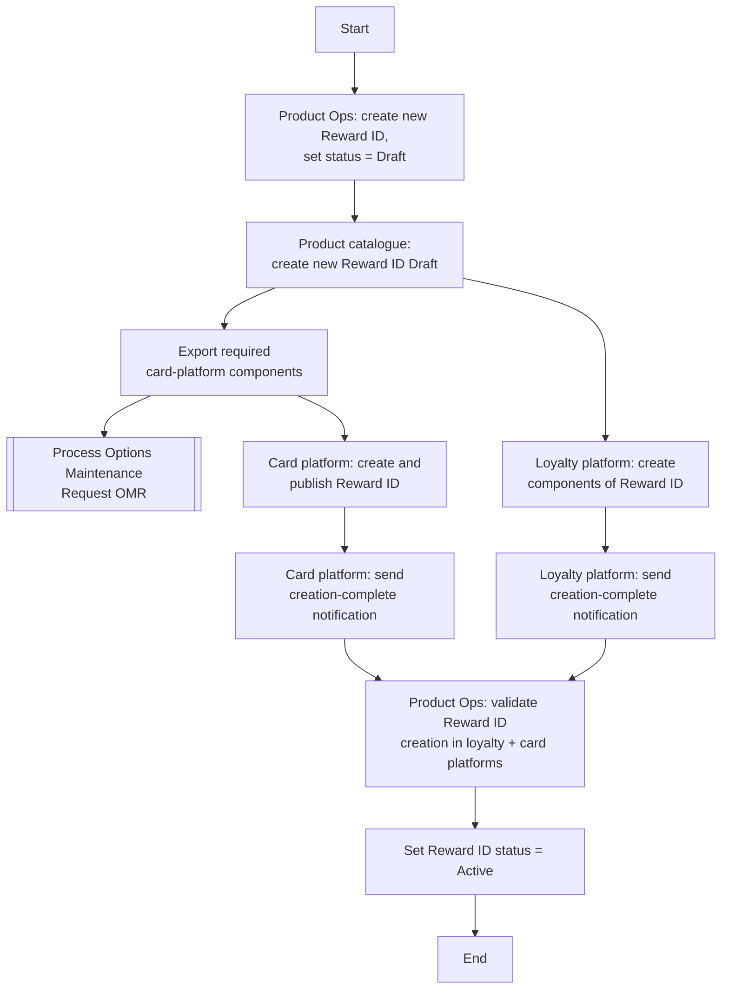

# Create Reward Flow

**Purpose:** The cross-functional back-office process to **create a new reward** — a **Reward ID** (an `ARQ`-class reward code) — and propagate it across the **product catalogue**, the **card processing platform**, and the **loyalty platform**, then validate and activate it.

**Preconditions (from source):** the Reward ID does not already exist, and the user has received the necessary sign-off.

## Flow

## Step Detail

### Step CRW-01 — Create Draft Reward ID

> **Step ID:** `CRW-01` · **Capability:** CLP-RWD-01 (earn definition) · **Actor:** Product Operations user · **Preconditions:** Reward ID does not exist; sign-off obtained · **Exits:** → CRW-02

The Product Operations user **creates a new Reward ID and sets its status to Draft**. The reward code and its attributes (the `ARQ`-class construct: a primary and secondary reward attribute) define how the reward earns and calculates.

### Step CRW-02 — Catalogue Creation and Component Export

> **Step ID:** `CRW-02` · **Capability:** CLP-RWD-01; PLB-CRD-01; ENT-BOR (product BoR, adjacent) · **Preconditions:** CRW-01 · **Exits:** → CRW-03 (parallel platform creation)

The **product catalogue** creates the new Reward ID in Draft status (the product book-of-record entry) and **exports the required card-platform components**. Changes destined for the card processing platform are dispatched as an **Options Maintenance Request** — see [[Submit Options Maintenance Request Flow]].

### Step CRW-03 — Parallel Platform Creation

> **Step ID:** `CRW-03` · **Capability:** CLP-RWD-01/02/03 · **Preconditions:** CRW-02 · **Exits:** both notifications received → CRW-04

The reward is created in parallel across the two downstream platforms, each sending a **creation-complete notification** to Product Ops:

- **Card processing platform** — creates and publishes the Reward ID (and receives the exported components).
- **Loyalty platform** — creates the loyalty components of the Reward ID (receiving related process/content information).

### Step CRW-04 — Validate and Activate

> **Step ID:** `CRW-04` · **Capability:** CLP-RWD-03 (track); PLB-CRD-01 · **Preconditions:** CRW-03 (both platforms confirmed) · **Exits:** End

Product Ops **validates the Reward ID creation in both the loyalty and card platforms**, and on success **sets the Reward ID status to Active**. The reward is then available for use in product setup ([[Set Up Premium Card Product Flow]]) and presentment ([[Publish Rewards Flow]]).

## Business Rules (Generalized)

| Rule | Statement |
|---|---|
| Uniqueness | The Reward ID must not already exist |
| Sign-off first | The user must have the necessary sign-off before creation |
| Draft then Active | The reward is created in Draft and only set Active after cross-platform validation |
| Cross-platform consistency | The reward must be created in both the card platform and the loyalty platform |
| Changes via OMR | Card-platform components are propagated through an Options Maintenance Request |

## Capability Mapping

| Capability | How exercised |
|---|---|
| [[Rewards]] CLP-RWD-01/02/03 | Reward-code definition, earn/calculate components, cross-platform tracking |
| [[Cards]] PLB-CRD-01 | The reward attaches to a card product in the catalogue |
| Enterprise Support — Books of Record (adjacent) | Product catalogue as the reward's book of record |

## Source Traceability

Generalized from the MBNA Product Operations *Manage Rewards — Create ARQ IDs (Rewards)* / *Add Reward (ARQ1, ARQ2)* flows. ARQ IDs, TSYS, TLP, and the product catalogue are abstracted per [[Systems and Integration Reference]]; source deck is DRAFT.
