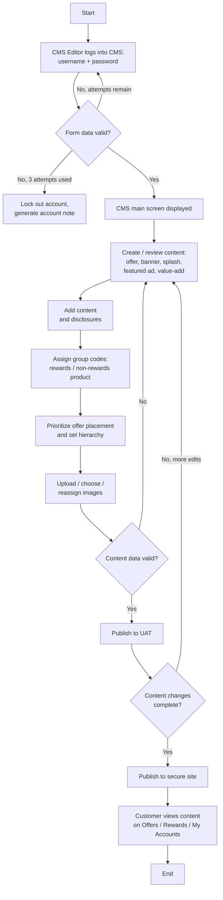

# Create and Update Content Management Flow

**Purpose:** How a content editor **creates or updates content on the authenticated (secure) site** of the card channel — offers, banners, splash screens, featured advertisements, and value-add features (which may include rewards). Content is authored with its disclosures, grouped and prioritized for placement, validated, published to UAT, and then released to the secure site where the signed-in customer sees it.

**Channel context:** This is the *secure-site* counterpart to the public-site [[Content Management CPCMS Flow]]. Content can be placed on the **Offers tab**, the **Rewards tab**, or the **My Accounts screen**; value-add features may include rewards content owned by [[Rewards|CLP-RWD]].

## Flow

## Step Detail

### Step CUC-01 — Editor Authentication

> **Step ID:** `CUC-01` · **Capability:** CEN-CNT-01 (Define/Publish); IAA (authentication, adjacent) · **Actor:** CMS Editor · **Inputs:** username + password · **Exits:** valid → CUC-02; three failed attempts → account lockout + account note

The content editor signs in to the content management system. Form data is validated; three failed attempts lock the account and generate an account note (a standard lockout control shared across the content flows).

### Step CUC-02 — Create or Review Content

> **Step ID:** `CUC-02` · **Capability:** CEN-CNT-01 · **Preconditions:** CUC-01 · **Inputs:** content type selection · **Exits:** → CUC-03

From the CMS main screen the editor creates or reviews a content item. **Content types:** offers, content blocks, banners, splash screens, featured advertisements. **Value-add features may include rewards.** The item is destined for a placement surface — the Offers tab, the Rewards tab, or the My Accounts screen.

### Step CUC-03 — Add Content and Disclosures

> **Step ID:** `CUC-03` · **Capability:** CEN-CNT-01; ONB-CCC-01 (disclosures) · **Preconditions:** CUC-02 · **Exits:** → CUC-04

The editor authors the content body and attaches the **disclosures** required for it. Disclosure text is sourced from the managed disclosure store maintained by [[Disclosure Management Flow]] rather than free-typed, so legal-approved language is reused.

### Step CUC-04 — Assign Group Codes and Prioritize Placement

> **Step ID:** `CUC-04` · **Capability:** CEN-CNT-01; CEN-OFR-01 (offer placement) · **Preconditions:** CUC-03 · **Exits:** → CUC-05

The editor **assigns group codes** distinguishing rewards from non-rewards product, then **prioritizes the offer placement and sets the display hierarchy** so competing offers/banners render in the intended order on the target surface. Images are uploaded, chosen, or reassigned.

### Step CUC-05 — Validate and Publish to UAT

> **Step ID:** `CUC-05` · **Capability:** CEN-CNT-01; OPS (UAT/test, adjacent) · **Preconditions:** CUC-04 · **Inputs:** content-data validation · **Exits:** invalid → back to CUC-02; valid → UAT publish

Content data is validated; failures return the editor to authoring. Valid content is **published to UAT** for review before going live.

### Step CUC-06 — Confirm Changes and Publish to Secure Site

> **Step ID:** `CUC-06` · **Capability:** CEN-CNT-01, CEN-CNT-02 (version history) · **Preconditions:** CUC-05 · **Exits:** changes complete → publish; otherwise → back to CUC-02

When all content changes are complete the item is **published to the secure site**. The published version is retained for audit (version history).

### Step CUC-07 — Customer Sees Content

> **Step ID:** `CUC-07` · **Capability:** CEN-CNT-01; CHN (self-serve, adjacent) · **Preconditions:** CUC-06 · **Exits:** End

The signed-in customer views the content on the applicable surface (Offers tab / Rewards tab / My Accounts). Value-add offers presented here are actioned by [[Value-Add Offers Flow]].

## Business Rules (Generalized)

| Rule | Statement |
|---|---|
| Separation of duties | Authoring and publishing are distinct CMS roles/logins |
| Lockout control | Three failed sign-in attempts lock the account and raise an account note |
| Disclosure reuse | Disclosures are attached from the managed disclosure store, not free-typed |
| UAT before live | Content is published to UAT and confirmed before release to the secure site |
| Placement hierarchy | Group codes and a set hierarchy govern which offer/banner shows where, in what order |

## Capability Mapping

| Capability | How exercised |
|---|---|
| [[Content Management]] CEN-CNT-01/02 | Authoring, disclosure attachment, UAT, secure-site publish, version retention |
| [[Offers]] CEN-OFR-01 | Offer placement, prioritization, and hierarchy on the secure site |
| [[Rewards]] CLP-RWD-05 | Rewards content placed on the Rewards tab as a value-add feature |

## Source Traceability

Generalized from the MBNA Online Channel *Secure Site: Content Management Process Flow* (Create / Update Content Management). Brand/vendor specifics abstracted per [[Systems and Integration Reference]]; the source deck is DRAFT workshop material.
