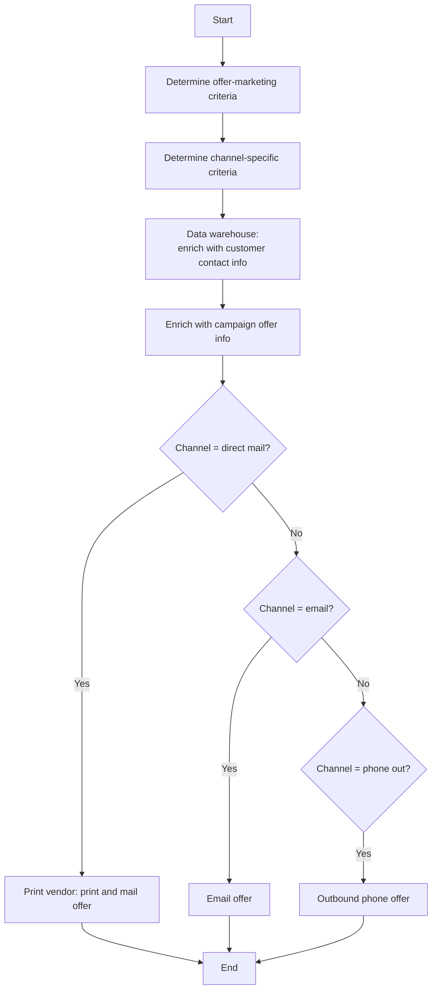

# Direct Marketing Campaign Flow

**Purpose:** How an **offer campaign is targeted and delivered to existing customers** — determining offer-marketing and channel-specific criteria, enriching the audience with contact and campaign-offer information, then routing each customer to the channel determined for them (**direct mail, email, or outbound phone**).

**Position:** The general-offer sibling of [[Publish Rewards Flow]] (which is rewards-specific). Lead-management / campaign capability; the offers it presents are built in [[Manage Source Code Flow]] and the lists in [[Apply List to Offers Flow]].

## Flow

## Step Detail

### Step DMC-01 — Determine Criteria

> **Step ID:** `DMC-01` · **Capability:** MKS-MKT-02 (campaign mgmt); CEN-OFR-01 · **Actor:** Marketing strategy · **Exits:** → DMC-02

The marketing team **determines the offer-marketing criteria** (which offer, to which population) and the **channel-specific criteria** (how the offer is tailored per channel).

### Step DMC-02 — Enrich the Audience

> **Step ID:** `DMC-02` · **Capability:** ENT — Data & Analytics (adjacent); CEN-CON-05 (outreach) · **Preconditions:** DMC-01 · **Exits:** → DMC-03

The data warehouse **enriches the audience with customer contact information** and then **with campaign-offer information**, producing the dispatch-ready dataset.

### Step DMC-03 — Channel Routing and Delivery

> **Step ID:** `DMC-03` · **Capability:** CEN-CON-04 (channel preference), CEN-CON-05; CEN-OFR-01 · **Preconditions:** DMC-02 · **Inputs:** determined channel · **Exits:** End

The flow routes each customer to the channel determined for them:

- **Direct mail** → the print vendor **prints and mails** the offer.
- **Email** → the offer is **emailed**.
- **Phone out** → an **outbound phone** offer is made (executed via [[Phone Channel Outbound Flow]]).

## Business Rules (Generalized)

| Rule | Statement |
|---|---|
| Existing customers | Targets existing customers |
| Two-tier criteria | Offer-marketing criteria and channel-specific criteria are set separately |
| Enrich before dispatch | Contact and campaign-offer enrichment precede channel routing |
| Single-channel routing | Each customer is routed to one determined channel |

## Capability Mapping

| Capability | How exercised |
|---|---|
| [[Marketing and Sales]] MKS-MKT-02 | Campaign criteria and execution |
| [[Offers]] CEN-OFR-01 | Offer selection and presentment via outbound channels |
| [[Contact Management]] CEN-CON-04/05 | Channel determination and outreach orchestration |

## Source Traceability

Generalized from the MBNA Product Operations *Sales/Value Add/Offer Management — Lead Management — Direct Marketing Campaign / Existing Customer* flow (Source: SRS Offer Presentation Modified Scope v3.3). Channels and the data warehouse abstracted per [[Systems and Integration Reference]]; source deck is DRAFT.
