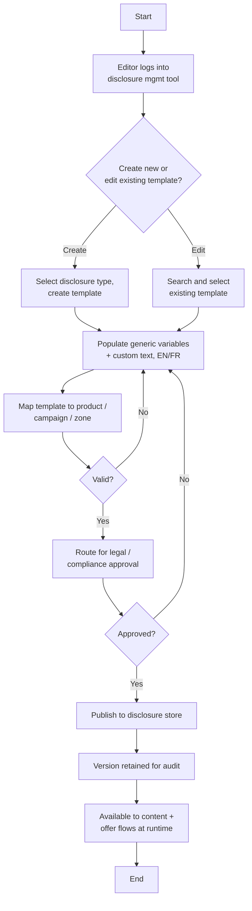

# Disclosure Management Flow

**Purpose:** How the bank **authors, approves, publishes, and versions the disclosure content** that card content and offers reference — cost-of-borrowing and product disclosures, presented as reusable **templates** with generic variables, mapped to campaigns/products/zones in English and French, and gated by legal/compliance approval before they enter the disclosure store.

**Position:** The disclosure store maintained here is consumed at authoring time by [[Create and Update Content Management Flow]] and [[Content Management CPCMS Flow]] (the "disclosure template" in the mapping step) and at runtime by [[Value-Add Offers Flow]], [[Online Campaign Flow]], and the phone presentment flows. Disclosure *content obligations* live in [[Canadian Regulatory Context]].

> **Note on fidelity:** the source diagram pages (Disclosure Management 1–2 of 2) are DRAFT and partly illegible; the steps below are reconstructed at the level the deck and the surrounding flows support, with generic step IDs. Treat the structure as authoritative and the exact step numbering as generalized.

## Flow

## Step Detail

### Step DSC-01 — Authentication and Template Selection

> **Step ID:** `DSC-01` · **Capability:** CEN-CNT-01 · **Actor:** Disclosure editor · **Exits:** → DSC-02

The editor signs in to the disclosure management tool (the same managed-content tooling family as the CMS) and chooses to **create a new disclosure template** (selecting the disclosure type) or **search and edit an existing one**.

### Step DSC-02 — Populate Template

> **Step ID:** `DSC-02` · **Capability:** CEN-CNT-01; ONB-CCC-01 · **Preconditions:** DSC-01 · **Inputs:** generic variables, custom text, language · **Exits:** → DSC-03

The editor populates the template's **generic variables** (the merge fields content and offers will supply at use time), any **custom text**, and the **English and French** renderings. This is the same template construct referenced as "disclosure template" by the CMS mapping step.

### Step DSC-03 — Map and Validate

> **Step ID:** `DSC-03` · **Capability:** CEN-CNT-01 · **Preconditions:** DSC-02 · **Exits:** invalid → DSC-02; valid → DSC-04

The template is **mapped** to the products, campaigns, and channel zones that will reference it, then validated. Validation failures return to authoring.

### Step DSC-04 — Legal / Compliance Approval

> **Step ID:** `DSC-04` · **Capability:** FRR Compliance — Reg. Disclosures (adjacent); CEN-CNT-01 · **Preconditions:** DSC-03 valid · **Inputs:** legal/compliance sign-off · **Exits:** approved → DSC-05; rejected → DSC-02

Because disclosure language is regulated, the template is **routed for legal/compliance approval**. Only approved language proceeds; rejection returns it for amendment.

### Step DSC-05 — Publish, Version, and Make Available

> **Step ID:** `DSC-05` · **Capability:** CEN-CNT-01, CEN-CNT-02 · **Preconditions:** DSC-04 approved · **Exits:** End

The approved template is **published to the disclosure store** with its version retained for audit. From there it is **available to content authoring and offer-presentment flows** — attached at authoring time (CMS) or retrieved at runtime (offer presentment, online campaign).

## Business Rules (Generalized)

| Rule | Statement |
|---|---|
| Templates, not free text | Disclosures are managed as reusable templates with generic variables |
| Bilingual | Each template carries English and French renderings |
| Legal gate | No disclosure reaches the store without legal/compliance approval |
| Versioned | Published disclosures are versioned and retained for audit |
| Single source | Content and offer flows reference the store rather than embedding disclosure text |

## Capability Mapping

| Capability | How exercised |
|---|---|
| [[Content Management]] CEN-CNT-01/02 | Disclosure authoring, mapping, publish, and versioning |
| Onboarding & Origination — ONB-CCC-01 (adjacent) | Customer disclosures as the artifact type managed |
| Fraud & Risk — Compliance (adjacent) | Regulatory-disclosure approval gate |

## Source Traceability

Generalized from the MBNA Online Channel *Disclosure Management Process Flow (1–2 of 2)* and the disclosure-template references in the CPCMS and Value-Add Offers flows. Reconstructed where source pages were DRAFT/illegible; abstractions per [[Systems and Integration Reference]].
