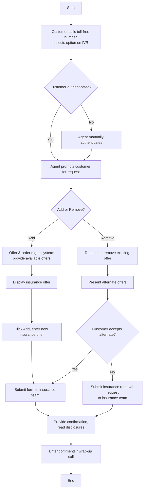

# Insurance Offer Presentment Flow

**Purpose:** How an **insurance offer** (creditor / credit-protection insurance) is **presented, added, or removed** on the phone/IVR channel — the customer calls in, is authenticated, the agent presents the insurance offer, and on acceptance a fulfilment request is sent to the insurance team with confirmation and disclosures; on removal, alternate offers are presented before submitting a removal request.

**Position:** Sibling of [[Pricing Offer Presentment Flow]] and [[Value-Add Offer Presentment Flow]]; the secure-site equivalent is [[Value-Add Offers Flow]] and the dedicated buy-flow is [[Add Insurance Product Phone Channel Flow]]. Products are set up in [[Manage Insurance Product Setup Flow]].

> **Note on scope:** the source defines **Add** and **Remove** variants; an insurance-offer **Modify** was flagged as not existing / TBD in the workshop and is not included.

## Flow

## Step Detail

### Step IOP-01 — Authentication and Request

> **Step ID:** `IOP-01` · **Capability:** CHN (adjacent); IAA (authentication) · **Actor:** Customer + IVR + agent · **Exits:** → IOP-A / IOP-R

The customer **calls the toll-free number and selects an IVR option**, which authenticates them; otherwise the agent **manually authenticates** and **prompts the customer for their request**.

### Step IOP-A — Add Insurance Offer

> **Step ID:** `IOP-A` · **Capability:** CEN-OFR-01; PLB-INS-06/07 · **Preconditions:** IOP-01 · **Exits:** → IOP-CONF

The **offer & order management system provides the available offers**; the agent **displays the insurance offer**, **adds** the new insurance offer, and **submits the form to the insurance team** for fulfilment.

### Step IOP-R — Remove Insurance Offer

> **Step ID:** `IOP-R` · **Capability:** CEN-OFR-01; PLB-INS-09 · **Preconditions:** IOP-01 · **Inputs:** alternate-offer decision · **Exits:** → IOP-CONF

On a removal request the agent **presents alternate offers**; if the customer accepts an alternate it is submitted, otherwise the agent **submits an insurance removal request to the insurance team**, which **processes the removal**.

### Step IOP-CONF — Confirm, Disclose, Wrap-Up

> **Step ID:** `IOP-CONF` · **Capability:** ONB-CCC-01 (disclosure); CEN-CON-06 (consent) · **Preconditions:** IOP-A/R · **Exits:** End

The agent **provides confirmation and reads the disclosures**, and **enters comments / wraps up the call**. *(Source note: at the disposition of an offer the offer system may be required to provide information to the marketing-analytics rules engine — TBD.)*

## Business Rules (Generalized)

| Rule | Statement |
|---|---|
| Authenticate first | The customer is authenticated before any change |
| Insurance team fulfils | Add/remove requests are submitted to the insurance team |
| Alternates before removal | Removal first presents alternate offers |
| Disclosures read | Disclosures are read at confirmation |
| No modify variant | Only Add and Remove are defined; Modify is TBD |

## Capability Mapping

| Capability | How exercised |
|---|---|
| [[Offers]] CEN-OFR-01 | Insurance-offer presentment, add/remove |
| [[Insurance]] PLB-INS-06/07/09 | Quoting, enrolment/issuance, and maintenance via the insurance team |
| Onboarding & Origination — ONB-CCC-01 (adjacent) | Disclosure read at confirmation |
| [[Contact Management]] CEN-CON-06 | Consent captured at acceptance |

## Source Traceability

Generalized from the MBNA Product Operations *Lead Management — Insurance Offers — Add / Remove* flows (Source: SRS Offer Presentation Modified Scope v3.3). IVR, CSR, PEGA, OOMS, TSYS, and the insurance team abstracted per [[Systems and Integration Reference]]; source deck is DRAFT.
