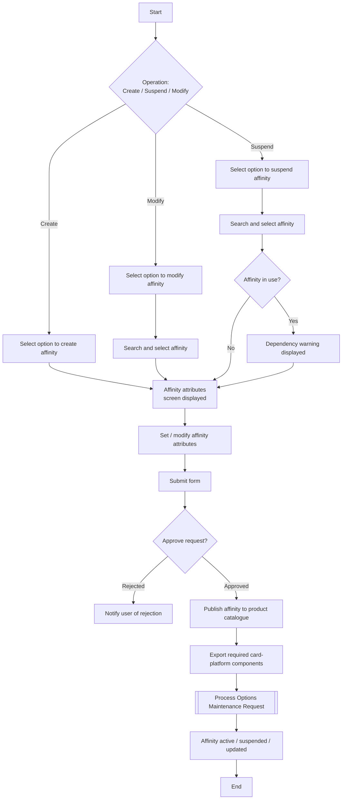

# Manage Affinity Partnership Flow

**Purpose:** The back-office process to **create, suspend, and modify an affinity partnership** — the co-brand/partner relationship that underpins affinity card products. An affinity record is set up with its attributes, routed through an approval workflow, published to the **product catalogue**, and propagated to the **card processing platform** via an Options Maintenance Request.

**Position:** Affinity is one of the constructs composed into a card product by [[Set Up Premium Card Product Flow]] and [[Manage Product Instance Flow]]. It is a [[Loyalty]] capability (`CLP-LOY-04`). Triggered by an incoming request to set up a new affinity — typically marketing submits this.

## Flow

## Step Detail

### Step AFF-C — Create Affinity

> **Step ID:** `AFF-C` · **Capability:** CLP-LOY-04 (affinity), CLP-LOY-06 (partners); PLB-CRD-03 (co-brand) · **Actor:** Product Operations user · **Trigger:** incoming request to set up a new affinity (typically from marketing) · **Exits:** → AFF-APPROVE

The user selects to **create an affinity**, the affinity-attributes screen is displayed (served by the workflow/UI), and the user **sets the affinity attributes** (partner, program identifiers, defaults) and **submits the form**.

### Step AFF-S — Suspend Affinity

> **Step ID:** `AFF-S` · **Capability:** CLP-LOY-04 · **Preconditions:** affinity exists · **Inputs:** suspension confirmation · **Exits:** → AFF-APPROVE

The user selects to **suspend an affinity**, **searches and selects** it, and the system **checks whether the affinity is in use**. If in use, a **dependency warning is displayed** (so suspension does not silently break dependent products); the user confirms the suspension/deletion before proceeding. *(Derived from the create process.)*

### Step AFF-M — Modify Affinity

> **Step ID:** `AFF-M` · **Capability:** CLP-LOY-04 · **Preconditions:** affinity exists · **Exits:** → AFF-APPROVE

The user selects to **modify an affinity**, **searches and selects** it, the attributes screen is displayed pre-populated, and the user **changes the attributes** and **submits**. *(Derived from the create process.)*

### Step AFF-APPROVE — Approval, Publish, and Propagation

> **Step ID:** `AFF-APPROVE` · **Capability:** OPS — Workflow & Rules (approvals, adjacent); ENT-BOR (product catalogue) · **Preconditions:** AFF-C/S/M submitted · **Inputs:** approver decision · **Exits:** approved → publish + OMR → End; rejected → notify user

The submitted change is routed for **approval**. On rejection the user is notified. On approval the affinity is **published to the product catalogue**, the **required card-platform components are exported**, and the change is propagated to the card processing platform through an **Options Maintenance Request** ([[Submit Options Maintenance Request Flow]]). The affinity becomes active / suspended / updated accordingly.

## Business Rules (Generalized)

| Rule | Statement |
|---|---|
| Request-triggered | Creation is triggered by an incoming partnership request (usually marketing) |
| Dependency check on suspend | Suspension warns when the affinity is in use by dependent products |
| Approval gate | All create/suspend/modify changes pass an approval step before publish |
| Catalogue is BoR | The affinity is published to the product catalogue as its book of record |
| Propagated via OMR | Card-platform impact is applied through an Options Maintenance Request |

## Capability Mapping

| Capability | How exercised |
|---|---|
| [[Loyalty]] CLP-LOY-04/06 | Affinity partnership and partner setup/maintenance |
| [[Cards]] PLB-CRD-03 | Affinity underpins co-brand / private-label card products |
| Operations — Workflow & Rules (adjacent) | Approval workflow for the change |
| Enterprise Support — Books of Record (adjacent) | Product catalogue as affinity BoR |

## Source Traceability

Generalized from the MBNA Product Operations *Manage Affinity — Create / Suspend / Modify Affinity* flows (Source: TD-MBNA SRS – Product Delivery). Workflow management system, TSYS, and product catalogue abstracted per [[Systems and Integration Reference]]; dense source diagrams reconstructed at confident level; source deck is DRAFT.
