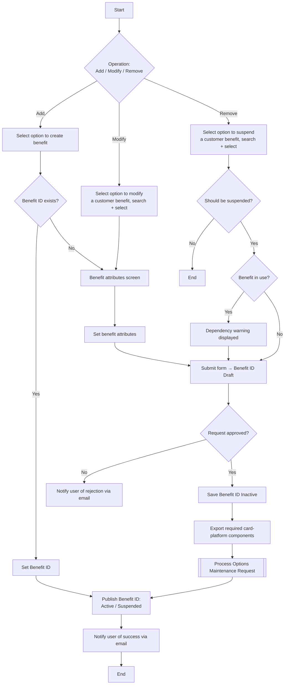

# Manage Card Benefits Flow

**Purpose:** The back-office process to **add, modify, and remove card benefits** (the card-network benefit sets attached to a card product) — each operation creating/updating a **Benefit ID** in Draft, routed through approval to an Inactive state, exported to the **card processing platform** via an Options Maintenance Request, then published Active (or Suspended), with the user notified by email.

**Position:** Benefits are one of the constructs composed into a card product by [[Set Up Premium Card Product Flow]] and [[Manage Product Instance Flow]]. A [[Cards]] / [[Loyalty]] capability.

## Flow

## Step Detail

### Step BEN-A — Add Benefit

> **Step ID:** `BEN-A` · **Capability:** PLB-CRD-01; CLP-LOY-03 (programs) · **Actor:** Product Operations user · **Exits:** → BEN-APPROVE

The user **selects to create a benefit**. If a **Benefit ID already exists** it is set directly; otherwise the system provides the **benefit-attributes screen**, the user **sets the benefit attributes** and **submits the form**, creating/updating the **Benefit ID in Draft status**.

### Step BEN-M — Modify Benefit

> **Step ID:** `BEN-M` · **Capability:** PLB-CRD-01 · **Preconditions:** benefit exists · **Exits:** → BEN-APPROVE

The user **selects to modify a customer benefit**, **searches and selects** it, the benefit-attributes screen is displayed pre-populated, the user **sets the attributes** and **submits**, updating the **Benefit ID in Draft status**. *(Derived from the add process.)*

### Step BEN-R — Remove Benefit

> **Step ID:** `BEN-R` · **Capability:** PLB-CRD-01 · **Preconditions:** benefit exists · **Inputs:** suspension confirmation · **Exits:** confirmed → BEN-APPROVE; not confirmed → End

The user **selects to suspend a customer benefit** and **searches and selects** it. A gate asks whether the benefit **should really be suspended** (no → end). On yes, the system **checks if the benefit is in use**; if in use, a **dependency warning is displayed** before the user confirms. *(Includes the option to confirm suspension/deletion.)*

### Step BEN-APPROVE — Approval, Export, Publish, Notify

> **Step ID:** `BEN-APPROVE` · **Capability:** OPS — Workflow & Rules (approvals, adjacent); ENT-BOR (product catalogue) · **Preconditions:** BEN-A/M/R submitted · **Inputs:** approver decision · **Exits:** End

The change is routed for **approval**. If **not approved**, the user is **notified of the rejection by email**. If approved: the **Benefit ID is saved Inactive** to the product-catalogue database, the **required card-platform components are exported**, the change is propagated via an **Options Maintenance Request** ([[Submit Options Maintenance Request Flow]]), and the **Benefit ID is published Active** (or **Suspended** on the remove path). The user **receives an email notification** of the successful creation/update/suspension.

## Business Rules (Generalized)

| Rule | Statement |
|---|---|
| Draft → Inactive → Active | Benefits are drafted, saved Inactive on approval, and published Active after platform sync |
| Approval gate | All add/modify/remove operations require approval before publish |
| Dependency check on remove | Suspension warns when the benefit is in use |
| Propagated via OMR | Card-platform impact is applied through an Options Maintenance Request |
| User notified | The user is emailed on both rejection and successful completion |

## Capability Mapping

| Capability | How exercised |
|---|---|
| [[Cards]] PLB-CRD-01 | Benefit configuration attached to card products |
| [[Loyalty]] CLP-LOY-03 | Benefit sets as part of card programs |
| Operations — Workflow & Rules (adjacent) | Approval workflow and notifications |
| Enterprise Support — Books of Record (adjacent) | Product catalogue as benefit BoR |

## Source Traceability

Generalized from the MBNA Product Ops *Manage MasterCard Benefits — Add / Modify / Remove Benefit (1–2 of 2)* flows (Source: TD-MBNA SRS – Product Catalog). TSYS, the workflow management system, and the product catalogue are abstracted per [[Systems and Integration Reference]]; source deck is DRAFT.
