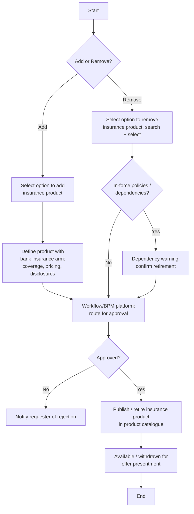

# Manage Insurance Product Setup Flow

**Purpose:** The back-office process to **add or remove a creditor / credit-protection insurance product** so it can be offered to cardholders — defining the product with the bank's insurance arm, routing through a workflow/BPM platform for approval, publishing it for offer presentment, and (on removal) checking in-force dependencies before retiring it.

**Position:** Sets up the products later presented by [[Value-Add Offers Flow]], [[Insurance Offer Presentment Flow]], and [[Add Insurance Product Phone Channel Flow]]. A [[Insurance]] capability.

> **Note on fidelity:** the source pages (Manage Insurance — Add / Remove) are DRAFT and were thin on internal step numbering; the structure below is reconstructed at a confident level using the bank-insurance-arm and workflow-tool lanes the source shows, with generic step IDs.

## Flow

## Step Detail

### Step IPS-A — Add Insurance Product

> **Step ID:** `IPS-A` · **Capability:** PLB-INS-07 (policy issuance setup); CEN-OFR-01 · **Actor:** Product Operations user + bank insurance arm · **Exits:** → IPS-APPROVE

The user **selects to add an insurance product**. The product is **defined together with the bank's insurance arm** — coverage, pricing/premium, eligibility, and the **disclosures** it must present (linked to [[Disclosure Management Flow]]). The workflow/BPM platform carries the request.

### Step IPS-R — Remove Insurance Product

> **Step ID:** `IPS-R` · **Capability:** PLB-INS-09 (policy maintenance) · **Preconditions:** product exists · **Inputs:** retirement confirmation · **Exits:** → IPS-APPROVE

The user **selects to remove an insurance product** and **searches and selects** it. The system **checks for in-force policies / dependencies**; if present, a **dependency warning** requires explicit confirmation before retirement (so existing enrolments are not orphaned).

### Step IPS-APPROVE — Approval and Publish/Retire

> **Step ID:** `IPS-APPROVE` · **Capability:** OPS — Workflow & Rules (approvals, adjacent); ENT-BOR · **Preconditions:** IPS-A/R submitted · **Inputs:** approver decision · **Exits:** End

The request is routed through the **workflow/BPM platform for approval**. On rejection the requester is notified. On approval the insurance product is **published (add) or retired (remove)** in the product catalogue, making it **available — or withdrawn — for offer presentment**.

## Business Rules (Generalized)

| Rule | Statement |
|---|---|
| Co-defined with insurer | Insurance products are defined together with the bank's insurance arm |
| Disclosure linkage | Each product carries the disclosures it must present at offer time |
| Dependency check on remove | Removal warns when in-force policies/dependencies exist |
| Approval gate | Add/remove is approved via the workflow/BPM platform before publish |
| Catalogue availability | Publish/retire controls whether the product is offerable |

## Capability Mapping

| Capability | How exercised |
|---|---|
| [[Insurance]] PLB-INS-07/09 | Insurance product setup (issuance enablement) and retirement (maintenance) |
| [[Offers]] CEN-OFR-01 | Makes the product available as an offer for presentment |
| Operations — Workflow & Rules (adjacent) | Approval routing via the workflow/BPM platform |

## Source Traceability

Generalized from the MBNA Product Operations *Manage Insurance — Manage Insurance Product Setup (Add / Remove)* flows (lanes including the workflow tool and the insurer). "TD Insurance" abstracted to the bank's insurance arm; PEGA-class workflow per [[Systems and Integration Reference]]; reconstructed where source was DRAFT.
