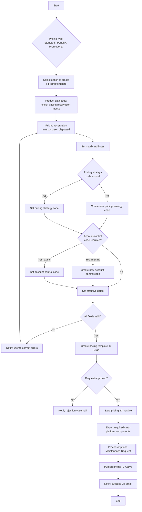

# Manage Pricing Flow

**Purpose:** The back-office process to **set up pricing templates** for card products — **Standard (Contract) Rate**, **Penalty**, and **Promotional** pricing — each created against the pricing reservation matrix, drafted, validated, routed through approval, exported to the **card processing platform** via an Options Maintenance Request, and published Active.

**Position:** The resulting rates land in [[Servicing - Monetary|Rate/APR Management (SVC-MON-01)]] and are referenced by product setup and by promotional offers in [[Pricing Offer Presentment Flow]]. Three pricing types share one template-setup skeleton, captured as sections below.

## Flow

## Step Detail

### Step PRC-S — Standard (Contract) Rate Pricing Setup

> **Step ID:** `PRC-S` · **Capability:** SVC-MON-01 (rate/APR) · **Actor:** Product Ops / Marketing Manager · **Exits:** → PRC-APPROVE

Sets up the **standard / contract rate pricing** for a product (the everyday APR construct). The user selects to create a pricing template, the **pricing reservation matrix** is checked and displayed, matrix attributes are set, the **pricing strategy code** is set (or created), and effective dates are set.

### Step PRC-P — Penalty Pricing Setup

> **Step ID:** `PRC-P` · **Capability:** SVC-MON-01; FRR — Credit Risk (adjacent) · **Exits:** → PRC-APPROVE

Sets up **penalty pricing** (the rate applied on delinquency/penalty triggers). Same matrix-driven setup, plus: set the **pricing strategy code** (create if it does not exist), determine whether an **account-control code** is required (create or set it if so), and **set the effective dates**. Penalty pricing intersects credit-risk strategy.

### Step PRC-M — Promotional Pricing Setup

> **Step ID:** `PRC-M` · **Capability:** SVC-MON-01; CEN-OFR-03 (promo) · **Exits:** → PRC-APPROVE

Sets up **promotional pricing** (e.g., introductory or balance-transfer promo rates), used by acquisition campaigns and pricing offers. Same matrix-driven template setup for the promotional rate and its dates.

### Step PRC-APPROVE — Validate, Approve, Export, Publish

> **Step ID:** `PRC-APPROVE` · **Capability:** OPS — Workflow & Rules (approvals, adjacent); ENT-BOR · **Preconditions:** PRC-S/P/M set · **Inputs:** field validation, approver decision · **Exits:** End

On submit, **all selected fields are validated** (invalid fields drive an error-notification correction loop). When valid, a **pricing template ID is created in Draft**, routed for **approval** (rejection → email), then **saved Inactive**, **exported to the card platform**, propagated via an **Options Maintenance Request** ([[Submit Options Maintenance Request Flow]]), and **published Active**, with a success email to the user. Note: triggering the card-platform update is itself a sub-process (the OMR).

## Business Rules (Generalized)

| Rule | Statement |
|---|---|
| Matrix-governed | Pricing is set up against the pricing reservation matrix |
| Strategy + control codes | Templates carry a pricing strategy code and, where required, an account-control code |
| Dated | Every pricing template carries effective dates |
| Validate → Draft → approve | Fields are validated, a Draft ID is created, then approved before publish |
| Inactive → Active via OMR | Saved Inactive, exported to the card platform via OMR, then published Active |

## Capability Mapping

| Capability | How exercised |
|---|---|
| [[Servicing - Monetary]] SVC-MON-01/02 | Rate/APR (standard, penalty, promotional) and fee setup |
| [[Cards]] PLB-CRD-01 | Pricing attaches to card products |
| Fraud & Risk — Credit Risk (adjacent) | Penalty-pricing strategy intersects credit-risk |
| Operations / Enterprise Support (adjacent) | Approval workflow; product catalogue BoR |

## Source Traceability

Generalized from the MBNA Product Operations *Manage Pricing — Standard (Contract) Pricing Setup*, *Penalty Pricing (1–2 of 2)*, and *Promotional Pricing Setup* flows. TSP, SAC, the pricing reservation matrix, TSYS, and the product catalogue are abstracted per [[Systems and Integration Reference]]; source deck is DRAFT.
