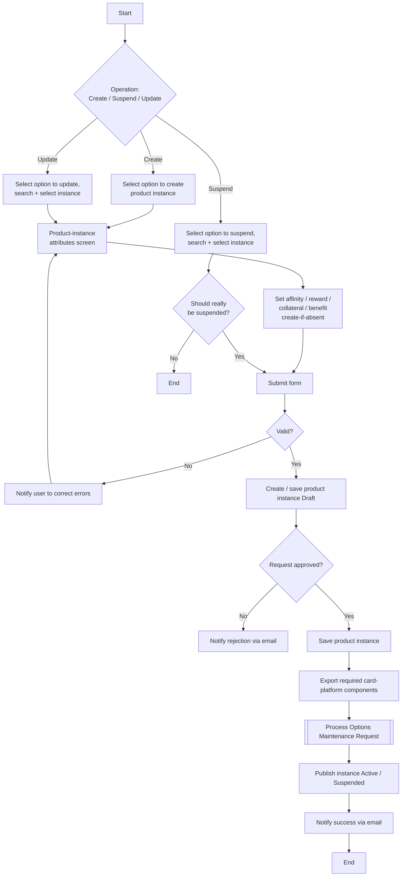

# Manage Product Instance Flow

**Purpose:** The back-office process to **create, suspend, and update a card product instance** — the base product record that composes affinity, reward, collateral, and benefit constructs. Each operation drafts the instance, validates and approves it, exports it to the **card processing platform** via an Options Maintenance Request, and publishes it Active (or Suspended).

**Position:** The general product-setup flow; [[Set Up Premium Card Product Flow]] is its premium-tier create specialization. Composes [[Manage Affinity Partnership Flow]], [[Create Reward Flow]], and [[Manage Card Benefits Flow]]. A [[Cards]] capability.

## Flow

## Step Detail

### Step PIN-C — Create Product Instance

> **Step ID:** `PIN-C` · **Capability:** PLB-CRD-01; CLP-LOY-04, CLP-RWD-01 · **Actor:** Product Operations user · **Exits:** → PIN-APPROVE

The user **selects to create a product instance**; the attributes screen is displayed. The user composes the instance's constructs — **affinity, reward, collateral, benefit** — selecting existing ones or **creating any that do not yet exist** (which enables them via their own setup flows), then **submits**.

### Step PIN-S — Suspend Product Instance

> **Step ID:** `PIN-S` · **Capability:** PLB-CRD-01 · **Preconditions:** instance exists · **Inputs:** suspension confirmation · **Exits:** confirmed → PIN-APPROVE; not confirmed → End

The user **selects to suspend a product instance** and **searches and selects** it. A gate asks whether it **should really be suspended** before proceeding (guarding against accidental suspension of a live product).

### Step PIN-U — Update Product Instance

> **Step ID:** `PIN-U` · **Capability:** PLB-CRD-01 · **Preconditions:** instance exists · **Exits:** → PIN-APPROVE

The user **selects to update a product instance**, **searches and selects** it, the attributes screen is displayed pre-populated, the user **changes the attributes/constructs** and **submits**.

### Step PIN-APPROVE — Validate, Approve, Export, Publish

> **Step ID:** `PIN-APPROVE` · **Capability:** OPS — Workflow & Rules (approvals, adjacent); ENT-BOR · **Preconditions:** PIN-C/S/U submitted · **Inputs:** validation, approver decision · **Exits:** End

On submit the fields are **validated** (invalid → error-correction loop). When valid the instance is **created/saved Draft**, routed for **approval** (rejection → email), **saved**, **exported to the card platform**, propagated via an **Options Maintenance Request** ([[Submit Options Maintenance Request Flow]]), and **published Active** (or **Suspended**), with a success email.

## Business Rules (Generalized)

| Rule | Statement |
|---|---|
| Composite instance | A product instance composes affinity, reward, collateral, and benefit |
| Create-if-absent | Constructs not yet existing are created inline before selection |
| Confirm before suspend | Suspension requires explicit confirmation |
| Validate → Draft → approve | Fields validate, a Draft is created, approval gates publish |
| Active/Suspended via OMR | Card-platform impact applied through an Options Maintenance Request |

## Capability Mapping

| Capability | How exercised |
|---|---|
| [[Cards]] PLB-CRD-01 | Product-instance creation, suspension, update |
| [[Loyalty]] CLP-LOY-04 | Affinity composition into the instance |
| [[Rewards]] CLP-RWD-01 | Reward composition into the instance |
| Operations / Enterprise Support (adjacent) | Approval workflow; product catalogue BoR |

## Source Traceability

Generalized from the MBNA Product Operations *Manage Product Instances — Create / Suspend / Update (Modify) Product Instances* flows. TSYS, the workflow management system, and the product catalogue are abstracted per [[Systems and Integration Reference]]; dense source diagrams reconstructed at confident level; source deck is DRAFT.
