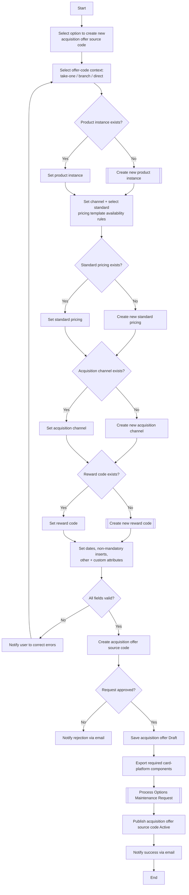

# Manage Source Code Flow

**Purpose:** The back-office process to **create an acquisition offer (source code)** — the construct that binds a **product instance, channel/availability rules, standard pricing, acquisition channel, and reward** into a single offer code used to acquire customers. The offer is composed, validated, approved, exported to the **card processing platform** via an Options Maintenance Request, and published Active.

**Position:** A [[Offers|Lead Management / Manage Offers (CEN-OFR-03)]] flow; the source codes it produces are consumed by acquisition campaigns ([[Phone Campaign New Customer Flow]]) and by public-site content ([[Content Management CPCMS Flow]]). Source spans two diagram pages (1–2 of 2).

## Flow

## Step Detail

### Step SRC-01 — Initiate and Set Context

> **Step ID:** `SRC-01` · **Capability:** CEN-OFR-03 (promo/source codes) · **Actor:** Product Operations user · **Exits:** → SRC-02

The user **selects to create a new acquisition offer (source code)** and selects the offer-code context (take-one / branch / direct — the acquisition vehicle the code is for).

### Step SRC-02 — Compose the Offer

> **Step ID:** `SRC-02` · **Capability:** CEN-OFR-03; SVC-MON-01 (standard pricing); CLP-RWD-01 (reward) · **Preconditions:** SRC-01 · **Exits:** → SRC-03

For each construct the flow checks existence and either sets it or creates it inline:

- **Product instance** — set or [[Manage Product Instance Flow|create new]].
- **Channel + standard pricing template** — set the channel and select the standard pricing template (availability rules); create new standard pricing if required ([[Manage Pricing Flow]]).
- **Acquisition channel** — set or create.
- **Reward code** — set or [[Create Reward Flow|create new reward code]] (the secondary reward attribute).

The user then sets **dates, non-mandatory inserts, other attributes, and custom attributes**.

### Step SRC-03 — Validate and Create

> **Step ID:** `SRC-03` · **Capability:** CEN-OFR-03 · **Preconditions:** SRC-02 · **Inputs:** field validation · **Exits:** invalid → error-correction loop; valid → SRC-04

On submit all selected fields are **validated**; invalid fields drive an error-notification correction loop. When valid, the **acquisition offer (source code) is created**.

### Step SRC-04 — Approve, Export, Publish, Notify

> **Step ID:** `SRC-04` · **Capability:** OPS — Workflow & Rules (approvals, adjacent); ENT-BOR · **Preconditions:** SRC-03 · **Inputs:** approver decision · **Exits:** End

The offer is routed for **approval** (rejection → email), **saved Draft**, **exported to the card platform**, propagated via an **Options Maintenance Request** ([[Submit Options Maintenance Request Flow]]), and **published Active**, with a success email.

## Business Rules (Generalized)

| Rule | Statement |
|---|---|
| Binds the offer | A source code binds product instance, channel/pricing, acquisition channel, and reward |
| Create-if-absent | Any missing construct is created inline before selection |
| Validation gate | All fields validate before the source code is created |
| Approval gate | The acquisition offer is approved before publish |
| Draft → Active via OMR | Saved Draft, exported to the card platform via OMR, then published Active |

## Capability Mapping

| Capability | How exercised |
|---|---|
| [[Offers]] CEN-OFR-03 | Acquisition offer / source-code generation |
| [[Marketing and Sales]] MKS-MKT-04, MKS-CRM-06 | Lead/prospect acquisition and lead generation |
| [[Servicing - Monetary]] SVC-MON-01 (adjacent) | Standard pricing template bound to the offer |
| [[Rewards]] CLP-RWD-01 (adjacent) | Reward code bound to the offer |

## Source Traceability

Generalized from the MBNA Product Ops *Lead Management — Manage Offers — Manage Source Code (1–2 of 2)* flow. TPC/OFC/Branch, SPT, AC, ARQ2, TSYS, and the product catalogue are abstracted per [[Systems and Integration Reference]]; source deck is DRAFT.
