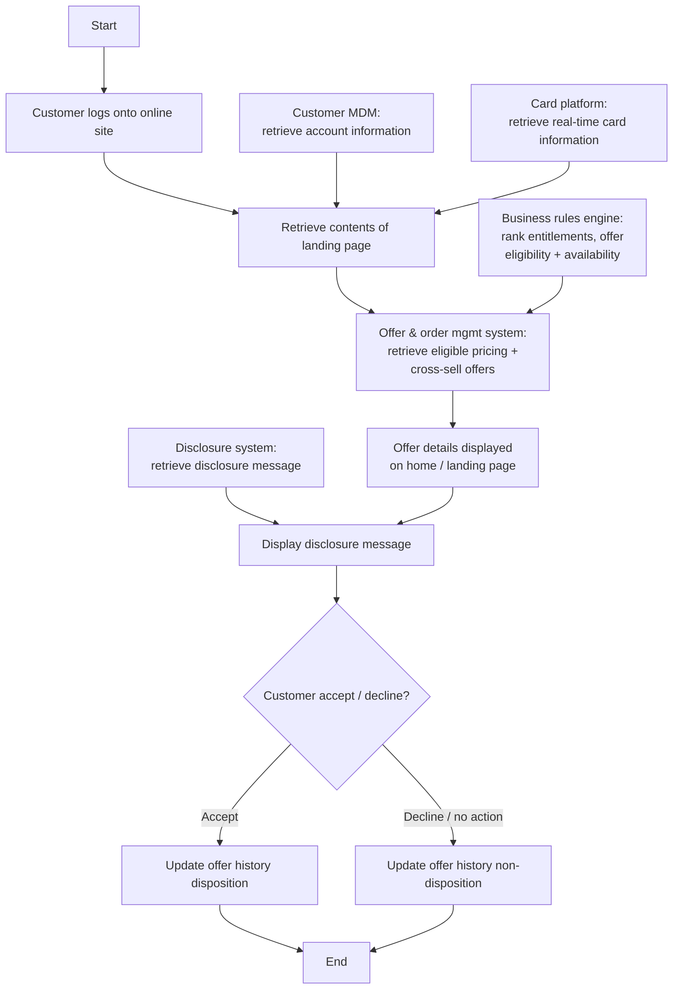

# Online Campaign Flow

**Purpose:** How offers are **presented to a logged-in existing customer on the online channel** — assembling the landing page from account and real-time card information, ranking eligibility through the **business rules engine**, retrieving eligible pricing and cross-sell offers from the **offer & order management system**, displaying the offer with its **disclosure**, and recording the customer's accept/decline in **offer history**.

**Position:** The online sibling of [[Phone Campaign Existing Customer Flow]]. Consumes content from [[Create and Update Content Management Flow]] and disclosures from [[Disclosure Management Flow]]. An [[Offers]] capability.

## Flow

## Step Detail

### Step ONC-01 — Login and Landing-Page Assembly

> **Step ID:** `ONC-01` · **Capability:** CEN-OFR-01; CHN — Self-Serve (adjacent) · **Actor:** Customer · **Exits:** → ONC-02

The customer **logs onto the online site**. The landing page is assembled from **account information** (customer MDM) and **real-time card information** (card processing platform).

### Step ONC-02 — Eligibility Ranking and Offer Retrieval

> **Step ID:** `ONC-02` · **Capability:** CEN-OFR-02 (offer engine) · **Preconditions:** ONC-01 · **Exits:** → ONC-03

The **business rules engine ranks account entitlements, offer eligibility, and offer availability**, and the **offer & order management system retrieves all eligible pricing and cross-sell offers** to present.

### Step ONC-03 — Present Offer with Disclosure

> **Step ID:** `ONC-03` · **Capability:** CEN-OFR-01; ONB-CCC-01 (disclosure) · **Preconditions:** ONC-02 · **Exits:** → ONC-04

The **offer details are displayed on the home/landing page**, and the **disclosure message** for the offer (retrieved from the disclosure/customer-communications system) is displayed to the customer.

### Step ONC-04 — Capture Disposition

> **Step ID:** `ONC-04` · **Capability:** CEN-CON-03 (contact/offer history) · **Preconditions:** ONC-03 · **Inputs:** accept/decline · **Exits:** End

The customer **accepts or declines**. **Offer history is updated** with the disposition (accepted) or non-disposition (declined/no action) so the offer is treated correctly on subsequent visits. *(Source note: at disposition the offer system may also feed the marketing-analytics rules engine — a requirement marked TBD.)*

## Business Rules (Generalized)

| Rule | Statement |
|---|---|
| Authenticated presentment | Offers are shown to a logged-in existing customer |
| Real-time assembly | The landing page uses real-time card and account information |
| Engine-ranked eligibility | The business rules engine ranks eligibility and availability |
| Disclosure with offer | The offer's disclosure message is displayed at presentment |
| History updated | Accept/decline updates offer history (disposition / non-disposition) |

## Capability Mapping

| Capability | How exercised |
|---|---|
| [[Offers]] CEN-OFR-01/02 | Online offer presentment; rules-engine eligibility ranking |
| [[Contact Management]] CEN-CON-03 | Offer-history update on disposition |
| Onboarding & Origination — ONB-CCC-01 (adjacent) | Offer disclosure display |

## Source Traceability

Generalized from the MBNA Product Operations *Lead Management — Online Campaign / Existing Customer* flow (Source: SRS Offer Fulfillment Modified Scope v3.3). Customer MDM, business rules engine, OOMS, Thunderhead One disclosures, TSYS, and BLAZE are abstracted per [[Systems and Integration Reference]]; source deck is DRAFT.
