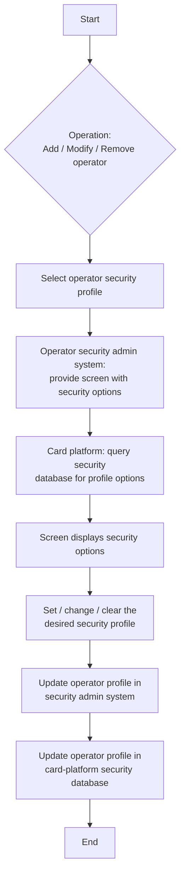

# Operator Security Administration Flow

**Purpose:** The back-office process to **administer operator security profiles** — adding, modifying, and removing the entitlements that determine what an internal operator (e.g., a contact-centre or product-ops user) can do in the card systems. The operator security administration system presents the security options, and changes are written to both that system and the **card processing platform's** security database.

**Position:** An **Identity, Auth & Access** capability (entitlements, user groups/roles, access controls) rather than a product/offer capability — included because it was part of the card-platform operational setup. The security profile gates who may perform the actions in the other flows.

## Flow

## Step Detail

### Step OSA-01 — Select Operator and Operation

> **Step ID:** `OSA-01` · **Capability:** IAA — Identity Management (user groups & roles) · **Actor:** Operator security administrator · **Inputs:** operator, operation (add/modify/remove) · **Exits:** → OSA-02

The administrator selects the **operator security profile** to work on and the operation — **add** a new operator, **modify** an existing operator's entitlements, or **remove** an operator's access.

### Step OSA-02 — Present and Retrieve Security Options

> **Step ID:** `OSA-02` · **Capability:** IAA — Authorization (access controls) · **Preconditions:** OSA-01 · **Exits:** → OSA-03

The operator security administration system **provides the screen with operator security options**; the **card processing platform queries its security database** for the available profile options, which are then displayed (the option levels and module-level access — e.g., debit-card module, security access controls).

### Step OSA-03 — Set Profile

> **Step ID:** `OSA-03` · **Capability:** IAA — Identity Management / Authorization · **Preconditions:** OSA-02 · **Inputs:** desired security profile · **Exits:** → OSA-04

The administrator **sets the desired security profile** for the operator: for **add**, grant the appropriate option levels and access controls; for **modify**, change them; for **remove**, clear/revoke them.

### Step OSA-04 — Persist to Both Systems

> **Step ID:** `OSA-04` · **Capability:** IAA — Identity Management (profile sync) · **Preconditions:** OSA-03 · **Exits:** End

The change is **written to the operator security administration system** and the **card-platform security database is updated** for the operator, keeping the two stores in sync.

## Business Rules (Generalized)

| Rule | Statement |
|---|---|
| Profile-driven access | What an operator can do is governed by the security profile/option levels |
| Source of options | Available profile options are read from the card-platform security database |
| Dual-write | Changes update both the security admin system and the card-platform security store |
| Lifecycle | Operators are added, modified, and removed through the same administration flow |

## Capability Mapping

| Capability | How exercised |
|---|---|
| Identity, Auth & Access — Identity Management (IAA-IDM) | Operator user groups, roles, entitlements, profile sync |
| Identity, Auth & Access — Authorization (IAA-AUTHZ) | Access controls / option-level permissions for operators |
| [[Cards]] PLB-CRD-01 (adjacent) | Card-platform security database holding operator profiles |

## Source Traceability

Generalized from the MBNA Product Ops *Manage Options — OTIS Security (Add / Modify / Remove Operator)* flow (Source: SDS for OTIS). OTIS, the MOOP/MOTP/MOHP/MOCO/MOOO screens, the T32 debit-card module, SAC, and TS2 are abstracted per [[Systems and Integration Reference]]; source deck is DRAFT.
