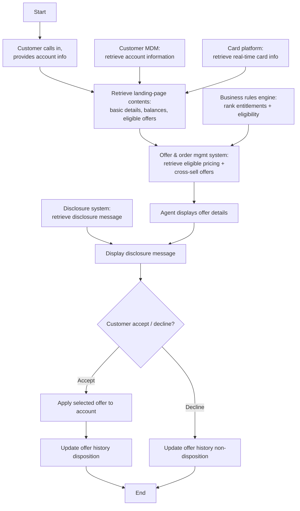

# Phone Campaign Existing Customer Flow

**Purpose:** How offers are **presented to an existing customer on the phone channel** — the agent assembles the customer's landing view from account and real-time card information, the **business rules engine** ranks eligibility, the **offer & order management system** returns eligible pricing and cross-sell offers, the agent presents the offer with its **disclosure**, applies the accepted offer, and updates **offer history**.

**Position:** The phone-channel sibling of [[Online Campaign Flow]] — same engine/offer/disclosure pattern, delivered through the agent desktop. An [[Offers]] / [[Marketing and Sales|cross-sell (MKS-CRM-03)]] capability.

## Flow

## Step Detail

### Step PCE-01 — Inbound Call and Landing Assembly

> **Step ID:** `PCE-01` · **Capability:** CEN-OFR-01; CHN — Assisted (adjacent) · **Actor:** Customer + agent · **Exits:** → PCE-02

The customer **calls in and provides account information**; the agent retrieves the **landing-page contents** (basic details, eligible offers, balances) from **account information** (customer MDM) and **real-time card information** (card platform).

### Step PCE-02 — Eligibility and Offer Retrieval

> **Step ID:** `PCE-02` · **Capability:** CEN-OFR-02 (offer engine) · **Preconditions:** PCE-01 · **Exits:** → PCE-03

The **business rules engine ranks entitlements, offer eligibility, and availability**, and the **offer & order management system retrieves eligible pricing and cross-sell offers**.

### Step PCE-03 — Present with Disclosure

> **Step ID:** `PCE-03` · **Capability:** CEN-OFR-01; MKS-CRM-03 (cross/upsell); ONB-CCC-01 · **Preconditions:** PCE-02 · **Exits:** → PCE-04

The agent **displays the offer details** and the **disclosure message** for the offer is displayed (retrieved from the disclosure/customer-communications system).

### Step PCE-04 — Apply and Update History

> **Step ID:** `PCE-04` · **Capability:** CEN-CON-03 (offer history); CEN-OFR-01 · **Preconditions:** PCE-03 · **Inputs:** accept/decline · **Exits:** End

On **accept**, the **selected offer is applied to the account** and **offer history is updated (disposition)**. On **decline**, offer history is updated (non-disposition).

## Business Rules (Generalized)

| Rule | Statement |
|---|---|
| Existing customers | Presentment to an authenticated existing customer on the phone |
| Real-time assembly | Landing view uses real-time card and account data |
| Engine-ranked eligibility | The business rules engine ranks eligibility/availability |
| Disclosure with offer | The offer's disclosure is read/displayed at presentment |
| Apply + history | Accepted offers are applied to the account; history records the disposition |

## Capability Mapping

| Capability | How exercised |
|---|---|
| [[Offers]] CEN-OFR-01/02 | Phone offer presentment; rules-engine eligibility |
| [[Marketing and Sales]] MKS-CRM-03 | Cross-sell of offers to existing customers |
| [[Contact Management]] CEN-CON-03 | Offer-history update |
| Onboarding & Origination — ONB-CCC-01 (adjacent) | Offer disclosure |

## Source Traceability

Generalized from the MBNA Product Operations *Lead Management — Phone Campaign / Existing Customer* flow (Source: SRS Offer Fulfillment Modified Scope v3.3). Customer MDM, business rules engine, OOMS, disclosure system, and TSYS abstracted per [[Systems and Integration Reference]]; source deck is DRAFT.
