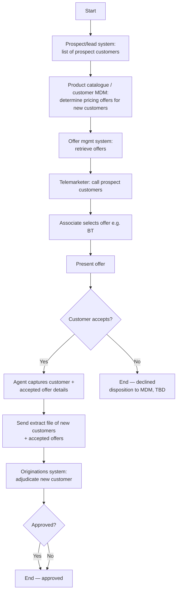

# Phone Campaign New Customer Flow

**Purpose:** How **prospects are acquired over the phone** — a prospect list is built, pricing offers are determined and retrieved, a third-party telemarketer calls prospects and presents an offer (e.g., a balance-transfer offer), accepted offers are captured into an extract file, and each new customer is **adjudicated** for approval.

**Position:** The acquisition (new-customer) phone flow, distinct from the existing-customer [[Phone Campaign Existing Customer Flow]]. It crosses into **Onboarding & Origination** (intake + adjudication) and presents [[Offers|intro offers (CEN-OFR-04)]] built in [[Manage Source Code Flow]].

## Flow

## Step Detail

### Step PCN-01 — Prospect List and Offer Determination

> **Step ID:** `PCN-01` · **Capability:** MKS-MKT-04 (lead/prospect), MKS-CRM-06 (lead gen) · **Actor:** Prospect/lead system · **Exits:** → PCN-02

A **list of prospect customers** is produced by the prospect/lead management system. The **product catalogue / customer MDM determines the pricing offers** to be sent to new customers, and the **offer management system retrieves the offers**.

### Step PCN-02 — Telemarketer Presentment

> **Step ID:** `PCN-02` · **Capability:** CEN-OFR-04 (intro offers); ONB-APP-01 (intake) · **Actor:** Third-party telemarketer · **Preconditions:** PCN-01 · **Inputs:** accept/decline · **Exits:** accept → PCN-03; decline → End

The **third-party telemarketer calls prospect customers**, the associate **selects the offer** (e.g., a balance-transfer offer) and **presents** it. If the customer **accepts**, the agent **captures the customer and accepted-offer details**; declines end the call (with the disposition provided to MDM per a TBD requirement).

### Step PCN-03 — Extract and Adjudicate

> **Step ID:** `PCN-03` · **Capability:** ONB-ADJ-01 (credit decisioning) · **Preconditions:** PCN-02 accepted · **Inputs:** extract file · **Exits:** End (approved / not approved)

An **extract file of all new customers and their accepted offers** is sent to the originations system, which **adjudicates each new customer**. The **approval decision** determines whether the new customer is booked.

## Business Rules (Generalized)

| Rule | Statement |
|---|---|
| Prospects, not customers | Targets prospects from a lead/prospect list |
| Offer pre-determined | Pricing offers for new customers are determined and retrieved before calling |
| Third-party calling | A third-party telemarketer conducts the outbound calls |
| Capture on accept | Accepted customer + offer details are captured into an extract file |
| Adjudication gate | New customers are adjudicated; approval governs booking |

## Capability Mapping

| Capability | How exercised |
|---|---|
| [[Marketing and Sales]] MKS-MKT-04, MKS-CRM-06 | Prospect/lead sourcing and lead generation |
| [[Offers]] CEN-OFR-04 | Intro/acquisition offer presentment |
| Onboarding & Origination — ONB-APP-01 / ONB-ADJ-01 (adjacent) | New-customer intake and credit adjudication |

## Source Traceability

Generalized from the MBNA Product Operations *Lead Management — Phone Campaign / New Customer* flow (Source: SRS Offer Presentation Modified Scope v3.3). CornerStone, PC/MDM, OOMS, the third-party telemarketer, and OM4 are abstracted per [[Systems and Integration Reference]]; source deck is DRAFT.
