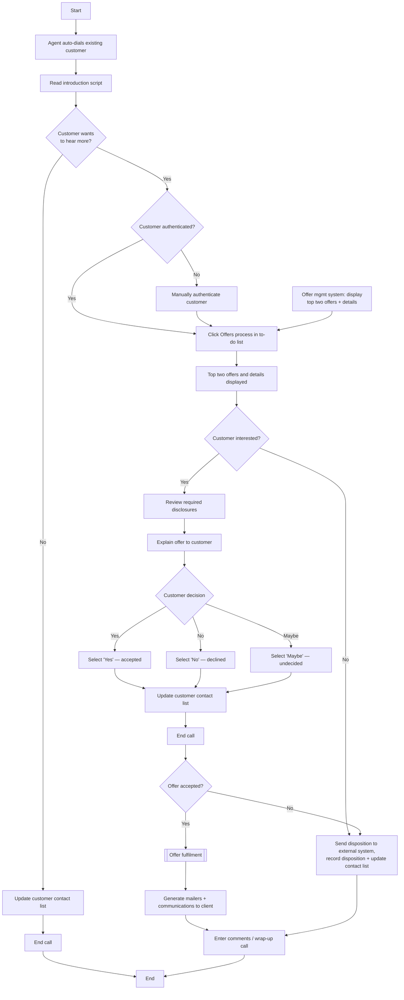

# Phone Channel Outbound Flow

**Purpose:** The **outbound calling sub-process** for existing customers — an agent auto-dials a customer from a to-do list, reads an intro script, gauges interest, authenticates, presents the **top two offers** from the offer management system with disclosures, captures the customer's **accept / decline / maybe** disposition, fulfils accepted offers, and records the disposition back to the contact list.

**Position:** The reusable sub-process invoked by outbound campaigns — [[Publish Rewards Flow]], [[Direct Marketing Campaign Flow]], and the phone branch of [[Apply List to Offers Flow]]. A [[Contact Management|outreach (CEN-CON-05)]] capability.

## Flow

## Step Detail

### Step PCO-01 — Dial and Introduction

> **Step ID:** `PCO-01` · **Capability:** CEN-CON-05 (outreach); CHN — Assisted (adjacent) · **Actor:** Agent · **Inputs:** to-do list / dialer · **Exits:** wants more → PCO-02; not interested → update contact list + end call

The agent **auto-dials an existing customer** and **reads the introduction script**. If the customer does **not** want to hear more, the agent **updates the contact list** and **ends the call**.

### Step PCO-02 — Authenticate and Retrieve Top Offers

> **Step ID:** `PCO-02` · **Capability:** IAA (authentication); CEN-OFR-01/02 · **Preconditions:** PCO-01 (wants more) · **Exits:** → PCO-03

The agent **authenticates the customer** (manually if needed) and **clicks the Offers process in the to-do list**; the **offer management system displays the top two offers and their details**.

### Step PCO-03 — Present, Disclose, Capture Disposition

> **Step ID:** `PCO-03` · **Capability:** CEN-OFR-01; MKS-CRM-03 (cross/upsell); ONB-CCC-01 (disclosure) · **Preconditions:** PCO-02 · **Inputs:** accept/decline/maybe · **Exits:** → PCO-04

If the customer is **interested**, the agent **reviews the required disclosures** and **explains the offer**, then captures the decision — **Yes** (accepted), **No** (declined), or **Maybe** (undecided) — **updates the customer contact list**, and **ends the call**.

### Step PCO-04 — Fulfil or Record, Wrap-Up

> **Step ID:** `PCO-04` · **Capability:** CEN-CON-03 (contact/offer history); CEN-OFR-01 · **Preconditions:** PCO-03 · **Inputs:** accepted? · **Exits:** End

If the **offer was accepted**, **offer fulfilment** runs and the system **generates required mailers and communications to the client**. If **not accepted**, the **disposition is sent to the external system** and **recorded, updating the client contact list**. The agent **enters comments / wraps up the call**.

## Business Rules (Generalized)

| Rule | Statement |
|---|---|
| Script first | The call opens with an introduction script and an interest gate |
| Authenticate before offers | The customer is authenticated before offers are presented |
| Top-two offers | The offer management system surfaces the top two offers from the to-do list |
| Three-way disposition | The agent records Yes / No / Maybe and updates the contact list |
| Fulfil or record | Accepted offers fulfil and generate communications; others record a disposition |

## Capability Mapping

| Capability | How exercised |
|---|---|
| [[Contact Management]] CEN-CON-03/05 | Outbound outreach, contact-list updates, disposition capture |
| [[Offers]] CEN-OFR-01/02 | Top-offer presentment and fulfilment |
| [[Marketing and Sales]] MKS-CRM-03 | Cross/upsell to existing customers |
| Onboarding & Origination — ONB-CCC-01 (adjacent) | Disclosures reviewed at presentment |

## Source Traceability

Generalized from the MBNA Phone Channel *Phone Channel Outbound Existing (Sub-process)* flow (Source: Agent Desktop Application). The dialer, agent desktop, and offer management system abstracted per [[Systems and Integration Reference]]; source deck is DRAFT.
