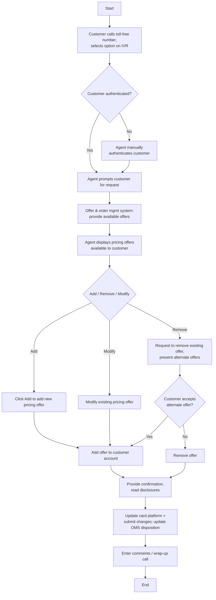

# Pricing Offer Presentment Flow

**Purpose:** How a **pricing offer** (e.g., a promotional balance-transfer rate) is **presented, added, removed, or modified** on the phone/IVR channel — the customer calls in, is authenticated, the agent presents eligible pricing offers from the offer & order management system, and on acceptance the offer is added to the account with disclosures read and the card platform updated (BT fulfilment following).

**Position:** One of three phone-channel presentment flows ([[Value-Add Offer Presentment Flow]], [[Insurance Offer Presentment Flow]]). The pricing it presents is set up in [[Manage Pricing Flow]]; lands in [[Servicing - Monetary|Rate/APR (SVC-MON-01)]]. Covers add/remove/modify variants.

## Flow

## Step Detail

### Step POP-01 — Authentication and Request

> **Step ID:** `POP-01` · **Capability:** CHN — Self-Serve/Assisted (adjacent); IAA (authentication) · **Actor:** Customer + IVR + agent · **Exits:** → POP-02

The customer **calls the toll-free number and selects an option on the IVR**, which authenticates them. If not authenticated, the agent **manually authenticates** the customer, then **prompts the customer for their request**.

### Step POP-02 — Present Available Pricing Offers

> **Step ID:** `POP-02` · **Capability:** CEN-OFR-01/02 · **Preconditions:** POP-01 · **Exits:** → POP-A / POP-R / POP-M

The **offer & order management system provides the available offers**; the agent **displays the pricing offers available to the customer** (offer-eligibility surfaced via the agent workflow/desktop). Real-time customer/card information is supplied by the card platform.

### Step POP-A — Add Pricing Offer

> **Step ID:** `POP-A` · **Capability:** CEN-OFR-01; SVC-MON-01; PLB-CRD-09 (balance transfer) · **Preconditions:** POP-02 · **Exits:** → POP-CONF

The agent **clicks Add to add a new pricing offer** (e.g., a promotional BT rate); the offer is **added to the customer account** via the agent workflow.

### Step POP-R — Remove Pricing Offer

> **Step ID:** `POP-R` · **Capability:** CEN-OFR-01 · **Preconditions:** POP-02 · **Inputs:** alternate-offer decision · **Exits:** → POP-CONF

On a removal request the agent **presents alternate offers**; if the customer accepts an alternate it is applied, otherwise the **existing offer is removed**.

### Step POP-M — Modify Pricing Offer

> **Step ID:** `POP-M` · **Capability:** CEN-OFR-01; SVC-MON-01 · **Preconditions:** POP-02 · **Exits:** → POP-CONF

The agent **modifies the existing pricing offer** on the account.

### Step POP-CONF — Confirm, Disclose, Update, Wrap-Up

> **Step ID:** `POP-CONF` · **Capability:** ONB-CCC-01 (disclosure); SVC-MON-05 (BT execution); CEN-CON-06 (consent) · **Preconditions:** POP-A/R/M · **Exits:** End

The agent **provides confirmation and reads the disclosures**, the change is **submitted to the card platform** (and the offer system's disposition updated; **balance-transfer fulfilment** follows for BT offers), and the agent **enters comments / wraps up the call**.

## Business Rules (Generalized)

| Rule | Statement |
|---|---|
| Authenticate first | The customer is authenticated (IVR or manual) before any change |
| Eligible offers only | Available pricing offers come from the offer & order management system |
| Disclosures read | Disclosures are read/confirmed before completing the change |
| Card-platform update | Accepted changes are submitted to the card processing platform |
| Disposition + fulfilment | The offer disposition is updated; BT fulfilment follows acceptance |

## Capability Mapping

| Capability | How exercised |
|---|---|
| [[Offers]] CEN-OFR-01 | Pricing-offer presentment, add/remove/modify, disposition |
| [[Servicing - Monetary]] SVC-MON-01/05 | Rate/APR and balance-transfer execution |
| [[Cards]] PLB-CRD-09 | Balance-transfer feature targeted by the offer |
| Onboarding & Origination — ONB-CCC-01 (adjacent) | Disclosure read at confirmation |

## Source Traceability

Generalized from the MBNA Product Operations *Lead Management — Pricing Offer (BT) Presentment — Add / Remove / Modify* flows (Source: SRS Offer Presentation Modified Scope v3.3). IVR, CSR, PEGA, OOMS, and TSYS abstracted per [[Systems and Integration Reference]]; source deck is DRAFT.
