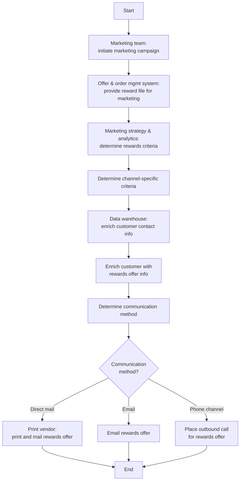

# Publish Rewards Flow

**Purpose:** The cross-functional process that takes a **rewards offer to existing customers** — from marketing-campaign initiation, through rewards-criteria and channel-criteria determination, customer data enrichment, and communication-method routing, to delivery via **direct mail, email, or outbound phone**.

**Assumption (from source):** the recipients are **existing customers**. This is a *presentment* campaign for rewards content created by [[Create Reward Flow]] and placed on the secure site by [[Create and Update Content Management Flow]].

## Flow

## Step Detail

### Step PRW-01 — Campaign Initiation and Reward File

> **Step ID:** `PRW-01` · **Capability:** MKS-MKT-02 (campaign mgmt); CLP-RWD-05 · **Actor:** Marketing team · **Exits:** → PRW-02

The marketing team **initiates a marketing campaign**. The **offer & order management system provides the reward file** (the rewards eligible for the campaign) for marketing to work from.

### Step PRW-02 — Rewards and Channel Criteria

> **Step ID:** `PRW-02` · **Capability:** MKS-MKT-02, MKS-MKT-03 (segment); CLP-RWD-05 · **Actor:** Marketing strategy & analytics · **Preconditions:** PRW-01 · **Exits:** → PRW-03

The marketing strategy & analytics team **determines the rewards criteria** (which rewards to offer to whom) and the **channel-specific criteria** (how the offer differs by delivery channel).

### Step PRW-03 — Customer Enrichment

> **Step ID:** `PRW-03` · **Capability:** ENT — Data & Analytics (adjacent); CEN-CON-05 (outreach) · **Actor:** Data warehouse · **Preconditions:** PRW-02 · **Exits:** → PRW-04

The data warehouse **enriches customer contact information** and then **enriches each customer with the rewards-offer information**, producing the audience-plus-offer dataset for dispatch.

### Step PRW-04 — Communication-Method Routing and Delivery

> **Step ID:** `PRW-04` · **Capability:** CEN-CON-04 (channel preference), CEN-CON-05; CLP-RWD-05 · **Preconditions:** PRW-03 · **Inputs:** determined communication method · **Exits:** End

The **communication method is determined** and the offer is routed to the appropriate channel:

- **Direct mail** → the print vendor **prints and mails** the rewards offer.
- **Email** → the rewards offer is **emailed**.
- **Phone channel** → an **outbound call** is placed for the rewards offer (executed via [[Phone Channel Outbound Flow]]).

## Business Rules (Generalized)

| Rule | Statement |
|---|---|
| Existing customers | The campaign targets existing customers |
| Reward file drives eligibility | The eligible-rewards file comes from the offer & order management system |
| Two-tier criteria | Rewards criteria and channel-specific criteria are set separately |
| Enrichment before dispatch | Customer contact and reward-offer data are enriched in the data warehouse first |
| Channel fan-out | Delivery is direct mail, email, or outbound phone per the determined method |

## Capability Mapping

| Capability | How exercised |
|---|---|
| [[Rewards]] CLP-RWD-05 | Presentment of rewards offers to customers across channels |
| [[Marketing and Sales]] MKS-MKT-02/03 | Campaign initiation, rewards criteria, segmentation |
| [[Contact Management]] CEN-CON-04/05 | Channel selection and outreach orchestration |

## Source Traceability

Generalized from the MBNA Product Operations *Content Management — Publish Rewards* flow. The offer/order management system (OOMS), marketing data warehouse, print vendor, and outbound-phone channels are abstracted per [[Systems and Integration Reference]]; source deck is DRAFT.
