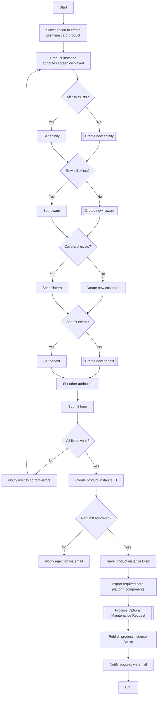

# Set Up Premium Card Product Flow

**Purpose:** The composite back-office process to **set up a premium-tier (World-class) card product instance** — creating the product instance and composing its **affinity, reward, collateral, and benefit** constructs (creating any that do not yet exist), validating, routing through approval, exporting to the **card processing platform** via an Options Maintenance Request, and publishing the product instance Active.

**Position:** A specialized create path on top of [[Manage Product Instance Flow]] that orchestrates [[Manage Affinity Partnership Flow]], [[Create Reward Flow]], and [[Manage Card Benefits Flow]] as sub-constructs. Premium tiers attach higher reward earn and tier benefits — see [[Loyalty|CLP-LOY-02]] and [[Rewards|CLP-RWD-08]].

## Flow

## Step Detail

### Step PCP-01 — Initiate and Display Attributes

> **Step ID:** `PCP-01` · **Capability:** PLB-CRD-01 · **Actor:** Product Operations user · **Exits:** → PCP-02

The user **selects to create a premium card product**; the **product-instance attributes screen** is displayed (served by the workflow/UI).

### Step PCP-02 — Compose Affinity, Reward, Collateral, Benefit

> **Step ID:** `PCP-02` · **Capability:** CLP-LOY-02/04, CLP-RWD-01/08, PLB-CRD-01 · **Preconditions:** PCP-01 · **Exits:** → PCP-03

For each construct the flow checks **whether it already exists**: if yes, the user **sets** (selects) it; if not, the corresponding **create sub-process** is invoked inline:

- **Affinity** — set or [[Manage Affinity Partnership Flow|create new affinity]].
- **Reward** — set or [[Create Reward Flow|create new reward]].
- **Collateral** — set or create new collateral.
- **Benefit** — set or [[Manage Card Benefits Flow|create new benefit]].

The user then **sets the other product attributes**.

### Step PCP-03 — Validate and Create Instance

> **Step ID:** `PCP-03` · **Capability:** PLB-CRD-01 · **Preconditions:** PCP-02 · **Inputs:** field validation · **Exits:** invalid → correct errors (back to attributes); valid → PCP-04

On **submit**, the system validates all selected fields. Invalid fields drive an **error-notification screen** and a correction loop. When valid, the **product-instance ID is created**.

### Step PCP-04 — Approve, Export, Publish, Notify

> **Step ID:** `PCP-04` · **Capability:** OPS — Workflow & Rules (approvals, adjacent); ENT-BOR · **Preconditions:** PCP-03 · **Inputs:** approver decision · **Exits:** End

The request is routed for **approval**. On rejection the user is emailed. On approval: the **product instance is saved Draft**, **required card-platform components are exported**, the change is propagated via an **Options Maintenance Request** ([[Submit Options Maintenance Request Flow]]), the **product instance is published Active**, and the user **receives a success email**.

## Business Rules (Generalized)

| Rule | Statement |
|---|---|
| Composite setup | A premium product composes affinity, reward, collateral, and benefit constructs |
| Create-if-absent | Any construct that does not yet exist is created inline before selection |
| Validation gate | All selected fields must validate before a product-instance ID is created |
| Approval gate | The product instance is approved before being saved and published |
| Draft → Active via OMR | Saved Draft, exported to the card platform via OMR, then published Active |

## Capability Mapping

| Capability | How exercised |
|---|---|
| [[Cards]] PLB-CRD-01 | Premium card product-instance creation |
| [[Loyalty]] CLP-LOY-02/04 | Tiered (premium) status and affinity composition |
| [[Rewards]] CLP-RWD-01/08 | Reward and tiered-reward composition |
| Operations / Enterprise Support (adjacent) | Approval workflow; product catalogue BoR |

## Source Traceability

Generalized from the MBNA Product Ops *Manage Product Instances — Setup World Card (1–2 of 2)* flow. "World Card" abstracted to a generic premium/World-tier card product; TSYS, workflow management system, and product catalogue per [[Systems and Integration Reference]]; source deck is DRAFT.
