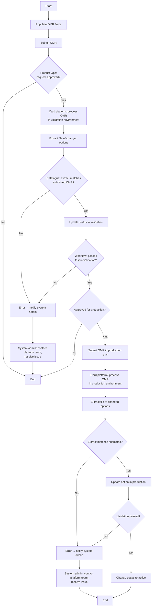

# Submit Options Maintenance Request Flow

**Purpose:** The controlled change-management process that **propagates a product/option change to the card processing platform** — populating and submitting an **Options Maintenance Request (OMR)**, approving it, applying it first in a **validation environment** (test and reconcile against the extracted change file), then in the **production environment**, with error paths that notify a system administrator.

**Position:** The shared "last mile" invoked by nearly every product-setup flow — [[Create Reward Flow]], [[Manage Affinity Partnership Flow]], [[Manage Card Benefits Flow]], [[Set Up Premium Card Product Flow]], [[Manage Pricing Flow]], and [[Manage Product Instance Flow]] — whenever a change must reach the card processing platform. An Operations *Workflow & Rules* capability. Source spans two diagram pages (1–2 of 2).

## Flow

## Step Detail

### Step OMR-01 — Populate and Submit

> **Step ID:** `OMR-01` · **Capability:** OPS-WFR-01 (workflow init) · **Actor:** Product Catalogue / requester · **Exits:** → OMR-02

The OMR fields are populated (the change set exported by the calling product-setup flow) and the **OMR is submitted**.

### Step OMR-02 — Approval

> **Step ID:** `OMR-02` · **Capability:** OPS-WFR-02 (approvals) · **Actor:** Product Ops team · **Preconditions:** OMR-01 · **Exits:** approved → OMR-03; not approved → End

The Product Ops team **approves the request for the OMR**. An unapproved request ends the flow.

### Step OMR-03 — Apply in Validation Environment

> **Step ID:** `OMR-03` · **Capability:** OPS-WFR-01; DEVSECOPS — Testing (adjacent) · **Preconditions:** OMR-02 approved · **Exits:** matches + test passes → OMR-04; mismatch/fail → OMR-ERR

The **card processing platform processes the OMR in the validation environment** and **extracts a file of changed options**. The product catalogue **checks the extract against the submitted OMR** (automated reconciliation). If it matches, status is updated to validation and the change is **tested in the validation environment (manual)**. A passed test advances to production approval.

### Step OMR-04 — Apply in Production Environment

> **Step ID:** `OMR-04` · **Capability:** OPS-WFR-01; ENT-BOR · **Preconditions:** OMR-03 passed + approved for production · **Exits:** matches + validation passes → status Active (End); mismatch/fail → OMR-ERR

On production approval the **OMR is submitted in the production environment**, the platform **processes it and extracts the changed-options file**, the catalogue **reconciles the extract against the submission**, the option is **updated in production**, and after a passed production validation the **status is changed to Active**.

### Step OMR-ERR — Error Handling

> **Step ID:** `OMR-ERR` · **Capability:** OPS — Case Mgmt. (adjacent) · **Trigger:** reconciliation mismatch or failed test/validation · **Exits:** End

On any reconciliation mismatch or failed test/validation, the platform **throws an error code and generates a notification for the system administrator**; an **error-notification screen** is shown, and the **system administrator contacts the card-platform team to resolve the issue**.

## Business Rules (Generalized)

| Rule | Statement |
|---|---|
| Approval before apply | An OMR is approved before it touches any environment |
| Validation before production | Changes are applied and tested in validation before production |
| Automated reconciliation | The extracted changed-options file is reconciled against the submitted OMR at each stage |
| Two-gate promotion | Separate approvals gate validation entry and production entry |
| Error to admin | Any mismatch/failure raises an error notification routed to a system administrator |

## Capability Mapping

| Capability | How exercised |
|---|---|
| Operations — Workflow & Rules OPS-WFR-01/02 | OMR initiation, approvals, environment promotion |
| Enterprise Support — Books of Record ENT-BOR | Product catalogue reconciliation and status of record |
| [[Cards]] PLB-CRD-01 | The card-platform option/product the change applies to |

## Source Traceability

Generalized from the MBNA Product Ops *Manage Options — Submit OMR (1–2 of 2)* flow. "V-Region"/"P-Region" abstracted to validation/production environments; TSYS and the MBNA System Administrator per [[Systems and Integration Reference]]; source deck is DRAFT.
