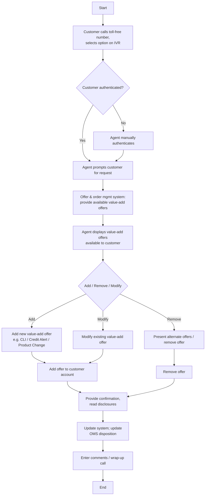

# Value-Add Offer Presentment Flow

**Purpose:** How a **value-add offer** — Credit-Limit Increase (CLI), Credit Alert, or Product Change — is **presented, added, removed, or modified** on the phone/IVR channel: the customer calls in, is authenticated, the agent presents eligible value-add offers from the offer & order management system, and on acceptance the offer is added to the account with confirmation and disclosures read, then the systems are updated.

**Position:** Sibling of [[Pricing Offer Presentment Flow]] and [[Insurance Offer Presentment Flow]]. CLI offers execute against [[Servicing - Monetary|CLI/CLD (SVC-MON-08)]] and [[Cards|card limits (PLB-CRD-08)]]. Covers add/remove/modify variants.

## Flow

## Step Detail

### Step VOP-01 — Authentication and Request

> **Step ID:** `VOP-01` · **Capability:** CHN (adjacent); IAA (authentication) · **Actor:** Customer + IVR + agent · **Exits:** → VOP-02

The customer **calls the toll-free number and selects an IVR option**, which authenticates them; failing that the agent **manually authenticates** and **prompts the customer for their request**.

### Step VOP-02 — Present Available Value-Add Offers

> **Step ID:** `VOP-02` · **Capability:** CEN-OFR-01/02; MKS-CRM-03 (cross/upsell) · **Preconditions:** VOP-01 · **Exits:** → VOP-A / VOP-R / VOP-M

The **offer & order management system provides the available offers**; the agent **displays the value-add offers** available to the customer. **Value-add offers include CLI, Credit Alert, and Product Change.**

### Step VOP-A — Add Value-Add Offer

> **Step ID:** `VOP-A` · **Capability:** CEN-OFR-01; SVC-MON-08 (CLI/CLD); PLB-CRD-08 (card limits) · **Preconditions:** VOP-02 · **Exits:** → VOP-CONF

The agent **adds the new value-add offer** (e.g., a credit-limit increase) and it is **added to the customer account**.

### Step VOP-R — Remove Value-Add Offer

> **Step ID:** `VOP-R` · **Capability:** CEN-OFR-01 · **Preconditions:** VOP-02 · **Inputs:** alternate-offer decision · **Exits:** → VOP-CONF

On a removal request the agent **presents alternate offers**; if none is accepted the **existing value-add offer is removed**.

### Step VOP-M — Modify Value-Add Offer

> **Step ID:** `VOP-M` · **Capability:** CEN-OFR-01 · **Preconditions:** VOP-02 · **Exits:** → VOP-CONF

The agent **modifies the existing value-add offer**. *(Source note: system or validation of value-add offer fulfilment can itself trigger a value-add modify.)*

### Step VOP-CONF — Confirm, Disclose, Update, Wrap-Up

> **Step ID:** `VOP-CONF` · **Capability:** ONB-CCC-01 (disclosure); SVC-MON-08 · **Preconditions:** VOP-A/R/M · **Exits:** End

The agent **provides confirmation and reads disclosures**, the **system is updated** (offer disposition recorded; CLI executed against card limits), and the agent **wraps up the call**.

## Business Rules (Generalized)

| Rule | Statement |
|---|---|
| Authenticate first | The customer is authenticated before any change |
| Defined value-adds | Value-add offers include CLI, Credit Alert, and Product Change |
| Eligible offers only | Available offers come from the offer & order management system |
| Disclosures read | Disclosures are read before completing the change |
| Fulfilment can trigger modify | Validation/fulfilment of a value-add offer may trigger a modify |

## Capability Mapping

| Capability | How exercised |
|---|---|
| [[Offers]] CEN-OFR-01 | Value-add offer presentment, add/remove/modify |
| [[Servicing - Monetary]] SVC-MON-08 | CLI/CLD execution |
| [[Cards]] PLB-CRD-08 | Card-limit change target of CLI |
| [[Marketing and Sales]] MKS-CRM-03 | Cross/upsell intent |

## Source Traceability

Generalized from the MBNA Product Operations *Lead Management — Value Add Offers — Add / Remove / Modify* flows (Source: SRS Offer Presentation Modified Scope v3.3; "Value Add Offers include CLI, Credit Alert, Product Change"). IVR, CSR, PEGA, OOMS, and TSYS abstracted per [[Systems and Integration Reference]]; source deck is DRAFT.
