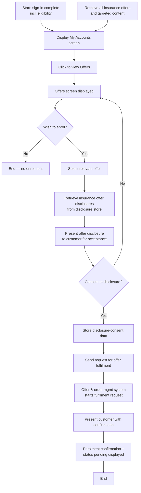

# Value-Add Offers Flow

**Purpose:** How a **signed-in customer is presented with, and enrols in, a value-add offer** (insurance / product-upgrade) on the secure site — from viewing targeted offers, through disclosure presentation and explicit consent, to the offer-and-order management system kicking off fulfilment and showing a confirmation with a *pending* enrolment status.

**Position:** Consumes content placed by [[Create and Update Content Management Flow]] and disclosures maintained by [[Disclosure Management Flow]]. The phone-channel equivalent is [[Insurance Offer Presentment Flow]] / [[Add Insurance Product Phone Channel Flow]].

## Flow

## Step Detail

### Step VAO-01 — Entry and Targeted Offer Retrieval

> **Step ID:** `VAO-01` · **Capability:** CEN-OFR-01/02, CEN-CNT-01 · **Preconditions:** sign-in process complete, **including eligibility** · **Inputs:** customer identity, targeted-content set · **Exits:** → VAO-02

On a completed, eligibility-aware sign-in the **My Accounts** screen is displayed. In parallel the core retrieves **all insurance offers and targeted content** for this customer so the offers surface is personalized.

### Step VAO-02 — View Offers

> **Step ID:** `VAO-02` · **Capability:** CEN-OFR-01 · **Preconditions:** VAO-01 · **Exits:** wish to enrol → VAO-03; otherwise → End

The customer clicks to view offers; the Offers screen is displayed. A decision gate ("wish to enrol?") gives a clean exit for customers who do not proceed.

### Step VAO-03 — Select Offer and Retrieve Disclosures

> **Step ID:** `VAO-03` · **Capability:** CEN-OFR-01; PLB-INS-06 · **Preconditions:** VAO-02 (wish to enrol) · **Inputs:** selected offer · **Exits:** → VAO-04

The customer selects the relevant offer. The system retrieves the **insurance offer disclosures** for that offer from the disclosure store ([[Disclosure Management Flow]]).

### Step VAO-04 — Present Disclosure and Capture Consent

> **Step ID:** `VAO-04` · **Capability:** ONB-CCC-01 (disclosures); CEN-CON-06 (consent tracking) · **Preconditions:** VAO-03 · **Inputs:** explicit consent · **Exits:** consent → VAO-05; no consent → back to Offers screen

The **offer disclosure is presented for acceptance**. The customer must **consent to the disclosure** to proceed; declining returns to the Offers screen. On consent, the **disclosure-consent data is stored** as the compliance record of the customer's acceptance.

### Step VAO-05 — Fulfilment and Confirmation

> **Step ID:** `VAO-05` · **Capability:** PLB-INS-07 (policy issuance); CEN-OFR-01 · **Preconditions:** VAO-04 consent recorded · **Exits:** End (status *pending* → *enrolled* after batch)

A **request for offer fulfilment** is sent; the **offer & order management system** starts the fulfilment request. The customer is presented with a confirmation, and the **enrolment confirmation with status *pending*** is displayed. Per the source note, **offers are processed in a nightly batch**: the enrolment status is set to *pending* in real time and moves to *enrolled* once fulfilled.

## Business Rules (Generalized)

| Rule | Statement |
|---|---|
| Eligibility before presentment | Offers are shown only after an eligibility-aware sign-in |
| Targeted content | The offer set is personalized from retrieved insurance offers and targeted content |
| Consent gates fulfilment | The offer disclosure must be explicitly accepted before any fulfilment request is sent |
| Consent is recorded | Disclosure-consent data is stored as the compliance record |
| Pending then enrolled | Enrolment is *pending* in real time and becomes *enrolled* after the nightly fulfilment batch |

## Capability Mapping

| Capability | How exercised |
|---|---|
| [[Offers]] CEN-OFR-01/02 | Targeted offer presentment and selection on the secure site |
| [[Insurance]] PLB-INS-06/07 | Insurance offer quoting and enrolment/issuance on acceptance |
| [[Content Management]] CEN-CNT-01 | Offer content and disclosures sourced from CMS/disclosure store |
| [[Contact Management]] CEN-CON-06 | Disclosure-consent capture and storage |

## Source Traceability

Generalized from the MBNA Online Channel *Secure Site: Value-Add Offers Process Flow* (Insurance / Product Upgrade). The offer/order management system, disclosure store, and core abstractions follow [[Systems and Integration Reference]]; source deck is DRAFT.
