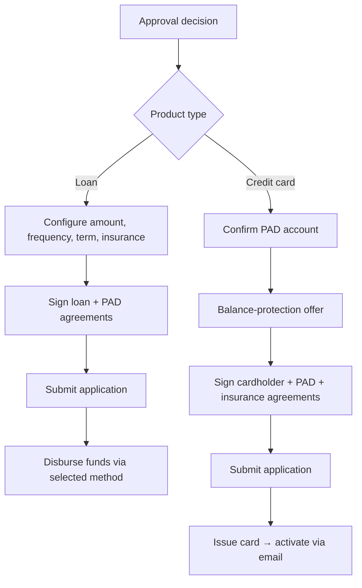

# Account Setup & Fulfillment (ONB-ASF)

**Parent:** [[Onboarding and Origination Capability Model|Onboarding & Origination (ONB)]]

Account Setup & Fulfillment covers everything required to turn an approved application into a **live, funded, usable product**: opening the account on the books of record, moving money (disbursement in, funding out), establishing repayment instruments, and issuing physical and virtual cards.

## L2 Capabilities

### ONB-ASF-01 — Account Opening

Creating the account/facility on the system of record once approval and signing are complete.

- **Customer-record creation or linkage:** new customers create credentials (digital account creation — password and security question — is itself a prerequisite gate: full applications require an authenticated customer, and fund disbursement requires an account to exist). Existing customers authenticate and reuse their profile.
- **Books-of-record updates:** posting the new account to customer, account, and product books of record (Enterprise Support domain), including approved amount/limit, terms, pricing, and elected add-ons (creditor insurance, balance protection).
- **Configuration capture at setup:** for loans — confirmed amount within the approved range (slider/inline edit constrained by the engine-approved maximum), payment frequency, term, and insurance election; for cards — credit limit set by approval (not customer-selected).
- **Submission orchestration:** the application "submits" at a precisely defined point — at binding e-signature on straight-through paths, or at funding-setup completion on manual-review paths — and the submission payload includes session identity, applied product, approval outcome, funding/repayment data, product parameters, and signed-document outcomes.

### ONB-ASF-02 — Funding Account (Disbursement & Repayment)

Moving money to the customer and establishing how money comes back. Detailed in [[Funding and Repayment Setup Flow]].

- **Disbursement method selection** (loan products): Interac **e-Transfer** to the email on file (typically 1–2 hours), **push-to-debit-card** (instant, via embedded card-capture integration), or **EFT direct deposit** (typically 1–2 business days) to a customer-entered bank account.
- **Repayment account establishment (PAD):** capture or confirmation of Canadian bank account details (institution number, transit number, account number) for pre-authorized debit. Where a bank account was linked during income verification via the data aggregator, that **same account is automatically used for repayment and cannot be changed digitally** — a fraud and operational-risk control. One account serves both disbursement (when direct deposit is chosen) and repayment.
- **Deposit-account funding** (generalized): for deposit products this capability covers initial funding via transfer, e-Transfer, or cheque deposit; for credit cards no disbursement occurs, but PAD setup for payments is the equivalent step.
- **Manual proof-of-banking:** on non-aggregated paths, banks commonly require proof of banking (e.g., void cheque) in addition to proof of income, validated in [[Manual Review Flow]].

### ONB-ASF-03 — Card Issuance

Initiating issuance of a card product after approval: creating the card record with the processor, assigning the PAN, binding the approved credit limit, and triggering production/activation paths (physical and/or virtual). The cardholder agreement and PAD agreement are executed before issuance is triggered (see [[Loan Finalization and Document Signing Flow]] and [[Credit Card Application Flow]]).

### ONB-ASF-04 — Plastic Production

Physical card manufacturing and personalization: embossing/printing, EMV chip and contactless personalization, PIN issuance coordination (Card-Linked Products domain), card-carrier insertion, and mailing logistics with SLA tracking. Interfaces with [[Collateral and Customer Communications]] for carriers, envelopes, and inserts.

### ONB-ASF-05 — Virtual / Instant Issue

Issuing a usable card credential immediately on approval, ahead of plastic arrival: virtual card numbers in online/mobile banking, instant in-branch issuance, and push-provisioning eligibility for wallets (executed under [[Activation and Enrolment]]).

### ONB-ASF-06 — Card Activation

Activating the issued card for use. The observed digital pattern is **activation via email**: on completed application, the confirmation screen tells the customer their card can be activated through emailed instructions. Generalized channels include online/mobile banking activation, IVR/phone activation, and first-PIN-transaction activation. Activation status gates card usability and is the bridge into [[Activation and Enrolment]].

## Fulfillment Sequencing Patterns

Key sequencing rules observed:

- **Funding setup precedes approval** in the source flows (payout method and repayment account are captured before the hard-inquiry decision), so disbursement can execute immediately on approval — an instant-gratification design choice.
- **Nothing fulfills before signing.** Disbursement, issuance, and account opening all gate on binding acceptance of the product agreements.
- **Manual-review paths defer fulfillment** entirely: the application submits and the session ends at a review-pending confirmation; fulfillment resumes only after human review approves ([[Manual Review Flow]]).

## Process Flows Exercising This Capability

| Flow | L2s exercised |
|---|---|
| [[Funding and Repayment Setup Flow]] | ONB-ASF-02 |
| [[Loan Finalization and Document Signing Flow]] | ONB-ASF-01, 02 |
| [[Credit Card Application Flow]] | ONB-ASF-01, 02, 03, 05, 06 |
| [[Post-Qualification Application Flow]] | ONB-ASF-01, 02 (orchestration) |

## Related

[[Activation and Enrolment]] · [[Collateral and Customer Communications]] · [[Funding and Repayment Setup Flow]] · [[Canadian Regulatory Context]]
