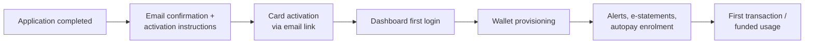

# Activation & Enrolment (ONB-ACT)

**Parent:** [[Onboarding and Origination Capability Model|Onboarding & Origination (ONB)]]

Activation & Enrolment is the final mile of onboarding: turning an opened account or issued card into an **actively used** product with the customer enrolled in the digital channels and services that surround it. It is the strongest predictor of early-life engagement and attrition — an opened-but-never-activated product is a cost, not a relationship.

## L2 Capabilities

### ONB-ACT-01 — Online Banking Enrolment

Enrolling the customer in web banking.

- **Credential establishment:** in the observed digital-first pattern, account creation (email/password plus security question) happens **during origination** — it is a prerequisite for the full application and for fund disbursement, not an afterthought. Returning customers authenticate with existing credentials (email, password, show/hide toggle, "remember me") and benefit from profile pre-fill.
- **Dashboard onboarding:** every terminal screen in origination routes to the authenticated customer dashboard ("Go to dashboard"), where application status, the new product, post-funding offers, and servicing actions live. The dashboard is the continuity surface between origination and servicing.
- Generalized for branch-originated customers: post-open enrolment invitations with identity-bound registration.

### ONB-ACT-02 — Mobile Banking Enrolment

Enrolling the customer in the mobile app: app download prompts in welcome communications, credential reuse from online banking, device registration and binding (a fraud control), and enablement of biometric login. Mobile enrolment also unlocks origination-time conveniences observed in the flows — QR-code session hand-off for identity verification and camera-based document capture — which presume a mobile-capable customer.

### ONB-ACT-03 — Wallet Activation

Provisioning the issued card into digital wallets (Apple Pay, Google Wallet, Samsung Wallet): push provisioning from the banking app, in-wallet manual provisioning with issuer verification (OTP/app approval), and tokenization via the network token services. Virtual/instant-issued cards ([[Account Setup and Fulfillment|ONB-ASF-05]]) are wallet-provisionable immediately, enabling spend before plastic arrives.

### ONB-ACT-04 — Card Enrolment

Enrolling the activated card into surrounding services: e-statements and statement preferences, transaction and card alerts, autopay/PAD for card payments (established at origination — see [[Credit Card Application Flow]]), rewards/loyalty program enrolment, and balance-protection insurance administration where elected.

### ONB-ACT-05 — Virtual Card

Ongoing virtual-card servicing established at onboarding: issuing virtual card numbers, exposing the credential in digital banking, controls (freeze, limits) and, where supported, merchant-specific numbers. Overlaps with ONB-ASF-05 (the issuance event); this capability covers the enrolled, in-life virtual credential.

### ONB-ACT-06 — Renewal

Cyclical re-issuance and re-enrolment: card expiry renewals (re-carding, carrier, re-activation), credential and consent refresh, periodic KYC refresh triggers set at onboarding, and product renewals (e.g., term-product rollovers) that re-enter origination capabilities with pre-filled data. Reuse policies — how long verified income and IDV results remain valid for subsequent applications — belong here and to [[Application|application management]]; the source program explicitly tracked this as a cross-product reuse question (e.g., reusing verification between a loan and a card application).

## Activation Journey Pattern

Observed sequencing principles:

- **Authentication-first origination collapses enrolment friction.** Because the customer created credentials during the application, "enrolment" at completion is one click to the dashboard rather than a separate registration journey.
- **Activation is communicated at the terminal screen and executed via email** — the confirmation screen sets the expectation; the email carries the action.
- **Progress chrome disappears at terminal screens.** Completed-application and confirmation screens drop the progress bar and back/save controls, signalling the journey is over and the relationship (dashboard) begins.

## Process Flows Exercising This Capability

| Flow | L2s exercised |
|---|---|
| [[Credit Card Application Flow]] | ONB-ACT-01, 04, 06 (activation hand-off) |
| [[Loan Finalization and Document Signing Flow]] | ONB-ACT-01 (dashboard hand-off) |
| [[Post-Qualification Application Flow]] | ONB-ACT-01 (authenticated entry, dashboard terminal) |
| [[Manual Review Flow]] | ONB-ACT-01 (status on dashboard) |

## Related

[[Account Setup and Fulfillment]] · [[Collateral and Customer Communications]] · [[Application]]
