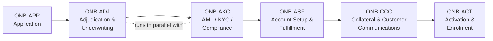

# Onboarding & Origination — Capability Model (L0)

**Capability ID:** ONB
**Position in the enterprise model:** Onboarding & Origination is one of the L0 functional domains of the multi-functional bank capability model, alongside Fraud & Risk, Channels, Interaction Management, Identity/Auth & Access, Marketing & Sales, Customer Engagement, Products & LOB, Card-Linked Products, Servicing, Payments & Transaction Processing, Enterprise Support, and Operations.

## Definition

Onboarding & Origination encompasses every capability a retail bank needs to take a prospect or existing customer from **expressed product interest** to an **opened, funded, documented, activated, and enrolled** account or credit facility. It covers deposit accounts, credit cards, unsecured and secured lending, and (in extended models) investment and insurance products. The domain is product-agnostic at L1: the same six capability groups are exercised whether the product is a chequing account, a credit card, an installment loan, or a mortgage — what changes is the depth and sequencing of each capability.

## L1 Decomposition

| # | L1 Capability | ID | L2 Capabilities |
|---|---|---|---|
| 1 | [[Application]] | ONB-APP | Intake · Application Capture · Application Management · Application Review · Up/Cross-Sell · Pre-Qualification |
| 2 | [[Adjudication and Underwriting]] | ONB-ADJ | Credit Decisioning · Instant Decision · Decision Engine · Bureau Access · Underwriting · Risk Assessment |
| 3 | [[AML KYC and Compliance]] | ONB-AKC | KYC Check · AML Check · Regulatory Check · Credit Check · Sanctions/OFAC · Enhanced Due Diligence · SAR Filing · ID Validation |
| 4 | [[Account Setup and Fulfillment]] | ONB-ASF | Account Opening · Funding Account · Card Issuance · Plastic Production · Virtual/Instant Issue · Card Activation |
| 5 | [[Collateral and Customer Communications]] | ONB-CCC | Customer Disclosures · Welcome Kits · Card Carriers · Envelopes/Inserts · T&C Documents · Returned Mail |
| 6 | [[Activation and Enrolment]] | ONB-ACT | Online Banking Enrol · Mobile Banking Enrol · Wallet Activation · Card Enrolment · Virtual Card · Renewal |

## Two-Stage Origination Pattern

Canadian digital origination commonly splits the journey into two stages, and the process flows in this library follow that pattern:

1. **Pre-qualification (soft stage).** A short, low-friction flow that collects identity, contact, financial, and address basics; presents mandatory provincial and federal disclosures; and obtains a **soft-inquiry eligibility decision** from the decision engine — explicitly without affecting the applicant's credit score. See [[Pre-Qualification Flow]].
2. **Post-qualification / full application (hard stage).** The authenticated, full application: income verification, funding and repayment setup, identity verification, the **hard-inquiry approval decision**, product configuration, and binding e-signature. See [[Post-Qualification Application Flow]].

The product the applicant applies for (the **applied product**) is captured once at entry and persists across both stages; eligibility (pre-qual) and approval (post-qual) are **separate decisions for the same product**, both owned by the decision engine.

## Cross-Domain Dependencies

Onboarding & Origination does not operate in isolation. The flows in this library exercise capabilities owned by adjacent L0 domains:

- **Identity, Auth & Access** — credential creation, returning-customer authentication, OTP challenge, session management, consent capture.
- **Fraud & Risk** — identity-fraud detection signals during ID validation and device/phone intelligence at entry.
- **Channels** — web/mobile self-serve flows, branch hand-off ("finish at a branch"), contact-centre escalation after failed verification.
- **Customer Engagement** — CMS-managed content, preference and consent tracking, offer presentation.
- **Payments & Transaction Processing** — disbursement rails (Interac e-Transfer, EFT/direct deposit, card push payments) and pre-authorized debit (PAD) for repayment.
- **Operations** — workflow, queueing, and case management for [[Manual Review Flow]].
- **Enterprise Support** — document upload/archival, API management, books of record updates when the account is opened.

## Design Principles Observed in Source Flows

- **Decisioning is centralized.** The front end never implements eligibility or approval logic; it collects data, invokes the decision engine, and renders the response. See [[Integration and Decisioning Patterns]].
- **Compliance is front-loaded.** Cost-of-borrowing and licensing disclosures are presented **before any personal information is collected**, and consents are individually and explicitly acknowledged. See [[Canadian Regulatory Context]].
- **Province-awareness is configuration, not code.** Product availability, disclosure content, and even verification method routing vary by province and are driven from configuration/CMS.
- **Third-party capabilities are black-box integrations.** Bank-account aggregation, identity verification, and card capture are embedded vendor experiences with defined launch/exit contracts.
- **Every exception path lands somewhere safe.** Failed bank linking falls back to manual income entry; failed IDV falls back to manual review; ineligible outcomes route to alternative-product exploration or branch.
