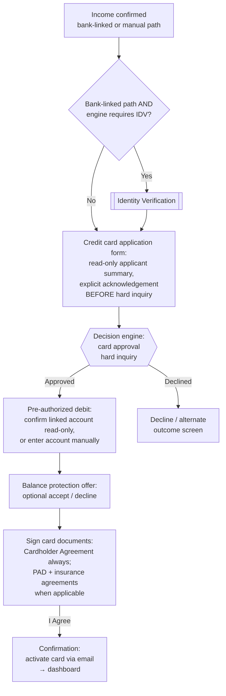

# Credit Card Application Flow

**Purpose:** The product-specific path for **credit card** applications within the [[Post-Qualification Application Flow]]: application acknowledgement before the hard inquiry, the approval decision, payment (PAD) setup, the optional balance-protection offer, card-document signing, and the activation hand-off.

**Key structural differences from the loan path:** no loan-amount selection at any stage (credit limit is set by approval); no payout-method/disbursement step (nothing is disbursed); a dedicated **application acknowledgement** step before the hard credit check; and card-specific agreements and activation.

## Flow

## Step Detail

### Step CC-01 — Entry and Income (Shared Steps)

> **Step ID:** `CC-01` · **Capability:** shared with POST-01 and IV steps · **Preconditions:** POST-01 + income verification complete (IV-A3 or IV-B2) · **Exits:** bank-linked path + engine requires IDV → IDV-00; otherwise → CC-02 · *No funding/repayment steps on the card path.*

The card applicant completes the same entry screen and province-aware [[Income Verification Flow]] as loan applicants. After income confirmation, routing diverges: **no funding/repayment steps**. On the bank-linked income path, [[Identity Verification Flow|identity verification]] is inserted when the engine requires it; on the manual income path IDV is never shown (documentary review provides the assurance).

### Step CC-02 — Card Application Acknowledgement

> **Step ID:** `CC-02` · **Capability:** ONB-AKC-03/04, ONB-CCC-01, ONB-APP-02 · **Preconditions:** CC-01 (and IDV-04 success when IDV was invoked); **must precede the hard inquiry** · **Inputs:** explicit acknowledgement over a read-only applicant summary + disclosure · **Exits:** → CC-03

A dedicated form, before the engine renders the card decision, where the applicant **explicitly acknowledges they are submitting a credit card application**. It presents pre-populated applicant information (name, contact, address) as read-only summary fields, the disclosure statement and cardholder-agreement summary, and a required acknowledgement control gating the advance CTA. Sequencing rationale (a compliance design point): the customer must see the application disclosure **before the hard credit inquiry**, and signs the binding documents after approval. Card applications also carry no separate privacy agreement beyond the general consent set — the card-specific document set is the application form, disclosure/cardholder agreement, and conditional PAD/insurance agreements.

### Step CC-03 — Approval Decision (Hard Inquiry)

> **Step ID:** `CC-03` · **Capability:** ONB-ADJ-01/02/03/04 · **Preconditions:** CC-02 acknowledgement recorded · **Inputs:** engine outcome with engine-set credit limit and terms (no customer amount selection) · **Exits:** approved → CC-04; declined → decline screen (terminal)

The decision engine returns the approval outcome for the card: approved **credit limit** and key terms (limits and pricing are engine-determined — the customer never selects a credit amount). Approval messaging references verified income; declines route to a defined decline screen and never reach card setup.

### Step CC-04 — Pre-Authorized Debit Setup

> **Step ID:** `CC-04` · **Capability:** ONB-ASF-02 · **Preconditions:** CC-03 approved · **Inputs:** bank-linked path — read-only confirmation of the linked account (immutable digitally); manual path — editable bank/transit/institution/account form · **Exits:** → CC-05

Establishes the card-payment account:

- **Bank-linked path:** the account linked during income verification is presented **read-only** — the applicant confirms it and cannot change it digitally (after initial PAD capture, no alternate payment option is offered digitally for cards). 
- **Manual path:** an editable PAD form mirroring the loan repayment screen — bank name, transit number, institution number, account number.

### Step CC-05 — Balance Protection Offer

> **Step ID:** `CC-05` · **Capability:** ONB-APP-05 · **Preconditions:** CC-04 · **Inputs:** explicit accept/decline (never blocks; opt-out itself produces an agreement/waiver) · **Exits:** → CC-06 with the election driving the document set

An optional **credit card balance protection** insurance offer: coverage, cost, and terms from CMS-managed product/legal content; explicit accept or decline; decline never blocks. The election determines the document set at signing — and note that opt-out itself produces an agreement/waiver to sign.

### Step CC-06 — Sign Card Documents

> **Step ID:** `CC-06` · **Capability:** ONB-CCC-05 · **Preconditions:** CC-05 · **Inputs:** per-document acknowledgements (Cardholder Agreement always; PAD/insurance agreements conditionally) + "I Agree" (binding acceptance **and** the card-application submission event) · **Exits:** → CC-07

Conditional document set, each individually acknowledged with preview/download/print: **Cardholder Agreement** (always), **PAD Agreement** (when PAD was established), **balance-protection agreement** (when elected; waiver when declined per policy). "I Agree" is binding acceptance and the card-application submission event; signed documents persist to the customer's account. Confirmed sequencing: the card PAD agreement is executed **after** the hard check and **before/with** final terms acceptance.

### Step CC-07 — Confirmation and Activation Hand-Off

> **Step ID:** `CC-07` · **Capability:** ONB-ASF-03/05/06, ONB-ACT-01/03/04 · **Preconditions:** CC-06 signed · **Exits:** dashboard hand-off (terminal); card activation via email; issuance/production proceeds outside the digital session · *Same screen as POST-09.*

Terminal confirmation: the application is complete and the customer can **activate the card via email** instructions; "go to dashboard" CTA; navigation chrome removed. Downstream (outside the digital session): card issuance, plastic production and carrier mailing ([[Account Setup and Fulfillment]]), with virtual/instant issuance and wallet provisioning per the bank's card proposition ([[Activation and Enrolment]]).

## Business Rules (Generalized)

| Rule | Statement |
|---|---|
| No disbursement steps | Card applications never see payout selection or the loan bank-account screen |
| Acknowledgement before hard inquiry | The card application form must be completed before the engine renders the hard-inquiry decision |
| Limit is engine-set | No customer credit-amount selection at any stage |
| Linked PAD is read-only | A bank-linked account is automatically and immutably the PAD account digitally |
| Insurance optional | Balance protection accept/decline never blocks; election drives the signing document set |
| Conditional document set | Cardholder Agreement always; PAD and insurance agreements only when applicable |
| Submission at signing | The card application persists at document acceptance, not at PAD or insurance steps |

## Capability Mapping

| Capability | How exercised |
|---|---|
| [[Application]] ONB-APP-02/04/05 | Read-only application summary, acknowledgement capture, insurance cross-sell |
| [[Adjudication and Underwriting]] ONB-ADJ-01/02/03/04 | Hard-inquiry card approval, limit assignment |
| [[AML KYC and Compliance]] ONB-AKC-03/04 | Pre-inquiry disclosure sequencing, hard-check consent posture |
| [[Account Setup and Fulfillment]] ONB-ASF-01/02/03/05/06 | PAD establishment, card issuance, activation trigger |
| [[Collateral and Customer Communications]] ONB-CCC-01/02/05 | Disclosure statement, cardholder agreement, confirmation comms |
| [[Activation and Enrolment]] ONB-ACT-01/03/04 | Email activation, dashboard hand-off, downstream wallet/service enrolment |

## Source Traceability

Generalized from the Money Mart post-qualification card application requirements (FR21, FR10B, FR17–FR20, BR20–BR25, D5, D10–D14) and journey map workshop notes (disclosure-before-hard-hit sequencing, PAD immutability, CCBP opt-out agreement); vendor names abstracted per [[Integration and Decisioning Patterns]].
