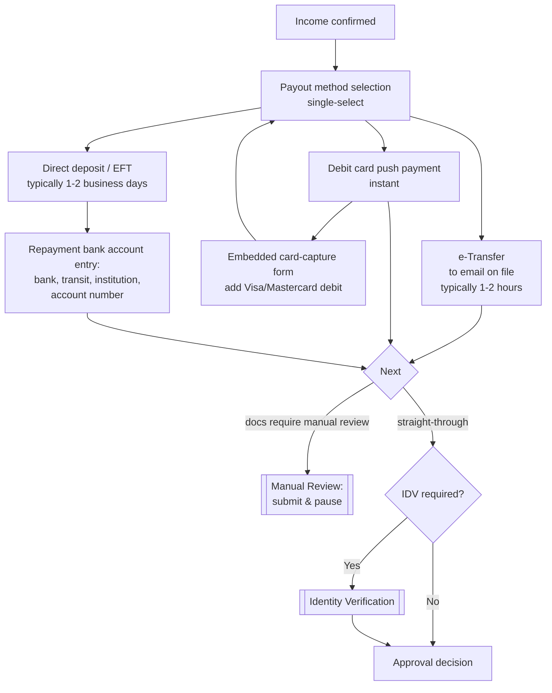

# Funding & Repayment Setup Flow

**Purpose:** Capture how the customer will **receive** loan funds (disbursement method) and **repay** them (pre-authorized debit account), before the approval decision — so disbursement can execute immediately on approval.

**Position:** Step 4 of the [[Post-Qualification Application Flow]], **loan products only**. Credit card applications skip this flow entirely; card repayment (PAD) is established on the card path ([[Credit Card Application Flow]]).

**Capability home:** [[Account Setup and Fulfillment|ONB-ASF-02 (Funding Account)]].

## Flow

## Step Detail

### Step FUND-01 — Payout Method Selection

> **Step ID:** `FUND-01` · **Capability:** ONB-ASF-02 · **Preconditions:** income confirmed (IV-A3 or IV-B2); applied product is a loan (cards never see this flow) · **Inputs:** exactly one payout method · **Exits:** e-Transfer → FUND-04; debit card → FUND-02; direct deposit → FUND-03

Three Canadian disbursement rails presented as single-select options with speed expectations:

| Method | Rail | Speed shown | Mechanics |
|---|---|---|---|
| **e-Transfer** | Interac e-Transfer | Typically 1–2 hours | Sent to the email address on file (pre-populated; **not editable in-flow** — changing the e-Transfer email is a fraud-sensitive action requiring fraud-team policy, handled outside the flow) |
| **Debit card push** | Visa Direct / Mastercard Send-class | Instant | Requires adding a debit card via the embedded card-capture form |
| **Direct deposit** | EFT (Payments Canada ACSS) | Typically 1–2 business days | Requires entering a Canadian bank account; the same account is used for repayment |

### Step FUND-02 — Embedded Debit-Card Capture (Conditional)

> **Step ID:** `FUND-02` · **Capability:** ONB-ASF-02 via embedded provider (PCI isolation — [[Integration and Decisioning Patterns]]) · **Preconditions:** FUND-01 = debit card push · **Inputs:** card details, captured vendor-side only · **Exits:** success → card attached, back to FUND-01 → FUND-04; a card must be attached before advancing with this method

Selecting debit card exposes an "add card" action launching an **embedded payment-provider form** (PCI-scope isolation — see [[Integration and Decisioning Patterns]]): cardholder name, card number (provider-rendered field), security code, expiry (MM/YY), billing street, billing postal code (Canadian format), province, plus system-populated merchant reference fields; TLS-security notice and a live card-art preview. The provider owns field validation and card capture; the bank owns launch and exit. On success the card renders in the option row (network logo, masked number, expiry, delete action); a card must be added before advancing with this method selected.

### Step FUND-03 — Repayment Bank Account Entry (Conditional)

> **Step ID:** `FUND-03` · **Capability:** ONB-ASF-02 · **Preconditions:** FUND-01 = direct deposit (the only method that opens this screen) · **Inputs:** bank name, transit (5 digits), institution (3 digits), account number — one account serves disbursement **and** repayment · **Exits:** → FUND-04

Reached **only** when direct deposit is selected. Titled around repayment ("which bank account would you like to pay us back from?") with guidance to match pay-stub/bank-statement details. Four required fields: **bank name** (select), **transit number** (5 digits), **institution number** (3 digits), **account number** — the standard Canadian account identification triplet. Design decision: **one account** — the screen offers no option to receive funds in a different account than the repayment account; when direct deposit was chosen, this single account serves disbursement and repayment.

### Rule FUND-R1 — Interaction with the Bank-Linked Income Path (Cross-Cutting)

> **Rule ID:** `FUND-R1` · **Scope:** applies across FUND-01–FUND-04 when an aggregator-linked account exists (IV-A1)

When the applicant linked a bank account during [[Income Verification Flow|income verification]], the linked institution's primary account (highest monthly net deposits) is treated as the repayment source automatically — the customer cannot change it digitally, and money leaves that account only under an agreed **PAD agreement** signed at [[Loan Finalization and Document Signing Flow|document signing]]. For e-Transfer and debit-card payouts (which skip the bank-account screen), repayment-account collection relies on the linked account; on manual paths this is an open design point banks must resolve (collect PAD at this step regardless of payout method, or during review).

### Step FUND-04 — Downstream Routing

> **Step ID:** `FUND-04` · **Capability:** ONB-APP-03 · **Preconditions:** FUND-01 complete (plus FUND-02/FUND-03 when their method was chosen) · **Exits:** uploaded documentation present → submit → MR-01 (terminal for session); straight-through → IDV-00; IDV not required → approval decision (POST-06)

"Next" behaviour is path-aware: applications carrying uploaded documentation **submit here** and advance to [[Manual Review Flow]] (terminal for the session); straight-through applications advance to [[Identity Verification Flow]] when the engine requires it, otherwise directly to the approval decision. Funding details captured here travel in the submission payload either way; funding and repayment may be re-confirmed for an application emerging from manual review prior to approval.

## Regulatory Context

The PAD authorization established here is governed by **Payments Canada Rule H1** (payor PAD agreements): mandatory agreement elements, pre-notification obligations, and cancellation rights — executed as the PAD Agreement at signing. Interac e-Transfer disbursement carries the bank's e-Transfer terms; push-to-card operates under card-network push-payment rules. See [[Canadian Regulatory Context]].

## Business Rules (Generalized)

| Rule | Statement |
|---|---|
| Loans only | Card applications never see payout selection; card PAD is its own step |
| Single payout method | One method per application, single-select |
| Direct deposit → account entry | Only the direct-deposit choice opens the bank-account screen |
| One account | No separate disbursement vs repayment accounts; a single account serves both |
| Linked account is sticky | An aggregator-linked account is automatically the repayment account and not digitally changeable |
| e-Transfer email locked | The e-Transfer destination email is the verified email on file; in-flow changes are prohibited pending fraud policy |
| Card required before advance | Debit-card payout requires a successfully added card |
| Capture precedes approval | Funding/repayment data is captured before the approval decision to enable instant disbursement |

## Capability Mapping

| Capability | How exercised |
|---|---|
| [[Account Setup and Fulfillment]] ONB-ASF-02 | Disbursement rail selection, repayment account establishment, PAD groundwork |
| [[Application]] ONB-APP-02 | Validated form capture, path-aware navigation |
| [[Collateral and Customer Communications]] ONB-CCC-05 | Feeds the PAD Agreement executed at signing |

## Source Traceability

Generalized from the Money Mart post-qualification shared requirements (FR8/FR8A/FR9, BR7–BR8, BR13, D4, D9) and journey map workshop notes (one-account decision, linked-account stickiness, e-Transfer email fraud constraint); vendor names abstracted per [[Integration and Decisioning Patterns]].
