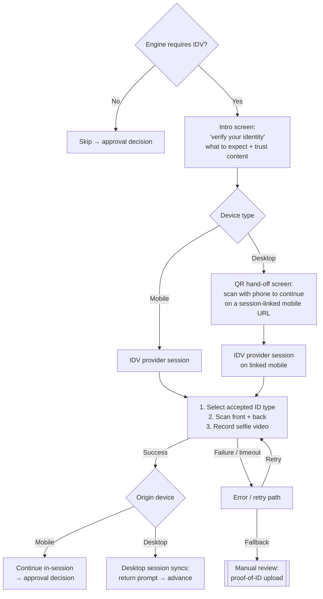

# Identity Verification Flow

**Purpose:** Digitally validate the applicant's identity — government ID document authenticity plus biometric liveness — when the decision engine determines verification is required, before the approval decision is rendered.

**Position:** Conditional step 5 of the [[Post-Qualification Application Flow]], on the bank-linked income path only. The manual income path does not include digital IDV; its documentary review ([[Manual Review Flow]]) covers identity assurance, with failed digital IDV also falling back to manual proof-of-ID upload.

**Capability home:** [[AML KYC and Compliance|ONB-AKC-08 (ID Validation)]], invoked under FINTRAC-accepted government-issued photo ID verification (see [[Canadian Regulatory Context]]).

## Step IDV-00 — Risk-Based Invocation Gate

> **Step ID:** `IDV-00` · **Capability:** ONB-ADJ-03/06 · **Preconditions:** FUND-04 (loans) or IV-A3 (cards); bank-linked income path only · **Inputs:** decision-engine IDV-required flag · **Exits:** not required → skip to approval decision (POST-06) / card acknowledgement (CC-02); required → IDV-01

After funding and repayment setup (loans) or income confirmation (cards), the orchestration evaluates **decision-engine output** to determine whether IDV is required for this applicant. Not required → the step is skipped entirely and the flow advances. Required → verification must **succeed** before the approval decision is reachable. This makes identity friction proportional to assessed risk rather than universal.

## Flow

## Step Detail

### Step IDV-01 — Intro Screen (Bank-Owned)

> **Step ID:** `IDV-01` · **Capability:** ONB-CCC-01 (trust messaging) · **Preconditions:** IDV-00 required · **Exits:** desktop → IDV-02; mobile → IDV-03

Standard application chrome; title "next, we need to verify your identity"; expectation-setting copy ("have your ID ready — you'll scan it and then record a short selfie video"); a primary "scan your ID" action with an info control; and a trust section ("is it safe to scan your ID online?" — encryption, verification-only use, fraud-protection framing, explanatory video). Cancel follows the standard confirmation flow.

### Step IDV-02 — Desktop-to-Mobile QR Hand-Off (Bank-Owned)

> **Step ID:** `IDV-02` · **Capability:** ONB-APP-03 (cross-device session linking) · **Preconditions:** IDV-01 on a desktop session (desktop capture is prohibited) · **Inputs:** QR scan of session-linked URL · **Exits:** → IDV-03 on mobile; desktop session waits and syncs live status

Document and selfie capture require a camera, so desktop applicants are **not** permitted to complete capture on desktop. The hand-off screen displays a **QR code encoding a secure, session-linked URL** that resumes the same application on mobile without re-authentication, plus instructions (scan → verify on mobile → return to desktop). While mobile capture proceeds, the desktop session stays open and reflects live status (waiting / in progress / complete / failed); on success it prompts the applicant to continue and enables advancement.

### Step IDV-03 — IDV Provider Session (Vendor-Owned)

> **Step ID:** `IDV-03` · **Capability:** ONB-AKC-08, ONB-AKC-01 · **Preconditions:** IDV-01 (mobile) or IDV-02 hand-off · **Inputs:** accepted ID type selection, front/back scan, selfie video (all captured inside the vendor boundary) · **Exits:** provider result → IDV-04

Identity capture is a contained third-party integration (Plaid IDV / Onfido / Persona-class). Inside the provider's flow the applicant: selects an accepted government ID type (driver's licence, provincial ID card, residency permit — the provider's configured list is authoritative), scans **front and back**, and records a **selfie video** for liveness and face-match. The bank owns launch, exit, success/failure handling, device routing, and session linking — not the capture UX or verification decisioning. Provider trust attribution displays where provider content is shown.

### Step IDV-04 — Completion, Failure, and Fallback

> **Step ID:** `IDV-04` · **Capability:** ONB-ADJ-06 (outcome gates approval) · **Preconditions:** IDV-03 returned a result · **Exits:** success → approval decision (POST-06) or CC-02 per product (desktop sessions sync first); failure/timeout → retry IDV-03; persistent failure → MR-01 with proof-of-ID upload

- **Success:** the verification outcome is recorded against the application; mobile sessions continue directly to the approval decision; QR-linked desktop sessions sync and advance. The approval decision is unreachable until verification succeeds when required.
- **Failure / abandonment / timeout:** error and retry paths; persistent failure falls back to **manual review** with applicant-uploaded proof of ID ([[Manual Review Flow]]) rather than terminating the application.
- **Reuse policy:** how long a successful IDV result remains valid for subsequent applications (e.g., applying for a card after a loan) is a bank policy decision tracked alongside income-verification reuse — see [[Activation and Enrolment|ONB-ACT-06]].

## Relationship to Other Identity Controls

Digital IDV layers on top of identity controls exercised earlier in origination: phone OTP ownership verification ([[Pre-Qualification Flow]]), mobile-carrier data disclosure consent at full-application entry ([[Post-Qualification Application Flow]]), credit-file identity matching via bureau access ([[Adjudication and Underwriting|ONB-ADJ-04]] — with partial-match handling a defined policy point), and address-match requirements at adjudication. Together these satisfy the bank's FINTRAC client-identification obligations through complementary methods.

## Business Rules (Generalized)

| Rule | Statement |
|---|---|
| Engine-gated | IDV shown only when decision-engine output requires it |
| Sequenced before approval | Occurs after funding setup (loans) / income confirmation (cards) and before the approval decision |
| Success gates approval | Approval results unreachable until IDV succeeds when required |
| Desktop never captures | Desktop sessions must hand off to mobile via QR for capture |
| Vendor boundary | Capture UX and verification logic are provider-owned; bank owns routing, linking, status sync, and post-success advancement |
| Fallback to manual | Failed digital IDV routes to documentary review, not decline |

## Capability Mapping

| Capability | How exercised |
|---|---|
| [[AML KYC and Compliance]] ONB-AKC-01/08 | FINTRAC-method ID validation: document authenticity + biometric liveness |
| [[Adjudication and Underwriting]] ONB-ADJ-03/06 | Engine-gated invocation; IDV outcome as a risk input to approval |
| [[Application]] ONB-APP-03 | Cross-device session linking and resume |

## Source Traceability

Generalized from the Money Mart post-qualification IDV requirements document (FR16/FR16A–FR16D, BR16–BR19) and journey map workshop notes (Plaid IDV, failure-to-manual-review fallback, verification-reuse question); vendor names abstracted per [[Integration and Decisioning Patterns]].
