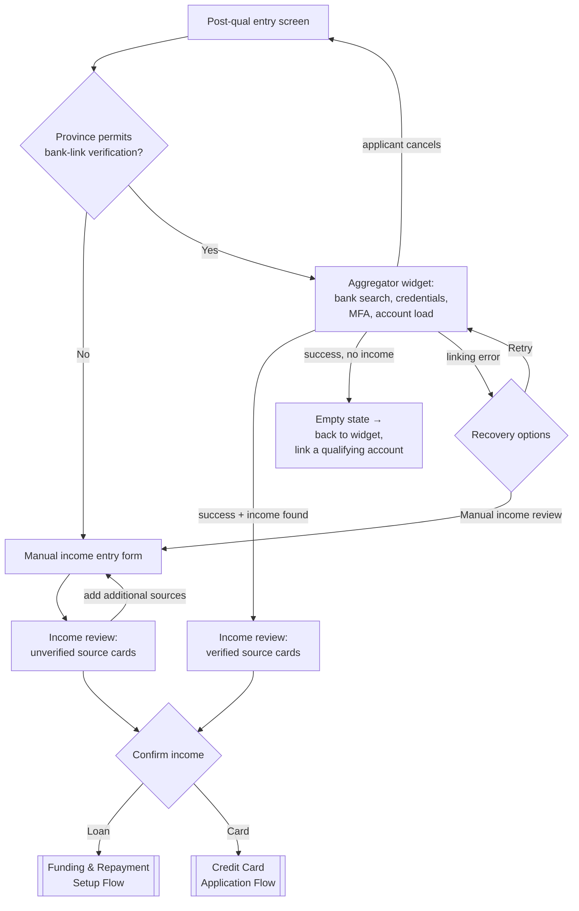

# Income Verification Flow

**Purpose:** Establish the applicant's income to lending-decision standard — either **digitally verified** through bank-account aggregation (open-banking-style transaction analysis) or **self-declared with documentary proof** subject to human review.

**Position:** Steps 2–3 of the [[Post-Qualification Application Flow]]; the verification method and result feed [[Adjudication and Underwriting|risk assessment and approval]].

## Two Verification Paths

**Path exclusivity:** verified (aggregator) and unverified (manual) sources never mix on one review screen. The bank-linked path shows aggregator-retrieved sources only and offers **no add-income controls** — additional income is obtained by returning to the widget. The manual path shows manually added sources only and offers explicit "add additional income sources" and "add proof of income" actions.

## Path A — Bank-Linked (Aggregator) Verification

### Step IV-A1 — Aggregator Widget Session

> **Step ID:** `IV-A1` · **Capability:** ONB-ADJ-06 (see [[Integration and Decisioning Patterns]]) · **Preconditions:** POST-01 complete; province permits bank-link verification · **Inputs:** applicant's bank credentials + MFA (vendor-side only — never visible to the bank) · **Exits:** routed per IV-A2

The financial data aggregator (Flinks/Plaid-class) renders as an embedded widget inside the bank's page shell; its internal screens (institution search, credential entry, MFA, account loading) are vendor-owned. The bank's chrome — header, progress bar, cancel — stays visible and functional throughout; cancel triggers the bank's confirmation flow, never the widget's. The screen carries trust framing ("connect your bank account securely"; data encrypted and used only for income and employment verification) and vendor trust attribution. The applicant connects **one financial institution** per session (multiple accounts within it may be retrieved).

#### Data contract — retrieved income elements

Per identified income source, the aggregator returns: bank name, account type, masked account number, source-of-income classification (e.g., part-time employed), employer/provider name, employer phone, previous month's income, direct-deposit indicator, last deposit amount, and last deposit date. See [[Data Requirements Reference]].

### Step IV-A2 — Aggregator Exit-State Handling

> **Step ID:** `IV-A2` · **Capability:** ONB-APP-03 (routing) · **Preconditions:** IV-A1 session ended · **Inputs:** aggregator exit event · **Exits:** success with income → IV-A3; success with zero income → empty state, back to IV-A1; applicant cancel → POST-01; linking error → retry IV-A1 or → IV-B1 (permanent switch to manual path)

| Aggregator exit | System behaviour |
|---|---|
| Success with income | Advance to income review with parsed sources pre-populated |
| Success, zero income identified | Income review **empty state**: warning indicator, $0.00 verified total, no advance CTA, no add CTA — back navigation returns to the widget to link a qualifying account |
| Applicant cancels in-widget | Return to entry screen; applicant may relaunch |
| Linking error / connection failure | Error state with **retry** and **manual income review** options; selecting manual moves the session permanently onto the manual path. Operational rule of thumb: route to manual review by the second consecutive failure |

### Step IV-A3 — Income Review and Confirmation (Verified)

> **Step ID:** `IV-A3` · **Capability:** ONB-APP-04 · **Preconditions:** IV-A2 success-with-income · **Inputs:** restricted edits (four declarative fields), confirmed deletions; minimum one source · **Exits:** confirm + loan → FUND-01; confirm + card → IDV-00 gate, then CC-02

Each source renders as a card badged with the **bank name**, with edit (pencil) and delete (trash) controls. Editing a verified card is **restricted to four fields** — employer name, employer phone, previous month's income, direct-deposit status — all aggregator-parsed account facts stay read-only, preserving verification integrity. Deletion always requires a confirmation modal; deleting the last card transitions to the empty state. A **"Total verified monthly income"** summary recalculates in real time on edits and deletions. The advance CTA ("income looks good") requires at least one source and routes by product: loans → funding and repayment; cards → identity verification (if required) then card application acknowledgement.

## Path B — Manual (Self-Declared + Documentary) Verification

### Step IV-B1 — Manual Income Entry Form

> **Step ID:** `IV-B1` · **Capability:** ONB-APP-02, ONB-ADJ-05 · **Preconditions:** POST-01 in a province mandating manual verification, **or** IV-A2 linking-error fallback — never a parallel happy-path choice · **Inputs:** D5 manual income fields + proof-of-income document upload (see [[Data Requirements Reference]]) · **Exits:** save → IV-B2

#### When this path is used

(1) **Mandated by province** — jurisdictions prohibiting credential-based aggregation route here directly from the entry screen, with the aggregator never offered; (2) **fallback** after an aggregator linking error in all other provinces. Never offered as a parallel choice on the happy path.

#### Form fields and behaviour

Titled to set expectations ("tell us about your work and income"), badged **"Unverified Income"**, and carrying a notice that uploaded proof takes **1–3 business days** to review. Fields (all required): source of income (select), employer/provider, pay frequency, last pay date, last net pay (after taxes), next pay date, previous month's income, direct-deposit indicator (yes/no), and **proof-of-income document upload** (pay stub, bank statement, or benefit letter) via file picker or camera capture, with a warning that document data must match the entered data. (Income frequency capture and the source-of-income option list are design decisions a bank must align with the pre-qualification income taxonomy.) Non-aggregated paths commonly also require **proof of banking** (e.g., void cheque) — captured here or at funding setup. Top-up/repeat lending may waive proof-of-income per policy. Saving adds an "Unverified Income" card to the review screen; cancel on this form is **back-navigation only** (no cancel-confirmation modal).

### Step IV-B2 — Income Review and Confirmation (Unverified)

> **Step ID:** `IV-B2` · **Capability:** ONB-APP-04 · **Preconditions:** IV-B1 with at least one income card · **Inputs:** full add/edit/delete; additional sources loop back to IV-B1 · **Exits:** confirm + loan → FUND-01, then MR-01 after submission; confirm + card → CC-02 directly (no digital IDV on the manual path)

Same card pattern, badged "Unverified Income", totalled as **"Total unverified monthly income"**, with full add/edit/delete controls (delete via the same confirmation modal; empty state offers "add proof of income"). A footnote notes that additional income sources can increase approval likelihood and qualified amount. Confirmation ("continue") routes by product: loans → funding and repayment, then **[[Manual Review Flow]]** after submission; cards → card application acknowledgement directly (no identity verification step on the manual path — the documentary review covers it).

## Business Rules (Generalized)

| Rule | Statement |
|---|---|
| Province-aware routing | Verification method is determined by province configuration, not applicant choice |
| Manual is fallback, not option | Outside mandated provinces, manual entry is reachable only from linking-error recovery |
| No mixed sources | Verified and unverified sources never appear together; totals are labelled per path |
| Minimum one source | No advancement past income review without at least one income source card |
| Restricted edits on verified data | Aggregator-parsed facts are read-only; only declarative fields are editable |
| Delete requires confirmation | Always modal-confirmed; never silent |
| Manual review SLA | Documentary income review within a published 1–3 business day service level |
| Document-data match | Uploaded proof must match declared data; mismatches fail review |
| Primary repayment source | The aggregator-linked account with the highest monthly net deposits is treated as the primary account and used for repayment — not customer-changeable digitally |

## Capability Mapping

| Capability | How exercised |
|---|---|
| [[Adjudication and Underwriting]] ONB-ADJ-05/06 | Verified-income evidence, underwriting review of documents, income-stability risk signals |
| [[Application]] ONB-APP-02/04 | Manual form capture, review-and-confirm pattern, validation |
| [[AML KYC and Compliance]] ONB-AKC-01 | Employment/income context for KYC; document collection standards |
| [[Account Setup and Fulfillment]] ONB-ASF-02 | The linked account becomes the repayment/disbursement account downstream |

## Source Traceability

Generalized from the Money Mart post-qualification shared requirements (FR3–FR6, BR1–BR6, D1–D3), manual-path requirements document, and journey map workshop notes (SK aggregation prohibition, second-failure routing, proof-of-banking, primary-account rule); vendor names abstracted per [[Integration and Decisioning Patterns]].
