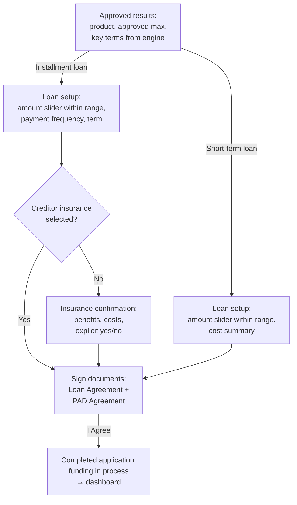

# Loan Finalization & Document Signing Flow

**Purpose:** After approval, let the customer **configure** the final loan within engine-approved bounds, decide on optional creditor insurance, and execute the binding agreements that complete the application and trigger fulfillment.

**Position:** Steps 6–9 of the [[Post-Qualification Application Flow]] on the straight-through (bank-linked income, no manual review) path for loan products. Manual-review-path applications never reach these steps in-session — they pause at [[Manual Review Flow]].

## Flow

## Step Detail

### Step LF-01 — Approved Results (Hand-Off)

> **Step ID:** `LF-01` · **Capability:** ONB-ADJ-01 hand-off · **Preconditions:** engine approval rendered — same screen as POST-06 · **Inputs:** approval payload (D8): approved maximum, terms · **Exits:** installment/term loan → LF-02; short-term loan → LF-04; declined applications never reach this step

The decision engine returns approval for the applied product with a maximum approved amount and terms (e.g., installment loan up to $3,500; short-term loan up to $1,500 — illustrative). The screen presents the approved offer with messaging that verified income supports the outcome; no product switching; decline routes to a defined decline screen and never reaches setup.

### Step LF-02 — Loan Setup (Installment/Term Loan)

> **Step ID:** `LF-02` · **Capability:** ONB-ASF-01 · **Preconditions:** LF-01, product = installment/term loan · **Inputs:** amount within approved range, payment frequency, term, explicit creditor-insurance yes/no · **Exits:** insurance elected → LF-05; insurance declined → LF-03

A configuration screen constrained to the engine-approved range:

- **Amount confirmation card:** prominent amount with inline edit and a slider bounded by the approved range.
- **Payment frequency** (weekly, bi-weekly, monthly) and **loan term** selections.
- **Optional creditor insurance card** (loan protection plan): monthly cost, include/exclude control with an **explicit yes/no election** (no ambiguous pre-checks), coverage description, expandable detail.
- **Total payment summary:** total payment amount, APR, loan amount, term and repayment description, total to be repaid — recalculated with selections, with an insurance-exclusion note when not selected.

### Step LF-03 — Creditor Insurance Confirmation (Conditional)

> **Step ID:** `LF-03` · **Capability:** ONB-APP-05 · **Preconditions:** LF-02 with insurance declined — shown once, never loops · **Inputs:** final yes/no election · **Exits:** both CTAs → LF-05 (the election never branches the flow)

Shown **only when insurance was not selected** — a single structured reconsideration (rebuttal) screen, never a loop: benefit accordions (involuntary unemployment, injury/sickness, death, critical illness, milestone and family-leave supports — generalized coverage set), a cost summary (monthly cost, total over term, total payment including insurance), and a fine-print legal disclaimer covering limitations, exclusions, and underwriters. Two CTAs — "yes, add" and "no, I do not want protection" — **both advance to signing**; the election never branches the flow. Compliance note: optional-insurance presentment and rebuttal patterns receive specific compliance scrutiny in Canada (clear optionality, no negative-option enrolment).

### Step LF-04 — Loan Setup (Short-Term Loan)

> **Step ID:** `LF-04` · **Capability:** ONB-ASF-01, ONB-CCC-01 · **Preconditions:** LF-01, product = short-term loan · **Inputs:** amount within approved range; regulated cost summary acknowledged implicitly by advancing · **Exits:** → LF-05 (no insurance offer on this product)

Amount confirmation within the approved range plus a regulated cost summary: total payment amount, payment due date, APR, number of payments, principal, advance date, term in days, **loan fee per $100 borrowed**, and total cost of borrowing — mirroring provincial payday-disclosure content (see [[Canadian Regulatory Context]]; federally capped at $14 per $100 as of January 1, 2025). No creditor-insurance upsell on this product. Cooling-off-period messaging applies between consecutive short-term loans per policy.

### Step LF-05 — Sign Documents

> **Step ID:** `LF-05` · **Capability:** ONB-CCC-05 · **Preconditions:** LF-02/LF-03 (installment) or LF-04 (short-term) · **Inputs:** per-document acknowledgement checkboxes + "I Agree" (binding acceptance **and** the submission event) · **Exits:** → LF-06

"Review and sign your loan documents": each document — **Loan Agreement** ("states the terms of the loan and says you agree to them") and **PAD Agreement** ("agreeing to make the loan payments as set out in this schedule") — presented with an individual acknowledgement checkbox, inline preview, and download/print actions. A disclosure states that clicking **"I Agree"** confirms the documents were read and all terms accepted, and that signed documents are saved to the customer's account. "I Agree" is the binding acceptance and the **application submission event**; document counts scale with product and elections (two to seven observed), and an insurance decline generates its own agreement on the card path's equivalent. Provincial e-sign variation applies: some provinces accept per-document click-to-agree; others (e.g., BC, NL, MB) require additional checkboxes or initials, with vendor e-sign (DocuSign-class) as the forward pattern.

### Step LF-06 — Completed Application

> **Step ID:** `LF-06` · **Capability:** ONB-ASF-01, ONB-ACT-01, ONB-CCC-02 · **Preconditions:** LF-05 signed · **Exits:** dashboard hand-off (terminal) · *Same screen as POST-09.*

Terminal confirmation — application complete, **funding in process** via the method selected in [[Funding and Repayment Setup Flow]] — with a "go to dashboard" CTA; progress bar and back/save controls removed. The submission payload includes session identity, applied product, approval outcome, payout method and account, loan parameters, insurance election, and signed-document outcomes (see [[Data Requirements Reference]]).

## Business Rules (Generalized)

| Rule | Statement |
|---|---|
| Approval gates setup | Setup and signing reachable only after engine approval for the applied product |
| Engine-bounded configuration | Amount selection constrained to the approved range; the front end enforces, never decides |
| Insurance is optional and explicit | Yes/no election required; decline never blocks; one structured reconsideration only |
| Signing is submission | "I Agree" is binding acceptance and the submission event; documents persist to the account |
| Per-document acknowledgement | Each agreement individually acknowledged; provincial e-sign rules configure the mechanics |
| Terminal means terminal | No navigation chrome after completion; continuity moves to the dashboard |

## Capability Mapping

| Capability | How exercised |
|---|---|
| [[Account Setup and Fulfillment]] ONB-ASF-01/02 | Product configuration, submission, account opening, disbursement trigger |
| [[Collateral and Customer Communications]] ONB-CCC-01/02/05 | Regulated cost summaries, agreement execution, completion communications |
| [[Application]] ONB-APP-05 | Creditor-insurance cross-sell and rebuttal |
| [[Activation and Enrolment]] ONB-ACT-01 | Dashboard hand-off |

## Source Traceability

Generalized from the Money Mart post-qualification loan application requirements (FR10A–FR15, BR9–BR11, BR25–BR26, D5–D8, D14) and journey map workshop notes (explicit LPP yes/no, provincial eSign variation, document counts, cooling-off messaging); vendor names abstracted per [[Integration and Decisioning Patterns]].
