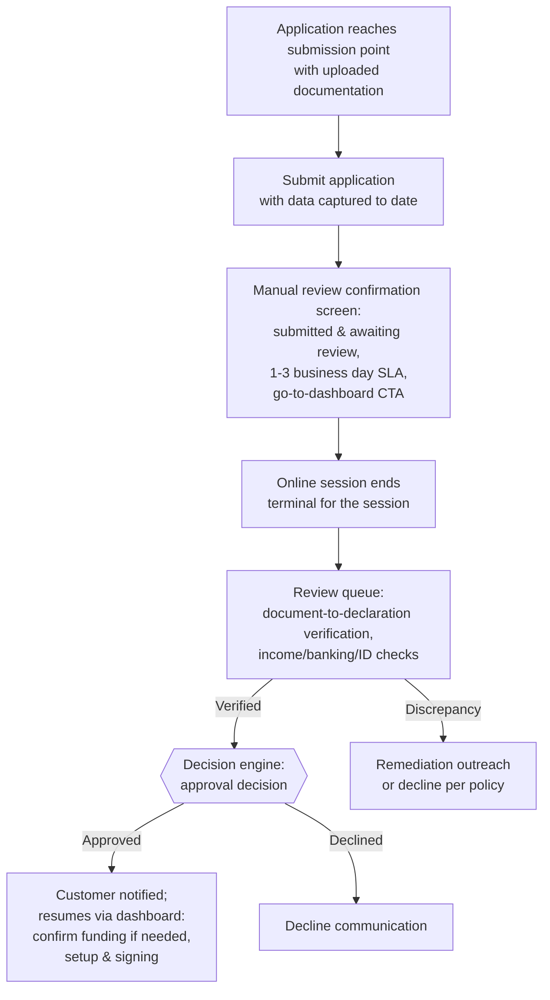

# Manual Review Flow

**Purpose:** Route applications that cannot be decided straight-through — because they carry **uploaded documentation requiring human verification** — into an underwriting review queue, pausing the digital session safely and resuming the journey after review.

**Position:** Conditional step 4a of the [[Post-Qualification Application Flow]] for loan products; the implicit decision-deferral mechanism on the manual income path generally. The capability home is [[Adjudication and Underwriting|ONB-ADJ-05 (Underwriting)]], executed through Operations-domain workflow and case management.

## Triggers

| Trigger | Source |
|---|---|
| Proof-of-income documents uploaded | Manual income path — [[Income Verification Flow]] |
| Proof-of-banking documents uploaded (e.g., void cheque) | Manual/non-aggregated funding paths — [[Funding and Repayment Setup Flow]] |
| Proof-of-ID uploaded after failed digital IDV | [[Identity Verification Flow]] fallback |
| Aggregator linking failures exhausting retry | Second consecutive failure routes to manual review per operational rule |

The governing rule: **no approval decision is rendered while unverified uploaded documentation is outstanding.** Manual review completes *before* the offer is approved or declined.

## Flow

## Step Detail

### Step MR-01 — Submission and Session Pause

> **Step ID:** `MR-01` · **Capability:** ONB-APP-03 · **Preconditions:** a submission point reached with uploaded documentation outstanding — FUND-04 (loan manual path), or IDV-04 persistent failure with proof-of-ID upload · **Inputs:** full submission of data captured to date · **Exits:** terminal for the online session → dashboard; case → MR-02

On the loan manual path, selecting "next" at the funding step **submits** the application with the payout method and any bank-account data captured to that point and advances to the manual-review confirmation screen. The screen communicates that the application has been submitted and is awaiting review, restates the **1–3 business day** documentary-review service level, and offers a "go to dashboard" primary CTA. It is **terminal for the online session**: identity verification, approved results, product setup, signing, and completed-application steps are not reachable until review completes. Application status surfaces on the authenticated customer dashboard.

### Step MR-02 — Document Review (Back-Office)

> **Step ID:** `MR-02` · **Capability:** ONB-ADJ-05, ONB-AKC-06/07; Operations domain (adjacent) · **Preconditions:** MR-01 case queued; 1–3 business day SLA · **Inputs:** uploaded documents verified against declared data · **Exits:** verified → MR-03; discrepancy → remediation outreach or decline per policy

Trained staff verify uploaded documents against declared data — pay stubs/bank statements/benefit letters against the income entries (the form explicitly warns applicants that document data must match), void cheques against banking details, ID documents against identity data. Review applies eligible-income-type policy per product, escalates higher-risk findings to enhanced due diligence ([[AML KYC and Compliance|ONB-AKC-06]]), and can generate suspicious-activity reporting where warranted ([[AML KYC and Compliance|ONB-AKC-07]]). Operational approval rules layer on top of engine rules for the review-to-approval transition, and funding/repayment details may be re-confirmed with the customer prior to approval.

### Step MR-03 — Post-Review Decision and Resume

> **Step ID:** `MR-03` · **Capability:** ONB-ADJ-01, ONB-APP-03 · **Preconditions:** MR-02 verified · **Exits:** approved → customer resumes from dashboard (loans: LF-02/LF-04 setup and LF-05 signing, with funding re-confirmation where needed; cards: per [[Credit Card Application Flow]]); declined → decline communication

On verified review, the engine renders the approval decision and the customer resumes from the dashboard to complete remaining steps (per product: loan setup and signing, or card steps). Card applications on the manual income path differ structurally: they proceed through application acknowledgement and the approval decision **in-session** (review applies to the income evidence asynchronously per the bank's operating model), with an editable PAD form since no linked account exists — see [[Credit Card Application Flow]].

## Why This Flow Matters in the Capability Model

Manual review is the **bridge between digital origination and operations**: it exercises Workflow & Rules, Case Management, and Agent Experience capabilities from the Operations domain on behalf of Onboarding & Origination. A bank's straight-through-processing rate — the share of applications that *avoid* this flow — is a primary origination KPI, and every design decision that improves verified-data capture (aggregation coverage, IDV success rates, document-quality guidance) shrinks this queue.

## Business Rules (Generalized)

| Rule | Statement |
|---|---|
| Documents defer decisions | Outstanding uploaded documentation blocks any approval decision |
| Submission before pause | The application is fully submitted (with captured funding data) before the session pauses |
| Terminal session | No downstream origination steps reachable in-session once review is pending |
| Published SLA | Documentary review within a stated 1–3 business day window, communicated at upload and at pause |
| Match standard | Document contents must corroborate declared data; mismatches fail review |
| Dashboard continuity | Status, notifications, and resume actions live on the authenticated dashboard |

## Capability Mapping

| Capability | How exercised |
|---|---|
| [[Adjudication and Underwriting]] ONB-ADJ-05 | Human underwriting verification and the deferred decision |
| [[Application]] ONB-APP-03/04 | Status lifecycle, submission orchestration, resume |
| [[AML KYC and Compliance]] ONB-AKC-06/07 | EDD escalation, reporting where warranted |
| Operations domain (adjacent) | Queue, case, and SLA management executing the review |

## Source Traceability

Generalized from the Money Mart post-qualification shared requirements (FR23, BR15, BR27), manual-path requirements (BR6), and journey map workshop notes (review-before-approval decision, second-failure routing, proof-of-banking, funding re-confirmation); vendor names abstracted per [[Integration and Decisioning Patterns]].
