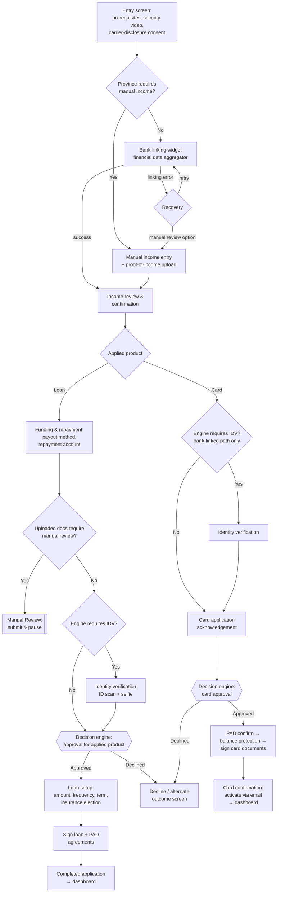

# Post-Qualification Application Flow

**Purpose:** The full product application — reached only after an eligible [[Pre-Qualification Flow]] outcome — covering income verification, funding and repayment setup, conditional identity verification, the final approval decision, product configuration, and binding e-signature.

**Entry precondition:** The applicant is **authenticated** (an account exists — created during or after pre-qualification; account creation collects only new information: password and security question). The applied product (loan or card) and province persist from pre-qualification.

**Nature:** This note is the **orchestration view**. Component steps are detailed in [[Income Verification Flow]], [[Identity Verification Flow]], [[Funding and Repayment Setup Flow]], [[Loan Finalization and Document Signing Flow]], [[Credit Card Application Flow]], and [[Manual Review Flow]].

## High-Level Step Model

| Step | Description | Step IDs | Detail note |
|---|---|---|---|
| 1 | **Entry screen** — prerequisites, security messaging, mobile-carrier disclosure consent | `POST-01` | below |
| 2 | **Income verification** — bank-linked (aggregator) or manual, routed by province | `IV-A1/IV-A2` or `IV-B1` | [[Income Verification Flow]] |
| 3 | **Income review & confirmation** — cards, edits, totals, minimum-one-source rule | `IV-A3` or `IV-B2` | [[Income Verification Flow]] |
| 4 | **Funding & repayment** — payout method + repayment bank account *(loan products only)* | `FUND-01`–`FUND-04` | [[Funding and Repayment Setup Flow]] |
| 4a | **Manual review** *(conditional)* — when uploaded documents require human review | `MR-01`–`MR-03` | [[Manual Review Flow]] |
| 5 | **Identity verification** *(conditional)* — only when the decision engine requires it | `IDV-00`–`IDV-04` | [[Identity Verification Flow]] |
| 5a | **Card application acknowledgement** *(card only)* — before the hard-inquiry decision | `CC-02` | [[Credit Card Application Flow]] |
| 6 | **Approved results** — engine approval for the applied product | `POST-06` | below |
| 7 | **Application details** — product configuration *(loan)* / PAD + insurance offer *(card)* | `LF-02`–`LF-04` / `CC-04`–`CC-05` | [[Loan Finalization and Document Signing Flow]] / [[Credit Card Application Flow]] |
| 8 | **Sign documents** — binding e-signature of product agreements | `LF-05` / `CC-06` | [[Loan Finalization and Document Signing Flow]] / [[Credit Card Application Flow]] |
| 9 | **Completed application** — terminal confirmation, dashboard hand-off | `POST-09` | below |

## Orchestration Diagram

## Step Detail (Orchestration-Owned Steps)

Orchestration-owned steps carry `POST-nn` IDs aligned to the step-model table above; component steps carry their detail note's IDs (`IV-…`, `IDV-…`, `FUND-…`, `LF-…`, `CC-…`, `MR-…`).

### Step POST-01 — Entry Screen

> **Step ID:** `POST-01` · **Capability:** ONB-APP-02, ONB-AKC-01, ONB-CCC-01 · **Preconditions:** authenticated account; eligible pre-qualification outcome (PQ-09) · **Inputs:** required mobile-carrier disclosure consent · **Exits:** province mandates manual income → IV-B1; otherwise → IV-A1

A "ready to finish your application" screen presenting: prerequisites (valid government ID, chequing account, steady verifiable income); security/trust messaging (bank-level encryption, identity verification, ongoing monitoring, explanatory video); and a required **mobile-carrier disclosure consent** — authorizing the applicant's mobile service provider to disclose the mobile number and account information for identity verification and fraud protection — gating the primary CTA. This consent checkbox replaces what was historically a standalone consent page. Advancing routes by province: provinces prohibiting screen-scraping bank linking go directly to manual income entry; all others launch the aggregator widget.

### POST-CHROME — Flow Chrome (Cross-Cutting)

> **Step ID:** `POST-CHROME` · **Capability:** ONB-APP-02/03 · **Scope:** applies from income verification through signing; removed on terminal screens (MR-01, POST-09)

From income verification onward: persistent progress bar, section header label, back navigation preserving data, **save-for-later** (available once the applicant is past OTP — the point at which enough data exists to resume), and a cancel action that always invokes the standard confirmation modal. Terminal screens drop the chrome.

### Step POST-06 — Approved Results

> **Step ID:** `POST-06` · **Capability:** ONB-ADJ-01/02/03/04 · **Preconditions:** income confirmed (IV-A3 or IV-B2); loans additionally FUND-04 straight-through; cards additionally CC-02 acknowledgement; IDV-04 success whenever the engine required IDV · **Inputs:** engine approval payload (D8 — see [[Data Requirements Reference]]) · **Exits:** approved loan → LF-01; approved card → CC-04; declined → decline/alternate outcome (terminal)

After funding setup (loans) or application acknowledgement (cards), and after any required identity verification, the orchestration invokes the decision engine for the **approval** decision on the applied product — the hard-inquiry decision where applicable. The screen presents product, approved amount or credit limit, and key terms returned by the engine; the applicant cannot switch products. Approval messaging notes that verified income supports the outcome. Decline routes to a defined decline/alternate-outcome screen and never advances to fulfillment. Approved amounts shown at pre-qual were indicative; this screen presents final terms.

### Step POST-09 — Completed Application

> **Step ID:** `POST-09` · **Capability:** ONB-ASF-01, ONB-ACT-01, ONB-CCC-02 · **Preconditions:** documents signed (LF-05 or CC-06) · **Exits:** dashboard hand-off (terminal) · *Same screen as LF-06 / CC-07 per product.*

Terminal confirmation: application complete, funding in process (loans) or card activation via email (cards); a "go to dashboard" CTA into the authenticated dashboard where status is tracked; no progress bar or back/save controls.

## Path-Routing Rules (Generalized)

| Condition | Routing |
|---|---|
| Province prohibits bank-link income verification | Entry → manual income entry directly; aggregator never offered |
| Aggregator linking error (other provinces) | Error recovery offers retry or manual income path; manual is **not** offered for cancellation or zero-income success |
| Applied product is a card | Funding/repayment steps skipped entirely; PAD handled on the card path |
| Uploaded documentation present (loans) | Application submits at funding step and pauses at [[Manual Review Flow]]; no IDV, approval, setup, or signing in-session |
| Engine requires identity verification | IDV inserted before approval (bank-linked path only; manual path relies on document review instead) |
| Engine declines | No fulfillment steps reachable; decline handling per product |

## Capability Mapping

| Capability | How exercised |
|---|---|
| [[Application]] ONB-APP-02/03/04 | Entry screen, chrome, save-for-later, state and status management, income review |
| [[Adjudication and Underwriting]] ONB-ADJ-01–06 | Approval decisioning, step gating, hard bureau inquiry, risk-adaptive routing |
| [[AML KYC and Compliance]] ONB-AKC-01/02/04/08 | Carrier-disclosure consent, identity verification, hard-check disclosure |
| [[Account Setup and Fulfillment]] ONB-ASF-01/02 | Funding/repayment capture, submission orchestration, account opening on completion |
| [[Collateral and Customer Communications]] ONB-CCC-01/05 | Security messaging, agreements at signing |
| [[Activation and Enrolment]] ONB-ACT-01 | Authenticated entry; dashboard terminal hand-off |

## Source Traceability

Generalized from the Money Mart Digital Experience Relaunch post-qualification functional requirements (shared FR0–FR23, BR1–BR27, D1–D14) and journey map workshop artifacts; vendor names abstracted per [[Integration and Decisioning Patterns]].
