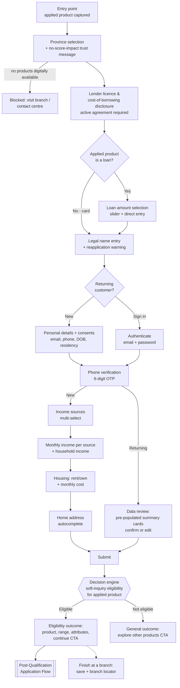

# Pre-Qualification Flow

**Purpose:** Let a prospective customer determine eligibility for a credit product **without affecting their credit score**, collecting the minimum dataset needed for a soft-inquiry eligibility decision and presenting all jurisdiction-mandated disclosures before personal information is collected.

**Stage:** First of the two-stage origination pattern; an eligible outcome gates entry to the [[Post-Qualification Application Flow]].

**Products in scope (generalized):** installment/term loan, short-term (single-payment) loan, and credit card. The applicant applies for **exactly one product per session** — the *applied product* — captured from the entry point (product page, campaign link, URL parameter) and immutable for the session. Multi-product application in a single session is a deliberate scope exclusion: applicants must select one specific product.

## End-to-End Flow

## Step Detail

Step IDs `PQ-nn` are stable anchors referenced throughout the library (see [[Process-to-Capability Mapping Matrix]]).

### Step PQ-01 — Entry and Applied Product

> **Step ID:** `PQ-01` · **Capability:** ONB-APP-01 Intake · **Preconditions:** none — flow entry · **Inputs:** applied product from entry-point context · **Exits:** valid product → PQ-02; no valid product → flow does not start

Every entry point maps to one applied product. The applied product persists for the session, is passed to the decision engine with the submission payload, and determines which approval the applicant ultimately receives in post-qualification. Entry points that do not carry a valid product do not start the flow. Product intent **can** be overridden when the customer navigates from a different product page, but never mid-session.

### Step PQ-02 — Province Selection and Gating

> **Step ID:** `PQ-02` · **Capability:** ONB-APP-01, ONB-AKC-03 · **Preconditions:** PQ-01 (applied product set) · **Inputs:** province of residence · **Exits:** product digitally available → PQ-03; nothing digitally available → blocked, branch/contact-centre direction (terminal)

Province is the first question because it drives everything: disclosure content, product availability, and later verification routing. A **product–province availability matrix** (online / retail-only / not available per product per province) determines whether the flow may proceed; where no product is digitally available in the selected province (e.g., jurisdictions where digital lending is not offered at all), the applicant is blocked with branch/contact-centre direction. A trust message states that checking eligibility will not affect the credit score. Note: geolocation may suggest a province but the applicant's selection governs; the residence-vs-location edge case is a policy decision.

### Step PHey Q-03 — Licensing and Cost-of-Borrowing Disclosure

> **Step ID:** `PQ-03` · **Capability:** ONB-CCC-01, ONB-AKC-03 · **Preconditions:** PQ-02 (content keyed to province + applied product) · **Inputs:** active agreement to disclosures · **Exits:** agree + loan product → PQ-04; agree + card → PQ-05; no agreement → no advance

Before any personal data is collected, the flow presents a province-specific disclosure screen: provincial lender licence, downloadable disclosure documents, maximum allowable cost of borrowing under provincial regulation, the lender's cost per $100 borrowed, a worked sample calculation (amount advanced, total cost of borrowing, total repayable, APR), statutory references, and regulator-approved educational links. The applicant must **actively agree** to advance. Returning to this screen after selecting a loan amount recalculates the sample with the applicant's amount. Province can be changed here without restarting; content reloads accordingly. All content is CMS-managed per province. See [[Canadian Regulatory Context]] for the underlying obligations (including the federal 35% APR criminal interest rate and the $14-per-$100 payday cost cap effective January 1, 2025).

### Step PQ-04 — Loan Amount Selection (Loans Only)

> **Step ID:** `PQ-04` · **Capability:** ONB-APP-02 · **Preconditions:** PQ-03; applied product is a loan (card applicants skip this step entirely) · **Inputs:** requested amount within product range · **Exits:** → PQ-05

Loan products only — card applicants skip directly to name entry, since credit limits are set by approval, not requested. Interactive slider plus direct numeric entry within a configurable range (observed: $100–$25,000), displayed and updated in real time.

### Step PQ-05 — Name Entry and Returning-Customer Branch

> **Step ID:** `PQ-05` · **Capability:** ONB-APP-02, ONB-APP-04 · **Preconditions:** PQ-04 (loans) or PQ-03 (cards) · **Inputs:** legal first/last name, or sign-in credentials (returning customer) · **Exits:** new applicant → PQ-06; returning authenticated → PQ-07, then consolidated data review (PQ-08R) → PQ-09

Legal first/last name is a dedicated step carrying a prominent warning that inaccurate information triggers a **14-day reapplication restriction** (enforced server-side). A sign-in prompt lets existing customers authenticate (email/password) instead of completing the new-applicant steps; authenticated returning customers skip personal details and the four data-collection steps, going from phone verification straight to a **consolidated data review**: income sources, monthly earnings, housing, and address pre-populated in summary cards, each with an edit action, requiring explicit confirmation before submission. Pre-population never bypasses confirmation, and applicants who don't self-identify always follow the new-applicant path.

### Step PQ-06 — Personal Details and Consents (New Applicants)

> **Step ID:** `PQ-06` · **Capability:** ONB-APP-02, ONB-AKC-01/04 · **Preconditions:** PQ-05, new-applicant branch · **Inputs:** email, phone, date of birth, residency status, three individually acknowledged consents · **Exits:** → PQ-07

Single step collecting email, phone, date of birth, and **Canadian residency status** (required selection), plus three individually acknowledged consents: marketing (optional — never blocks), credit-bureau (required — with explicit no-score-impact statement), and terms/privacy (required). Bulk consent acceptance is prohibited; checkbox default state (opt-in vs pre-checked) is a tracked regulatory concern.

### Step PQ-07 — Phone Verification (OTP)

> **Step ID:** `PQ-07` · **Capability:** ONB-APP-02; Identity/Auth domain (adjacent) · **Preconditions:** PQ-06 (new) or PQ-05 sign-in (returning) · **Inputs:** 6-digit OTP · **Exits:** verified + new → PQ-08; verified + returning → PQ-08R; three failed attempts → click-to-call path (no further OTP this session)

6-digit OTP to the provided (new) or on-file (returning) number; individual digit inputs; resend support; after three failed attempts, a click-to-call customer-service path replaces further OTP attempts for the session. Phone OTP is the mandatory blocking verification; email verification, where required, is recommended as a non-blocking parallel verification link (or deferred to the pre-qual→full-app transition for card products where it is a hard requirement) to avoid stacking blocking verifications.

### Step PQ-08 — Financial Profile Capture (New Applicants)

> **Step ID:** `PQ-08` · **Capability:** ONB-APP-02 (feeds ONB-ADJ-05/06) · **Preconditions:** PQ-07 verified, new-applicant branch · **Inputs:** income sources + monthly amounts, household income, housing tenure/cost, home address · **Exits:** Submit → PQ-09 · *Returning customers instead see a consolidated pre-populated data review (`PQ-08R`, described under PQ-05): every value editable, explicit confirmation required, then → PQ-09.*

- **Income sources:** multi-select from a configurable list (full-time, part-time, pension, CPP, OAS, commissions, private disability, workers' compensation, EI, social assistance, child tax benefits, other); at least one required. Product policy may restrict eligible income types per product — communicating ineligible income types early is a known UX consideration.
- **Monthly income:** the entry form is generated at runtime from the selected sources only; monthly after-tax amount per source plus total household income (always collected) in CAD.
- **Housing:** rent/own (exactly one) plus monthly housing cost, with shared-cost guidance ("enter only your portion").
- **Address:** search/autocomplete with editable populated fields; street (P.O. boxes per policy), apt/suite optional, city, province (pre-filled from step 2), postal code. Address submission is the action that triggers decisioning — the CTA is "Submit", not "Next".

### Step PQ-09 — Eligibility Decision and Outcomes

> **Step ID:** `PQ-09` · **Capability:** ONB-ADJ-01/02/03/04 · **Preconditions:** PQ-08 submission or PQ-08R confirmed review · **Inputs:** decision-engine soft-inquiry outcome for the applied product · **Exits:** eligible → [[Post-Qualification Application Flow]] (POST-01) or finish-at-a-branch; not eligible → general outcome screen (terminal)

The decision engine evaluates eligibility for the applied product from the submitted payload (see [[Data Requirements Reference]]). The front end implements no eligibility logic.

- **Eligible:** outcome screen presents the applied product — name (and customer-facing label where different), indicative amount range, key attributes (repayment structure, term, rate, fee, whether a credit check is required) — a disclaimer that eligibility is not final approval, and a CTA to continue to post-qualification. Loan-product outcomes add an educational content card, live support options, and a **finish-at-a-branch** option (saves progress server-side, opens branch locator).
- **Not eligible:** a general outcome screen (no alternate in-scope product selection) with applicant-friendly messaging and a CTA to explore other products (e.g., prepaid cards) outside the flow.

## Business Rules (Generalized)

| Rule | Statement |
|---|---|
| Single applied product | One product per session, set at entry, immutable in-flow |
| Province gates products | Availability matrix governs digital availability; engine further restricts per applicant |
| Disclosure before data | Licensing/cost disclosures precede any personal-information collection and require active agreement |
| No score impact | Pre-qual uses soft inquiry only; messaging must say so |
| Reapplication restriction | Inaccurate information bars reapplication for 14 days; warned before name submission |
| Income-driven forms | Income entry fields generated only for selected sources; household income always collected |
| Cancel requires confirmation | Cancel never abandons silently; confirmation modal with progress-loss warning |
| Validation on submit | Step-level validation; all errors surfaced simultaneously with actionable messages |
| Returning-user confirmation | Pre-populated data must be explicitly confirmed; every value editable |
| Eligibility ≠ approval | Pre-qual outcome gates entry to full application; approval is a separate decision on the same product |

## Capability Mapping

| Capability | How exercised |
|---|---|
| [[Application]] ONB-APP-01/02/03/04/06 | Entry-point and product capture, stepped data capture, session persistence, returning-user review, the pre-qualification stage itself |
| [[Adjudication and Underwriting]] ONB-ADJ-01/02/03/04 | Soft-inquiry instant eligibility decision by the central engine via bureau access |
| [[AML KYC and Compliance]] ONB-AKC-01/03/04 | Identity dataset and residency capture, province-aware regulatory gating, bureau consent |
| [[Collateral and Customer Communications]] ONB-CCC-01 | Licensing, cost-of-borrowing, and regulatory disclosures; consent-linked documents |

## Source Traceability

Generalized from the Money Mart Digital Experience Relaunch pre-qualification functional requirements (FR1–FR18, BR1–BR14, D1–D3) and full journey map workshop artifacts; vendor names abstracted per [[Integration and Decisioning Patterns]].
